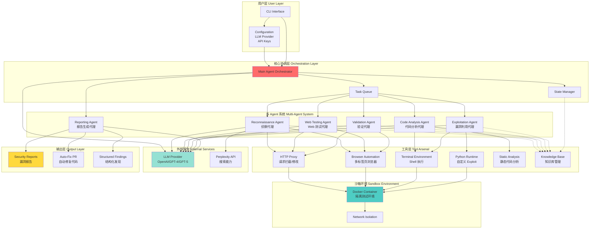
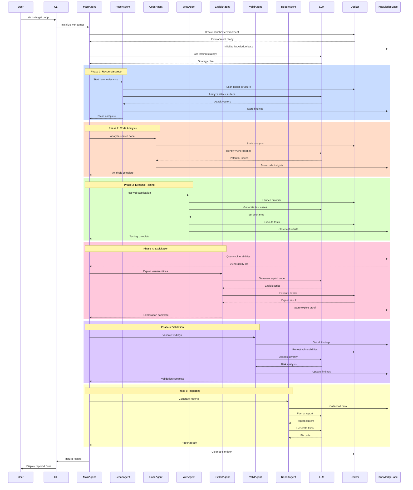
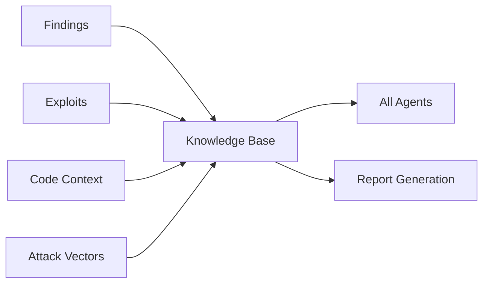

让我基于获取到的信息,为你生成 **Strix** 项目的架构图和流程图,并详细介绍 Agent 的实现逻辑。

## 📊 Strix 项目架构分析

基于我对项目的了解,Strix 是一个 **AI 驱动的自动化渗透测试工具**,采用多 Agent 协作架构来模拟真实黑客行为。

---

## 🏗️ 系统架构图



---

## 🔄 Agent 执行流程图



---

## 🤖 Agent 实现逻辑详解

### 1. **Main Agent Orchestrator (主协调代理)**

**核心职责:**

- 任务分解与调度
- Agent 之间的协调
- 状态管理
- 决策优先级

**实现逻辑:**

```python
# 伪代码示例
class MainAgentOrchestrator:
    def __init__(self, target, llm_provider):
        self.target = target
        self.llm = llm_provider
        self.knowledge_base = KnowledgeBase()
        self.state_manager = StateManager()
        self.task_queue = TaskQueue()

    async def run(self):
        # 1. 获取测试策略
        strategy = await self.llm.get_testing_strategy(
            target=self.target,
            context=self.knowledge_base.get_context()
        )

        # 2. 分配任务给专门的 Agent
        tasks = self.decompose_strategy(strategy)

        # 3. 并行执行任务
        results = await self.execute_tasks_parallel(tasks)

        # 4. 合成结果
        return self.synthesize_results(results)
```

### 2. **Reconnaissance Agent (侦察代理)**

**核心职责:**

- 攻击面映射
- OSINT 收集
- 目标结构分析
- 技术栈识别

**实现逻辑:**

```python
class ReconnaissanceAgent:
    def __init__(self, llm, tools):
        self.llm = llm
        self.http_proxy = tools['http_proxy']
        self.browser = tools['browser']

    async def scan(self, target):
        # 1. 基础信息收集
        endpoints = await self.discover_endpoints(target)
        tech_stack = await self.identify_tech_stack(target)

        # 2. 使用 LLM 分析攻击向量
        attack_vectors = await self.llm.analyze_attack_surface({
            'endpoints': endpoints,
            'tech_stack': tech_stack
        })

        # 3. 深度探测
        detailed_info = await self.deep_probe(attack_vectors)

        return {
            'endpoints': endpoints,
            'tech_stack': tech_stack,
            'attack_vectors': attack_vectors,
            'detailed_info': detailed_info
        }
```

### 3. **Code Analysis Agent (代码分析代理)**

**核心职责:**

- 静态代码分析
- 数据流追踪
- 危险函数识别
- 依赖漏洞检测

**实现逻辑:**

```python
class CodeAnalysisAgent:
    def __init__(self, llm, code_scanner):
        self.llm = llm
        self.scanner = code_scanner

    async def analyze(self, codebase):
        # 1. 静态扫描
        scan_results = await self.scanner.scan(codebase)

        # 2. LLM 深度分析
        vulnerabilities = []
        for issue in scan_results:
            # 让 LLM 理解上下文并判断真实性
            analysis = await self.llm.analyze_code_issue({
                'issue': issue,
                'context': self.get_surrounding_code(issue)
            })

            if analysis['is_real_vulnerability']:
                vulnerabilities.append(analysis)

        # 3. 数据流分析
        data_flows = await self.trace_data_flows(vulnerabilities)

        return {
            'vulnerabilities': vulnerabilities,
            'data_flows': data_flows
        }
```

### 4. **Web Testing Agent (Web 测试代理)**

**核心职责:**

- XSS/CSRF 测试
- 认证流程测试
- 会话管理测试
- 业务逻辑漏洞

**实现逻辑:**

```python
class WebTestingAgent:
    def __init__(self, llm, browser, http_proxy):
        self.llm = llm
        self.browser = browser
        self.proxy = http_proxy

    async def test(self, target):
        # 1. 生成测试用例
        test_cases = await self.llm.generate_test_cases({
            'target': target,
            'attack_types': ['xss', 'csrf', 'auth_bypass']
        })

        # 2. 执行测试
        results = []
        for test_case in test_cases:
            # 使用浏览器自动化执行
            result = await self.browser.execute_test(test_case)

            # 拦截和分析请求
            requests = self.proxy.get_intercepted_requests()

            # LLM 分析结果
            analysis = await self.llm.analyze_test_result({
                'test_case': test_case,
                'result': result,
                'requests': requests
            })

            results.append(analysis)

        return results
```

### 5. **Exploitation Agent (漏洞利用代理)**

**核心职责:**

- Exploit 代码生成
- 实际攻击执行
- 权限提升验证
- PoC 创建

**实现逻辑:**

```python
class ExploitationAgent:
    def __init__(self, llm, python_runtime, terminal):
        self.llm = llm
        self.runtime = python_runtime
        self.terminal = terminal

    async def exploit(self, vulnerability):
        # 1. 生成 exploit 代码
        exploit_code = await self.llm.generate_exploit({
            'vulnerability': vulnerability,
            'target': vulnerability['target'],
            'context': vulnerability['context']
        })

        # 2. 在沙箱中执行
        try:
            result = await self.runtime.execute(exploit_code)

            # 3. 验证成功性
            is_successful = await self.verify_exploit(result)

            return {
                'success': is_successful,
                'exploit_code': exploit_code,
                'proof': result
            }
        except Exception as e:
            # 失败则让 LLM 修正
            fixed_code = await self.llm.fix_exploit({
                'original': exploit_code,
                'error': str(e)
            })
            return await self.exploit_with_code(fixed_code)
```

### 6. **Validation Agent (验证代理)**

**核心职责:**

- 漏洞真实性确认
- 风险评估
- 误报过滤
- 影响分析

**实现逻辑:**

```python
class ValidationAgent:
    def __init__(self, llm, tools):
        self.llm = llm
        self.tools = tools

    async def validate(self, findings):
        validated = []

        for finding in findings:
            # 1. 重新测试
            retest_result = await self.retest(finding)

            # 2. LLM 评估严重性
            assessment = await self.llm.assess_severity({
                'finding': finding,
                'retest': retest_result,
                'impact': self.calculate_impact(finding)
            })

            # 3. 过滤误报
            if assessment['confidence'] > 0.8:
                validated.append({
                    **finding,
                    'severity': assessment['severity'],
                    'confidence': assessment['confidence'],
                    'cvss': assessment['cvss']
                })

        return validated
```

### 7. **Reporting Agent (报告生成代理)**

**核心职责:**

- 报告生成
- 修复代码生成
- PR 创建
- 文档输出

**实现逻辑:**

```python
class ReportingAgent:
    def __init__(self, llm, knowledge_base):
        self.llm = llm
        self.kb = knowledge_base

    async def generate_report(self):
        # 1. 收集所有发现
        all_findings = self.kb.get_all_findings()

        # 2. LLM 生成报告
        report = await self.llm.generate_report({
            'findings': all_findings,
            'format': 'markdown'
        })

        # 3. 生成修复代码
        fixes = []
        for finding in all_findings:
            if finding['auto_fixable']:
                fix_code = await self.llm.generate_fix({
                    'vulnerability': finding,
                    'original_code': finding['code']
                })
                fixes.append(fix_code)

        # 4. 创建 PR (如果配置)
        if self.config.auto_pr:
            await self.create_pull_request(fixes)

        return {
            'report': report,
            'fixes': fixes
        }
```

---

## 🔑 核心技术特点

### 1. **Graph of Agents (Agent 图)**

- **分布式工作流**: 不同 Agent 专注不同攻击类型
- **动态协调**: Agent 之间共享发现和协作
- **并行执行**: 多个 Agent 同时工作提高效率

### 2. **LLM 驱动的智能决策**

```
User Input → LLM Planning → Task Decomposition →
Agent Execution → LLM Analysis → Validation →
LLM Reporting → Output
```

### 3. **Tool Arsenal (工具武器库)**

每个 Agent 都可以访问:

- HTTP Proxy (请求拦截和修改)
- Browser Automation (多标签页浏览器)
- Terminal (Shell 命令执行)
- Python Runtime (自定义脚本)
- Code Scanner (静态分析)
- Knowledge Base (知识共享)

### 4. **Knowledge Management**



---

## 💡 Agent 协作示例

假设测试一个 Web 应用:

1. **Recon Agent** 发现: `/api/user/{id}` 端点
2. 将发现存入 **Knowledge Base**
3. **Code Analysis Agent** 读取 KB,分析相关代码,发现没有权限检查
4. **Web Testing Agent** 创建测试用例,尝试访问其他用户数据
5. **Exploitation Agent** 生成 IDOR exploit,成功获取其他用户数据
6. **Validation Agent** 重新测试确认漏洞,评估为 High severity
7. **Reporting Agent** 生成报告和修复代码,创建 PR

---

## 🎯 总结

Strix 的 Agent 架构核心优势:

1. **真实渗透测试**: 不是简单扫描,而是实际利用
2. **低误报率**: 通过实际 exploit 验证漏洞
3. **自动修复**: 生成可用的修复代码
4. **开发者友好**: 集成 CI/CD,自动 PR
5. **沙箱安全**: Docker 隔离,本地处理

这个架构设计非常适合学习 AI Agent 系统的构建! 🚀

需要我详细解释某个特定 Agent 的实现吗?
