# EVM 工作原理完全指南

## 目录

- [EVM 基础概念](#evm基础概念)
- [EVM 架构详解](#evm架构详解)
- [字节码与操作码](#字节码与操作码)
- [智能合约执行流程](#智能合约执行流程)
- [Gas 与 EVM 的关系](#gas与evm的关系)
- [实践练习](#实践练习)
- [参考资料](#参考资料)

---

## EVM 基础概念

### 1. 什么是 EVM？


**定义：**

```
EVM = Ethereum Virtual Machine（以太坊虚拟机）
    = 去中心化的计算引擎
    = 智能合约的执行环境
    = 全球同步的状态机
```

### 2. EVM 类比理解

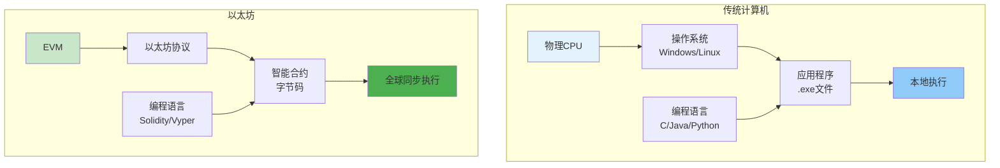

| 概念     | 传统计算机    | 以太坊         |
| -------- | ------------- | -------------- |
| 硬件     | 物理 CPU      | EVM（虚拟）    |
| 操作系统 | Windows/Linux | 以太坊协议     |
| 应用程序 | .exe 文件     | 智能合约       |
| 编程语言 | C/Java/Python | Solidity/Vyper |
| 运行位置 | 本地机器      | 全球数千节点   |
| 执行结果 | 可能不同      | 完全相同       |

### 3. EVM 的核心特点

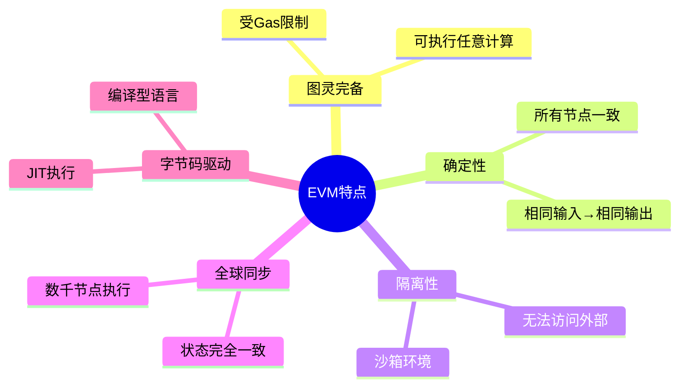

#### 特点详解

**✅ 图灵完备（Turing Complete）**

```
可以执行：
- 条件判断（if/else）
- 循环（while/for）
- 递归调用
- 任意复杂的逻辑

限制：
- Gas限制防止无限循环
- 区块Gas限制防止DOS
```

**✅ 确定性（Deterministic）**

```
相同的输入 → 必定产生相同的输出

例子：
函数 add(a, b) 在任何节点执行
输入 (3, 5) → 输出永远是 8

这保证了：
- 所有节点达成共识
- 可以验证计算结果
- 网络状态一致
```

**✅ 隔离性（Sandboxed）**

```
EVM运行在隔离环境中：

不能：
❌ 访问文件系统
❌ 发起网络请求
❌ 获取真随机数
❌ 访问其他进程

只能：
✅ 读取区块链数据
✅ 调用其他合约
✅ 修改自己的存储
✅ 触发事件（Event）
```

**✅ 全球同步（Globally Synchronized）**

```
当你部署合约：
    ↓
全球数千个节点同时执行
    ↓
每个节点独立计算
    ↓
所有节点得到相同结果
    ↓
达成共识
```

### 4. EVM 的限制

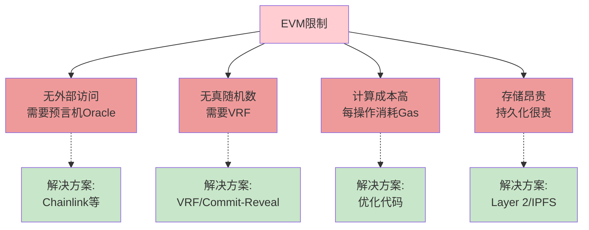

---

## EVM 架构详解

### 1. EVM 组件总览

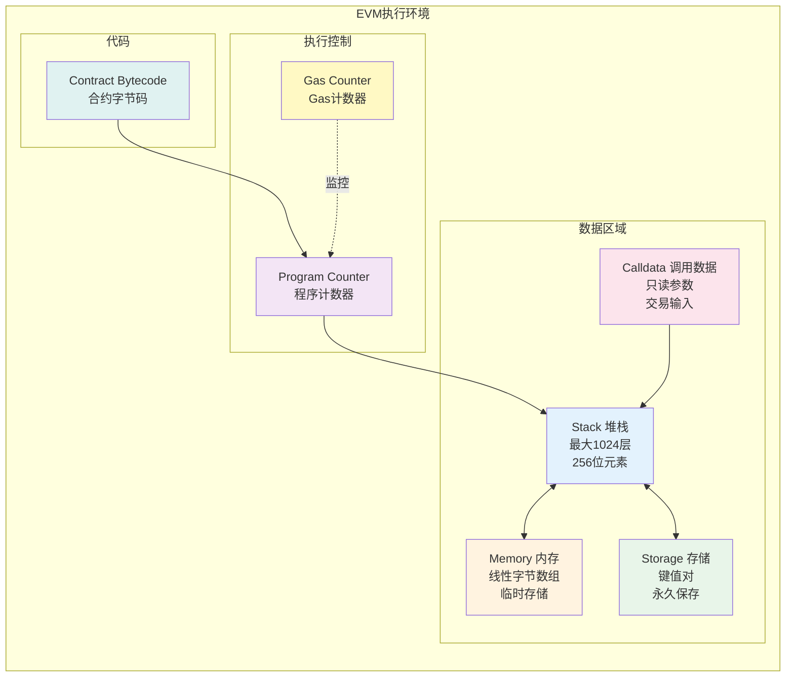

### 2. Stack（堆栈）

#### 堆栈特性

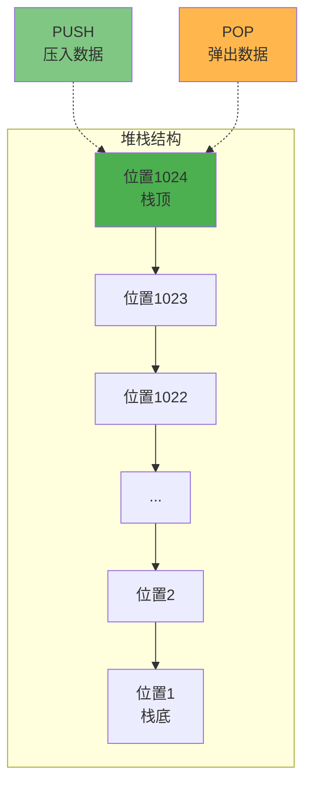

**堆栈规格：**

```
类型：LIFO（Last In First Out，后进先出）
最大深度：1024个元素
元素大小：256位（32字节）
访问方式：只能操作栈顶部分
溢出：超过1024会失败
下溢：空栈弹出会失败
```

#### 堆栈操作演示

**示例 1：简单计算（3 + 5）**

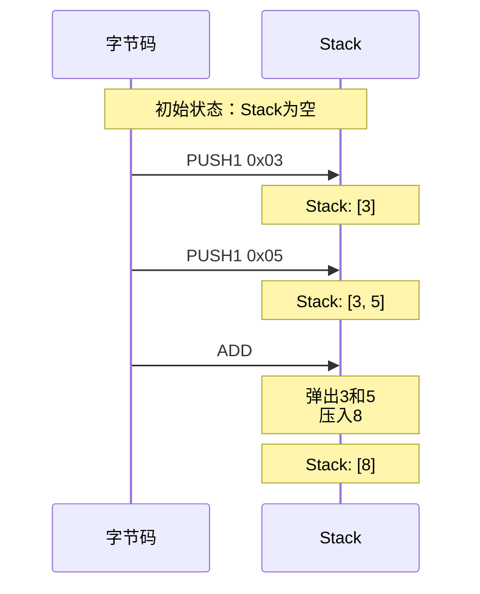

**对应字节码：**

```
60 03        PUSH1 3     (压入3)
60 05        PUSH1 5     (压入5)
01           ADD         (相加)

结果：Stack = [8]
```

**示例 2：复杂表达式（(a + b) \* c）**

```
假设：a=2, b=3, c=4

步骤1: PUSH1 0x02    Stack: [2]
步骤2: PUSH1 0x03    Stack: [2, 3]
步骤3: ADD           Stack: [5]        // 2+3
步骤4: PUSH1 0x04    Stack: [5, 4]
步骤5: MUL           Stack: [20]       // 5*4

最终结果：20
```

#### 堆栈操作指令

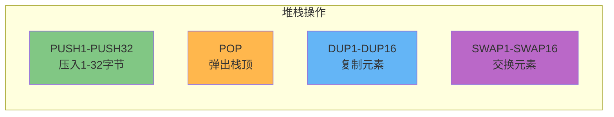

**指令说明：**

```
PUSH1-PUSH32: 压入1到32字节的数据
  例: PUSH1 0x05  → Stack: [5]

POP: 弹出并丢弃栈顶元素
  例: POP  → 移除栈顶

DUP1-DUP16: 复制栈顶第N个元素到栈顶
  例: Stack: [A, B, C]
      DUP1 → Stack: [A, A, B, C]  (复制栈顶)
      DUP2 → Stack: [B, A, B, C]  (复制第2个)

SWAP1-SWAP16: 交换栈顶和第N+1个元素
  例: Stack: [A, B, C]
      SWAP1 → Stack: [B, A, C]  (交换栈顶两个)
      SWAP2 → Stack: [C, B, A]  (交换栈顶和第3个)
```

### 3. Memory（内存）

#### 内存特性

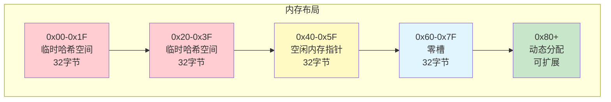

**内存规格：**

```
类型：线性字节数组
访问：按32字节（256位）字对齐
生命周期：仅在交易执行期间
清除：交易结束后释放
初始大小：0字节
扩展：按需扩展（付费）
```

#### 内存操作

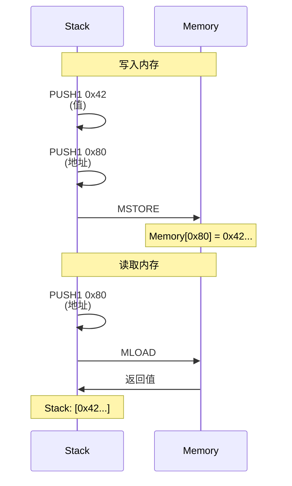

**内存操作指令：**

```
MSTORE(offset, value):
  将32字节值写入内存
  例: MSTORE(0x80, 0x42)
      → Memory[0x80-0x9F] = 0x42...

MLOAD(offset):
  从内存读取32字节
  例: MLOAD(0x80)
      → Stack: [Memory[0x80-0x9F]]

MSTORE8(offset, value):
  将1字节值写入内存
  例: MSTORE8(0x80, 0x42)
      → Memory[0x80] = 0x42
```

#### 内存 Gas 成本

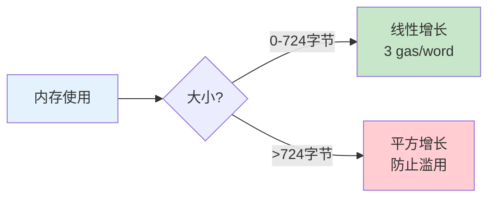

**Gas 计算公式：**

```
memory_cost = (memory_size_word² / 512) + (3 × memory_size_word)

例子：
使用64字节（2 words）:
  cost = (2² / 512) + (3 × 2) = 0.0078 + 6 ≈ 6 gas

使用1024字节（32 words）:
  cost = (32² / 512) + (3 × 32) = 2 + 96 = 98 gas

使用10KB:
  cost = 1000+ gas（快速增长）
```

### 4. Storage（存储）

#### 存储特性

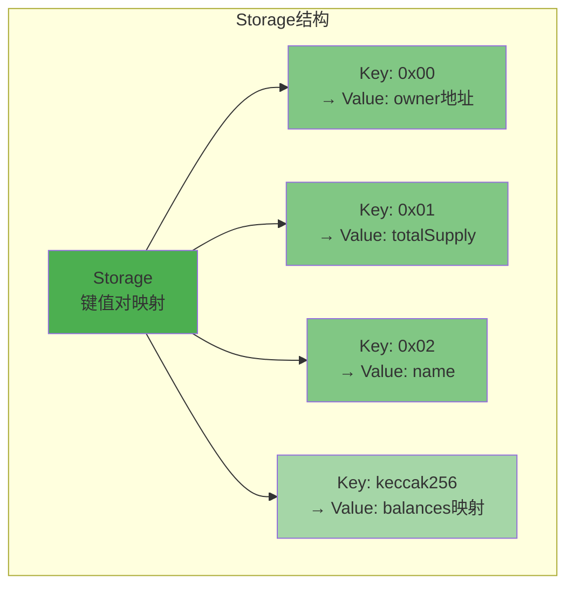

**存储规格：**

```
类型：键值对映射（Key-Value）
键大小：32字节（256位）
值大小：32字节（256位）
持久化：永久保存在区块链上
每个合约：独立的存储空间
初始值：所有槽位默认为0
```

#### Storage vs Memory vs Stack

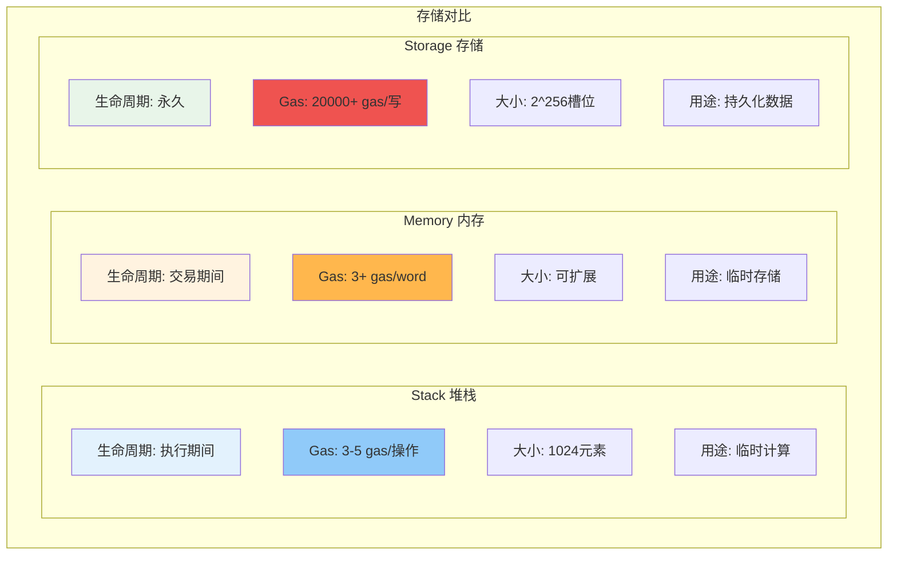

#### Storage Gas 成本

**最昂贵的操作！**

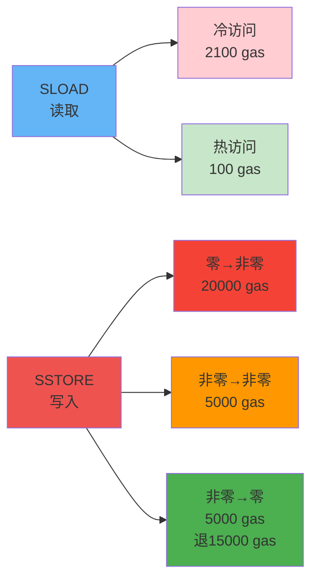

**Gas 成本详解：**

```
SLOAD（读取Storage）:
  - 冷访问（首次）：2100 gas
  - 热访问（同交易内再次）：100 gas

SSTORE（写入Storage）:
  - 零 → 非零（新建）：20000 gas
  - 非零 → 非零（修改）：5000 gas
  - 非零 → 零（清除）：5000 gas + 退款15000 gas

示例：
  uint256 value;  // 默认为0

  value = 100;    // 零→非零：20000 gas
  value = 200;    // 非零→非零：5000 gas
  value = 0;      // 非零→零：5000 gas - 15000退款 = -10000
```

#### Storage 优化技巧

**技巧 1：缓存到内存**

```solidity
// ❌ 低效：多次读取Storage
function inefficient() public view returns (uint) {
    return value + value + value;  // 读3次storage
    // 成本：2100 + 100 + 100 = 2300 gas
}

// ✅ 高效：缓存到内存
function efficient() public view returns (uint) {
    uint temp = value;  // 读1次storage
    return temp + temp + temp;  // 内存操作
    // 成本：2100 gas
}
```

**技巧 2：打包变量**

```solidity
// ❌ 低效：占用多个槽
contract Inefficient {
    uint128 a;  // slot 0
    uint256 b;  // slot 1
    uint128 c;  // slot 2
}
// 读取a+c: 2次SLOAD = 2200 gas

// ✅ 高效：打包到同一槽
contract Efficient {
    uint128 a;  // slot 0前半部分
    uint128 c;  // slot 0后半部分
    uint256 b;  // slot 1
}
// 读取a+c: 1次SLOAD = 2100 gas（如果都在同一交易）
```

**技巧 3：使用映射而非数组（某些情况）**

```solidity
// 数组：需要存储长度
uint[] public arr;  // slot 0: length, slot hash(0): elements

// 映射：不存储长度，按需访问
mapping(uint => uint) public map;  // 只在使用时才有gas成本
```

### 5. Calldata（调用数据）

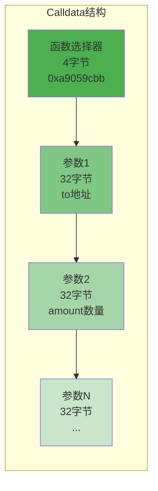

**Calldata 特性：**

```
类型：只读字节数组
来源：交易的data字段
访问：CALLDATALOAD, CALLDATASIZE, CALLDATACOPY
生命周期：仅当前调用
成本：非零字节16 gas，零字节4 gas
```

**Calldata 示例：**

```javascript
// 调用: transfer(address to, uint256 amount)
// to: 0x742d35Cc6634C0532925a3b844Bc9e7595f0bEb
// amount: 1000000000000000000 (1 ETH in Wei)

Calldata:
0xa9059cbb  // transfer(address,uint256)的函数选择器
000000000000000000000000742d35Cc6634C0532925a3b844Bc9e7595f0bEb  // to地址
0000000000000000000000000000000000000000000000000de0b6b3a7640000  // amount

总长度：4 + 32 + 32 = 68字节
```

### 6. Program Counter（程序计数器）

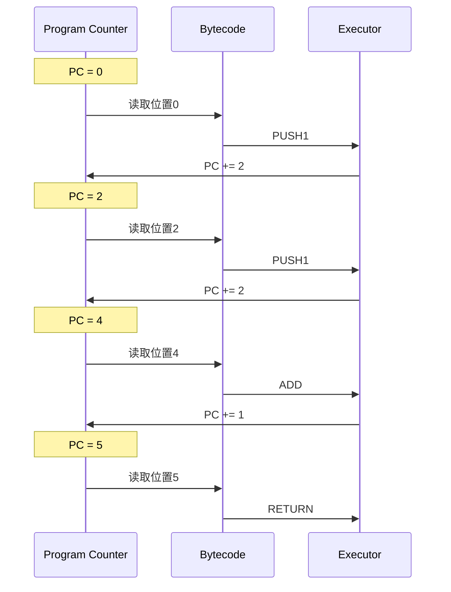

**PC 工作原理：**

```
字节码：60 03 60 05 01 ...
位置：   0  1  2  3  4  5

执行流程：
1. PC = 0: 读取0x60 (PUSH1)
2. PC = 1: 读取0x03 (数据)
3. PC = 2: 读取0x60 (PUSH1)
4. PC = 3: 读取0x05 (数据)
5. PC = 4: 读取0x01 (ADD)
6. PC = 5: 继续...

跳转：
- JUMP：直接修改PC
- JUMPI：条件修改PC
- JUMPDEST：跳转目标标记
```

---

## 字节码与操作码

### 1. 编译流程

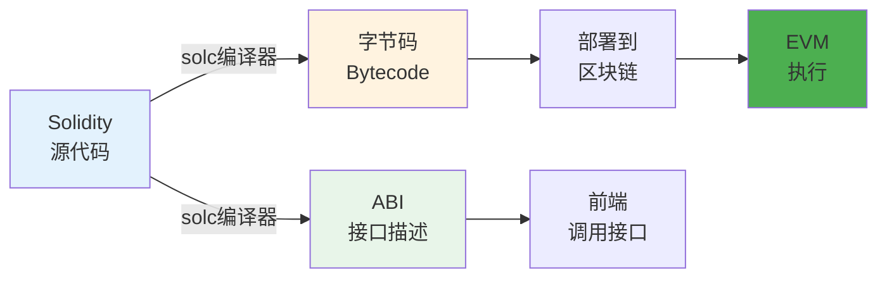

**详细流程：**

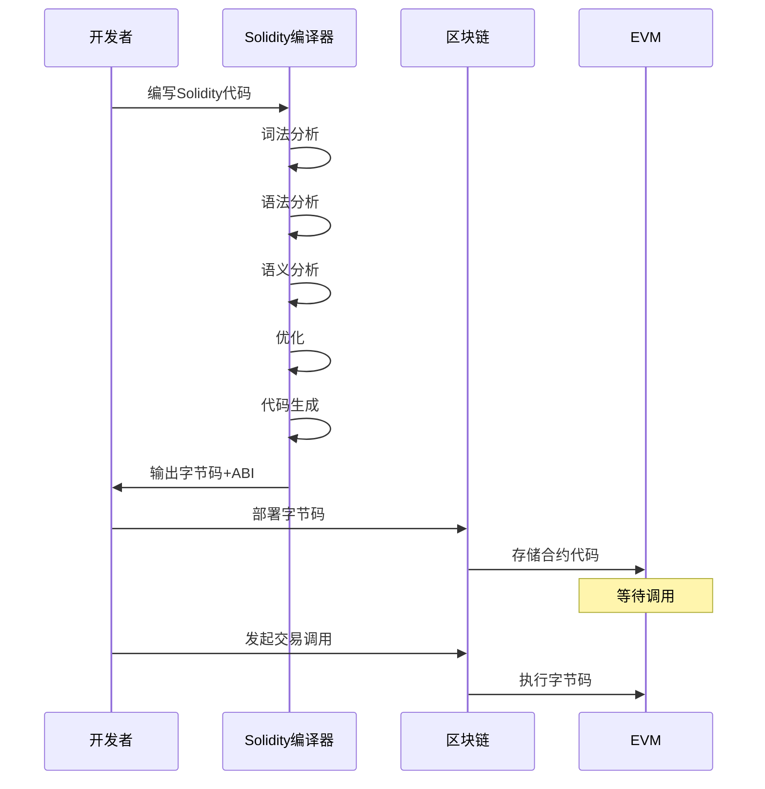

**示例：**

```solidity
// Solidity源代码
contract Simple {
    uint256 public value;

    function setValue(uint256 _value) public {
        value = _value;
    }
}

// 编译后的字节码（部分）
608060405234801561001057600080fd5b50...

// ABI（接口）
[
  {
    "inputs": [{"name": "_value", "type": "uint256"}],
    "name": "setValue",
    "outputs": [],
    "stateMutability": "nonpayable",
    "type": "function"
  }
]
```

### 2. 操作码分类

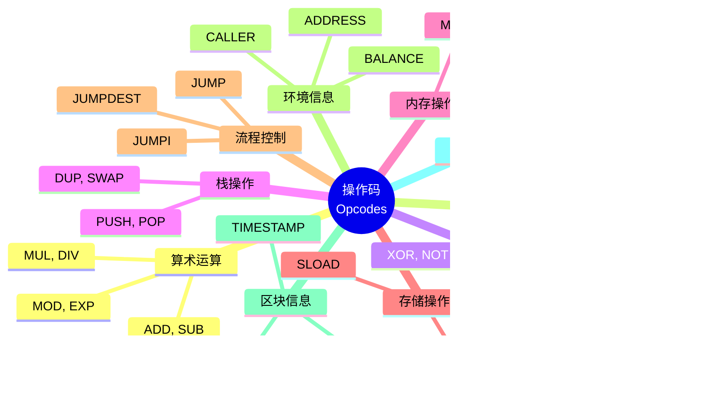

### 3. 常用操作码详解

#### 算术操作（Gas: 3-10）

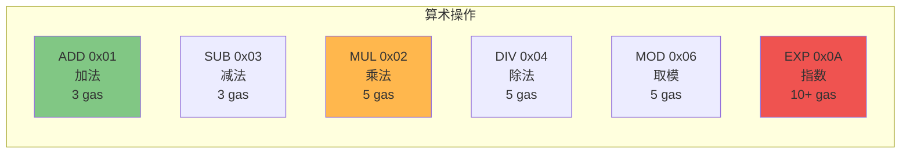

**操作码表：**

| 操作码 | 十六进制 | Gas | 说明        | 栈变化                |
| ------ | -------- | --- | ----------- | --------------------- |
| ADD    | 0x01     | 3   | a + b       | [a,b] → [a+b]         |
| MUL    | 0x02     | 5   | a × b       | [a,b] → [a×b]         |
| SUB    | 0x03     | 3   | a - b       | [a,b] → [a-b]         |
| DIV    | 0x04     | 5   | a ÷ b       | [a,b] → [a÷b]         |
| MOD    | 0x06     | 5   | a % b       | [a,b] → [a%b]         |
| ADDMOD | 0x08     | 8   | \(a+b\) % N | [a,b,N] → [\(a+b\)%N] |
| MULMOD | 0x09     | 8   | \(a×b\) % N | [a,b,N] → [\(a×b\)%N] |
| EXP    | 0x0A     | 10+ | a ^ b       | [a,b] → [a^b]         |

#### 比较操作（Gas: 3）

| 操作码 | 十六进制 | 说明   | 栈变化               |
| ------ | -------- | ------ | -------------------- |
| LT     | 0x10     | a < b  | [a,b] → [a&lt;b?1:0] |
| GT     | 0x11     | a > b  | [a,b] → [a&gt;b?1:0] |
| EQ     | 0x14     | a == b | [a,b] → [a==b?1:0]   |
| ISZERO | 0x15     | a == 0 | [a] → [a==0?1:0]     |

#### 位运算（Gas: 3）

| 操作码 | 十六进制 | 说明     | 栈变化                               |
| ------ | -------- | -------- | ------------------------------------ |
| AND    | 0x16     | 按位与   | [a,b] → [a&amp;b]                    |
| OR     | 0x17     | 按位或   | [a,b] → [a&#124;b]                   |
| XOR    | 0x18     | 按位异或 | [a,b] → [a&#94;b]                    |
| NOT    | 0x19     | 按位非   | [a] → [&#126;a]                      |
| SHL    | 0x1B     | 左移     | [shift,value] → [value&lt;&lt;shift] |
| SHR    | 0x1C     | 右移     | [shift,value] → [value&gt;&gt;shift] |

#### 环境信息

| 操作码       | 十六进制 | Gas | 说明          |
| ------------ | -------- | --- | ------------- |
| ADDRESS      | 0x30     | 2   | 当前合约地址  |
| BALANCE      | 0x31     | 100 | 账户余额      |
| ORIGIN       | 0x32     | 2   | 交易发起者    |
| CALLER       | 0x33     | 2   | 调用者地址    |
| CALLVALUE    | 0x34     | 2   | 发送的 ETH    |
| CALLDATALOAD | 0x35     | 3   | 读取 calldata |
| CALLDATASIZE | 0x36     | 2   | calldata 大小 |
| GASPRICE     | 0x3A     | 2   | Gas 价格      |

#### 区块信息

| 操作码     | 十六进制 | Gas | 说明          |
| ---------- | -------- | --- | ------------- |
| BLOCKHASH  | 0x40     | 20  | 区块哈希      |
| COINBASE   | 0x41     | 2   | 验证者地址    |
| TIMESTAMP  | 0x42     | 2   | 区块时间戳    |
| NUMBER     | 0x43     | 2   | 区块号        |
| DIFFICULTY | 0x44     | 2   | 难度（PoS=0） |
| GASLIMIT   | 0x45     | 2   | Gas 限制      |
| CHAINID    | 0x46     | 2   | 链 ID         |

### 4. 字节码分析实例

**Solidity 函数：**

```solidity
function add(uint a, uint b) public pure returns (uint) {
    return a + b;
}
```

**编译后的操作流程：**

```mermaid
sequenceDiagram
    participant C as Calldata
    participant S as Stack
    participant E as EVM

    Note over C: 输入: add(5, 10)

    C->>E: CALLDATALOAD(4)
    E->>S: PUSH 5
    Note over S: Stack: [5]

    C->>E: CALLDATALOAD(36)
    E->>S: PUSH 10
    Note over S: Stack: [5, 10]

    S->>E: ADD
    E->>S: PUSH 15
    Note over S: Stack: [15]

    S->>E: RETURN
    Note over E: 返回: 15
```

**对应字节码：**

```
// 函数选择器检查
60 04           PUSH1 4
35              CALLDATALOAD        // 读取函数选择器
63 771602f7     PUSH4 0x771602f7    // add(uint,uint)的选择器
14              EQ
61 001a         PUSH2 0x001A
57              JUMPI               // 如果匹配，跳转到函数体

// 函数体
5b              JUMPDEST            // 跳转目标
60 04           PUSH1 4
35              CALLDATALOAD        // 读取参数a
60 24           PUSH1 36
35              CALLDATALOAD        // 读取参数b
01              ADD                 // a + b
60 00           PUSH1 0
52              MSTORE              // 存到内存
60 20           PUSH1 32
60 00           PUSH1 0
f3              RETURN              // 返回结果
```

---

## 智能合约执行流程

### 1. 完整执行流程

```mermaid
sequenceDiagram
    participant U as 用户
    participant W as 钱包
    participant N as 节点
    participant MP as 交易池
    participant V as 验证者
    participant EVM as EVM
    participant S as 世界状态

    U->>W: 1. 发起交易
    W->>W: 2. 签名交易
    W->>N: 3. 广播交易

    N->>N: 4. 验证签名
    N->>N: 5. 检查nonce
    N->>N: 6. 检查余额
    N->>MP: 7. 加入交易池

    MP->>V: 8. 验证者选择交易
    V->>V: 9. 构建区块

    V->>EVM: 10. 执行交易
    activate EVM

    EVM->>EVM: 11. 初始化环境
    EVM->>EVM: 12. 逐条执行字节码
    EVM->>EVM: 13. 处理子调用
    EVM->>EVM: 14. 更新状态

    EVM->>S: 15. 提交状态变更
    deactivate EVM

    V->>N: 16. 广播区块
    N->>U: 17. 确认交易
```

### 2. EVM 执行详细步骤

```mermaid
graph TB
    Start([开始执行])

    Init[1. 初始化环境<br/>创建Stack/Memory<br/>加载Calldata]

    CheckGas{2. Gas足够?}

    LoadBytecode[3. 加载字节码<br/>PC指向下一条]

    DecodeOp[4. 解码操作码<br/>识别指令]

    CheckValid{5. 操作码有效?}

    Execute[6. 执行操作<br/>修改Stack/Memory/Storage]

    DeductGas[7. 扣除Gas]

    CheckResult{8. 检查结果}

    SubCall{9. 需要调用<br/>其他合约?}

    RecurseCall[10. 递归调用EVM]

    CheckEnd{11. 执行完成?}

    UpdateState[12. 更新世界状态]

    GenReceipt[13. 生成Receipt]

    End([执行结束])

    Start --> Init
    Init --> CheckGas
    CheckGas -->|是| LoadBytecode
    CheckGas -->|否| Error1[Out of Gas]
    Error1 --> End

    LoadBytecode --> DecodeOp
    DecodeOp --> CheckValid
    CheckValid -->|是| Execute
    CheckValid -->|否| Error2[Invalid Opcode]
    Error2 --> End

    Execute --> DeductGas
    DeductGas --> CheckResult
    CheckResult -->|成功| SubCall
    CheckResult -->|失败| Error3[Revert/Invalid]
    Error3 --> End

    SubCall -->|是| RecurseCall
    SubCall -->|否| CheckEnd
    RecurseCall --> CheckEnd

    CheckEnd -->|否| CheckGas
    CheckEnd -->|是| UpdateState

    UpdateState --> GenReceipt
    GenReceipt --> End

    style Start fill:#4caf50
    style End fill:#f44336
    style Execute fill:#2196f3
    style UpdateState fill:#ff9800
```

### 3. 函数调用过程

**示例场景：DEX 交易**

```mermaid
sequenceDiagram
    participant U as 用户合约
    participant DEX as DEX合约
    participant Token as 代币合约

    U->>DEX: swap(100 USDT)
    activate DEX

    Note over DEX: 检查授权
    DEX->>Token: allowance(user, dex)
    activate Token
    Token-->>DEX: 1000 USDT
    deactivate Token

    Note over DEX: 转移代币
    DEX->>Token: transferFrom(user, dex, 100)
    activate Token
    Token->>Token: 更新balances
    Token-->>DEX: success
    deactivate Token

    Note over DEX: 计算兑换率
    DEX->>DEX: 100 USDT = 0.05 ETH

    Note over DEX: 发送ETH
    DEX->>U: transfer 0.05 ETH

    DEX-->>U: 返回结果
    deactivate DEX
```

**调用栈变化：**

```
初始状态:
Call Stack: [UserContract]

UserContract调用DEX:
Call Stack: [UserContract, DEXContract]

DEXContract调用Token:
Call Stack: [UserContract, DEXContract, TokenContract]

TokenContract返回:
Call Stack: [UserContract, DEXContract]

DEXContract返回:
Call Stack: [UserContract]

完成
Call Stack: []
```

### 4. 异常处理机制

```mermaid
graph TB
    E[异常类型]

    E1[Out of Gas<br/>Gas耗尽]
    E2[Invalid Opcode<br/>无效操作码]
    E3[Stack Overflow<br/>栈溢出]
    E4[Stack Underflow<br/>栈下溢]
    E5[REVERT<br/>主动回滚]
    E6[INVALID<br/>显式失败]

    E --> E1
    E --> E2
    E --> E3
    E --> E4
    E --> E5
    E --> E6

    R1[所有状态回滚<br/>已消耗Gas不退还]
    R2[所有状态回滚<br/>已消耗Gas不退还]
    R3[执行失败<br/>已消耗Gas不退还]
    R4[执行失败<br/>已消耗Gas不退还]
    R5[状态回滚<br/>剩余Gas退还<br/>可返回错误信息]
    R6[所有状态回滚<br/>全部Gas消耗]

    E1 --> R1
    E2 --> R2
    E3 --> R3
    E4 --> R4
    E5 --> R5
    E6 --> R6

    style E fill:#ffcdd2
    style E1 fill:#ef9a9a
    style E2 fill:#ef9a9a
    style E3 fill:#ef9a9a
    style E4 fill:#ef9a9a
    style E5 fill:#ffb74d
    style E6 fill:#f44336
    style R5 fill:#c8e6c9
```

**异常示例：**

```solidity
function divide(uint a, uint b) public pure returns (uint) {
    require(b != 0, "Division by zero");  // REVERT if b==0
    return a / b;
}

// 执行流程：
// 1. 检查 b != 0
// 2. 如果b=0，触发REVERT
// 3. 返回错误信息 "Division by zero"
// 4. 状态回滚
// 5. 剩余Gas退还给调用者
```

---

## Gas 与 EVM 的关系

### 1. 为什么需要 Gas?

```mermaid
mindmap
  root((Gas的作用))
    防止滥用
      无限循环
      DOS攻击
      垃圾交易
    资源计量
      CPU时间
      存储空间
      网络带宽
    激励机制
      验证者奖励
      网络维护
      去中心化
    优先级
      价格竞价
      快速确认
      资源分配
```

### 2. Gas 成本设计原则

```mermaid
graph TB
    P[Gas成本<br/>设计原则]

    P1[计算复杂度<br/>越复杂越贵]
    P2[资源消耗<br/>越多越贵]
    P3[存储成本<br/>永久存储最贵]
    P4[网络影响<br/>影响越大越贵]

    P --> P1
    P --> P2
    P --> P3
    P --> P4

    E1[ADD: 3 gas<br/>简单运算]
    E2[SHA3: 30+ gas<br/>复杂计算]
    E3[SSTORE: 20000 gas<br/>持久存储]
    E4[CREATE: 32000 gas<br/>创建合约]

    P1 -.示例.-> E1
    P2 -.示例.-> E2
    P3 -.示例.-> E3
    P4 -.示例.-> E4

    style P fill:#4caf50
    style P3 fill:#f44336
    style E3 fill:#ef5350
```

### 3. 操作码 Gas 成本对照

```mermaid
graph LR
    subgraph "Gas成本等级"
        L1[极便宜<br/>2-3 gas]
        L2[便宜<br/>3-5 gas]
        L3[中等<br/>10-50 gas]
        L4[昂贵<br/>100-2100 gas]
        L5[极昂贵<br/>5000-32000 gas]
    end

    L1 --> PUSH[PUSH, POP<br/>ADD, SUB]
    L2 --> MUL[MUL, DIV<br/>AND, OR]
    L3 --> SHA3[SHA3, EXP]
    L4 --> SLOAD[SLOAD, CALL]
    L5 --> SSTORE[SSTORE, CREATE]

    style L1 fill:#c8e6c9
    style L2 fill:#fff9c4
    style L3 fill:#ffcc80
    style L4 fill:#ffab91
    style L5 fill:#ef5350
```

**详细成本表：**

| 级别   | Gas 范围   | 操作示例                | 用途       |
| ------ | ---------- | ----------------------- | ---------- |
| 极便宜 | 2-3        | PUSH, POP, ADD, SUB     | 基础栈操作 |
| 便宜   | 3-8        | MUL, DIV, AND, OR, XOR  | 算术和逻辑 |
| 中等   | 10-50      | SHA3, BYTE, SHL, SHR    | 复杂计算   |
| 昂贵   | 100-2100   | BALANCE, SLOAD, CALL    | 状态访问   |
| 极昂贵 | 5000-32000 | SSTORE, CREATE, CREATE2 | 状态修改   |

### 4. Gas 优化策略

#### 策略 1：使用短路评估

```solidity
// ✅ 便宜的条件在前
if (cheapCheck() && expensiveCheck()) {
    // cheapCheck()为false时不执行expensiveCheck()
}

// ❌ 昂贵的条件在前
if (expensiveCheck() && cheapCheck()) {
    // 总是先执行expensiveCheck()
}
```

#### 策略 2：批量操作

```solidity
// ❌ 多次单独调用
for(uint i = 0; i < users.length; i++) {
    token.transfer(users[i], amounts[i]);  // 每次21000+ gas
}

// ✅ 批量转账
function batchTransfer(address[] memory users, uint[] memory amounts) public {
    for(uint i = 0; i < users.length; i++) {
        balances[users[i]] += amounts[i];  // 单次调用处理全部
    }
}
```

#### 策略 3：使用事件代替存储

```solidity
// ❌ 存储历史记录
uint[] public history;
function record(uint value) {
    history.push(value);  // ~20000 gas per entry
}

// ✅ 使用事件
event Recorded(uint value, uint timestamp);
function record(uint value) {
    emit Recorded(value, block.timestamp);  // ~375 gas
}
```

#### 策略 4：变量打包

```solidity
// ❌ 浪费存储槽
struct User {
    uint256 id;        // slot 0
    bool active;       // slot 1 (浪费31字节)
    uint256 balance;   // slot 2
}

// ✅ 优化打包
struct User {
    uint128 id;        // slot 0 前半部分
    uint128 balance;   // slot 0 后半部分
    bool active;       // slot 1 (仍然浪费，但减少了一个槽)
}
```

#### 策略 5：使用 immutable 和 constant

```solidity
// ❌ 普通状态变量
address public owner;  // 每次访问2100 gas

// ✅ immutable（部署时设置）
address public immutable owner;  // 编译时内联，几乎免费

// ✅ constant（编译时常量）
uint public constant FEE = 100;  // 完全免费
```

### 5. Gas 优化对比

```mermaid
graph TB
    subgraph "优化前"
        B1[Storage读取×3<br/>6300 gas]
        B2[循环内Storage写入<br/>100000 gas]
        B3[未打包变量<br/>额外槽位]

        B1 --> B2 --> B3
    end

    subgraph "优化后"
        A1[缓存到Memory<br/>2100 gas]
        A2[批量Storage写入<br/>25000 gas]
        A3[打包变量<br/>节省槽位]

        A1 --> A2 --> A3
    end

    B3 -.省70%.-> A1

    style B1 fill:#ffcdd2
    style B2 fill:#ef9a9a
    style B3 fill:#f44336
    style A1 fill:#c8e6c9
    style A2 fill:#a5d6a7
    style A3 fill:#81c784
```

---

## 实践练习

### 练习 1：反汇编字节码

**工具：** https://etherscan.io/opcode-tool

**步骤：**

```solidity
// 1. 编写简单合约
contract Add {
    function add(uint a, uint b) public pure returns (uint) {
        return a + b;
    }
}

// 2. 使用Remix编译
// 3. 复制字节码
// 4. 在opcode-tool中分析
// 5. 理解每个操作码的作用
```

### 练习 2：Gas 消耗分析

```solidity
// 部署以下三个版本，对比gas消耗

// 版本A：未优化
contract VersionA {
    uint public counter;

    function increment() public {
        counter = counter + 1;
    }
}

// 版本B：使用++
contract VersionB {
    uint public counter;

    function increment() public {
        counter++;
    }
}

// 版本C：使用unchecked
contract VersionC {
    uint public counter;

    function increment() public {
        unchecked {
            ++counter;
        }
    }
}

// 测试：调用increment()10次，记录总gas消耗
```

### 练习 3：使用 Remix 调试器

**步骤：**

1. 在 Remix 中部署合约
2. 调用函数
3. 点击"Debug"按钮
4. 观察：
   - Stack 的变化
   - Memory 的内容
   - Storage 的更新
   - Gas 的消耗
5. 单步执行每个操作码

### 练习 4：分析真实合约

**使用 Etherscan：**

1. 访问 Uniswap 合约：
   `0x7a250d5630B4cF539739dF2C5dAcb4c659F2488D`

2. 查看"Contract" → "Code"

3. 分析字节码：

   - 找到函数选择器
   - 识别主要操作码
   - 理解逻辑流程

4. 在"Read Contract"中调用函数
   - 观察返回值
   - 理解函数功能

---

## 参考资料

### 官方文档

1. **Ethereum.org - EVM**

   - https://ethereum.org/en/developers/docs/evm/
   - EVM 官方文档

2. **Ethereum Yellow Paper**

   - https://ethereum.github.io/yellowpaper/paper.pdf
   - EVM 技术规范（第 9 章）

3. **EVM Opcodes**

   - https://www.evm.codes/
   - 交互式操作码参考（必备！）

4. **Solidity Documentation**
   - https://docs.soliditylang.org/
   - Solidity 到 EVM 的编译

### 深度学习

5. **Mastering Ethereum - EVM Chapter**

   - https://github.com/ethereumbook/ethereumbook
   - EVM 章节详解

6. **EVM Deep Dives**

   - https://noxx.substack.com/
   - 深入的 EVM 技术文章

7. **Deconstructing a Solidity Contract**

   - https://blog.openzeppelin.com/deconstructing-a-solidity-contract-part-i-introduction-832efd2d7737/
   - 合约解构系列

8. **Understanding EVM Stack**
   - https://medium.com/@hayeah/diving-into-the-ethereum-vm-6e8d5d2f3c30
   - EVM 堆栈深入

### 工具

9. **Remix IDE**

   - https://remix.ethereum.org/
   - 在线 IDE 和调试器

10. **Tenderly**

    - https://tenderly.co/
    - 交易模拟和调试

11. **Foundry**

    - https://book.getfoundry.sh/
    - 现代化开发工具

12. **Hardhat**
    - https://hardhat.org/
    - 开发环境

### Gas 优化

13. **Gas Optimization Guide**

    - https://github.com/iskdrews/awesome-solidity-gas-optimization
    - Gas 优化技巧集合

14. **Solidity Gas Optimization Tips**

    - https://mudit.blog/solidity-gas-optimization-tips/
    - 实用优化技巧

15. **Yul Documentation**
    - https://docs.soliditylang.org/en/latest/yul.html
    - 低级优化语言

### 进阶主题

16. **EVM Puzzles**

    - https://github.com/fvictorio/evm-puzzles
    - 通过谜题学习 EVM

17. **Huff Language**

    - https://huff.sh/
    - 低级 EVM 编程

18. **EVM Bytecode Analyzer**
    - https://library.dedaub.com/decompile
    - 字节码反编译

### 视频教程

19. **Smart Contract Programmer - EVM**

    - https://www.youtube.com/c/SmartContractProgrammer
    - EVM 原理视频

20. **Patrick Collins - Assembly**
    - https://www.youtube.com/c/PatrickCollins
    - Solidity Assembly 教程

### 研究论文

21. **A Survey of Tools for Analyzing Ethereum**

    - https://arxiv.org/abs/1906.10917
    - EVM 分析工具研究

22. **Ethereum Smart Contract Security**
    - https://github.com/sigp/solidity-security-blog
    - 安全最佳实践

### 社区资源

23. **Ethereum StackExchange**

    - https://ethereum.stackexchange.com/questions/tagged/evm
    - EVM 相关问答

24. **EVM Security**

    - https://consensys.github.io/smart-contract-best-practices/
    - 安全指南

25. **Week in Ethereum - Development**
    - https://weekinethereumnews.com/
    - 最新开发动态

---

## 总结

### 核心要点

**EVM 的本质：**

```
✅ 基于栈的虚拟机
   - 256位字长
   - LIFO堆栈

✅ 三种存储
   - Stack: 临时计算（便宜）
   - Memory: 交易期间（中等）
   - Storage: 永久保存（昂贵）

✅ 字节码驱动
   - Solidity → 字节码
   - 操作码执行
   - Gas计量

✅ 确定性执行
   - 相同输入→相同输出
   - 全球节点一致
   - 可验证计算
```

### EVM vs 传统 VM

| 特性     | EVM      | JVM/其他 VM   |
| -------- | -------- | ------------- |
| 架构     | 基于栈   | 基于寄存器/栈 |
| 字长     | 256 位   | 32/64 位      |
| 确定性   | 强制     | 非强制        |
| 资源计量 | Gas      | 无            |
| 执行环境 | 全球同步 | 本地          |
| 持久化   | 区块链   | 数据库/文件   |

### 学习路径

**初学者：**

1. 理解 Stack/Memory/Storage
2. 学习基本操作码
3. 使用 Remix 调试
4. 分析简单合约

**进阶：**

1. 深入字节码分析
2. 学习 Gas 优化
3. 理解调用机制
4. 研究异常处理

**高级：**

1. 学习 Yul/Assembly
2. 研究 EVM 内部
3. 贡献 EVM 实现
4. 安全审计

### 关键技能

```mermaid
mindmap
  root((EVM专家))
    理论知识
      操作码
      Gas机制
      执行流程
    实践能力
      调试技巧
      优化方法
      安全意识
    工具使用
      Remix
      Foundry
      Tenderly
    进阶主题
      Assembly
      字节码
      安全审计
```

### 最佳实践

**开发时：**

```
✅ 使用最新Solidity版本
✅ 启用编译器优化
✅ 测试gas消耗
✅ 审查字节码
✅ 使用静态分析工具
```

**优化时：**

```
✅ 缓存storage到memory
✅ 使用事件代替storage
✅ 打包变量节省槽位
✅ 使用immutable/constant
✅ 批量操作减少调用
```

**安全时：**

```
✅ 检查外部调用
✅ 使用checks-effects-interactions
✅ 防止重入攻击
✅ 限制gas使用
✅ 处理异常情况
```

---

**恭喜完成学习！** 🎉

你现在对 EVM 的工作原理有了深入的理解。结合之前的《以太坊架构》教程，你已经掌握了以太坊的完整技术栈！

**下一步建议：**

- 实践编写和优化智能合约
- 学习高级安全技术
- 探索 Layer 2 和扩容方案
- 参与开源项目贡献

_最后更新：2025 年 11 月_
_祝你成为区块链技术专家！🚀_
