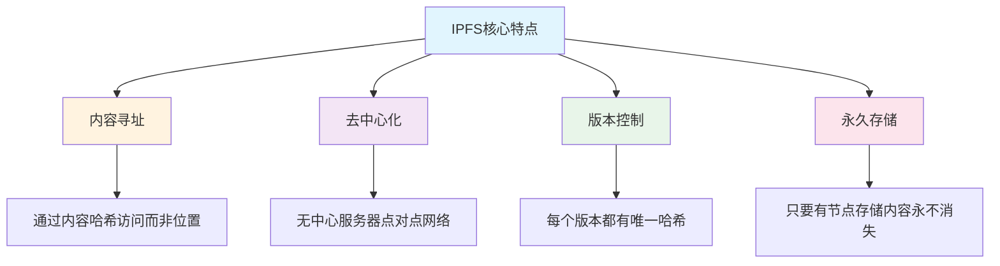
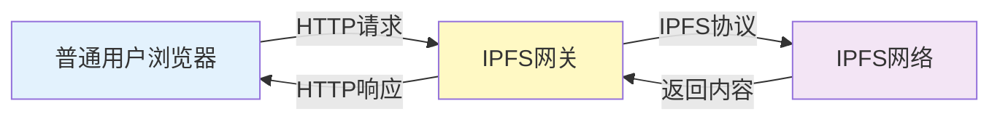
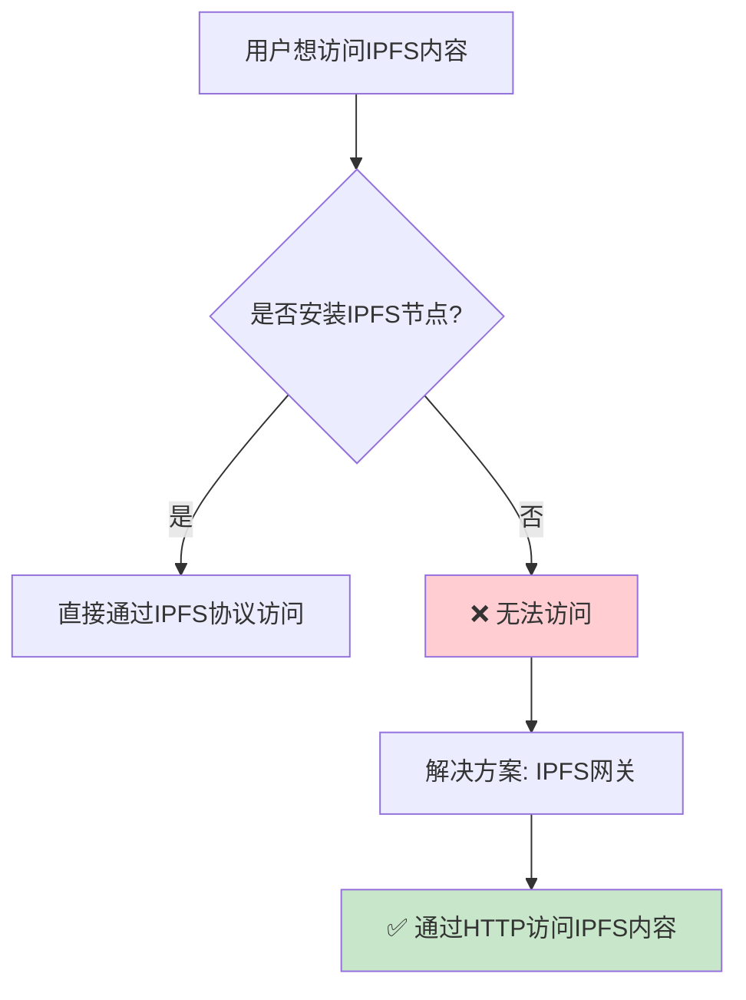
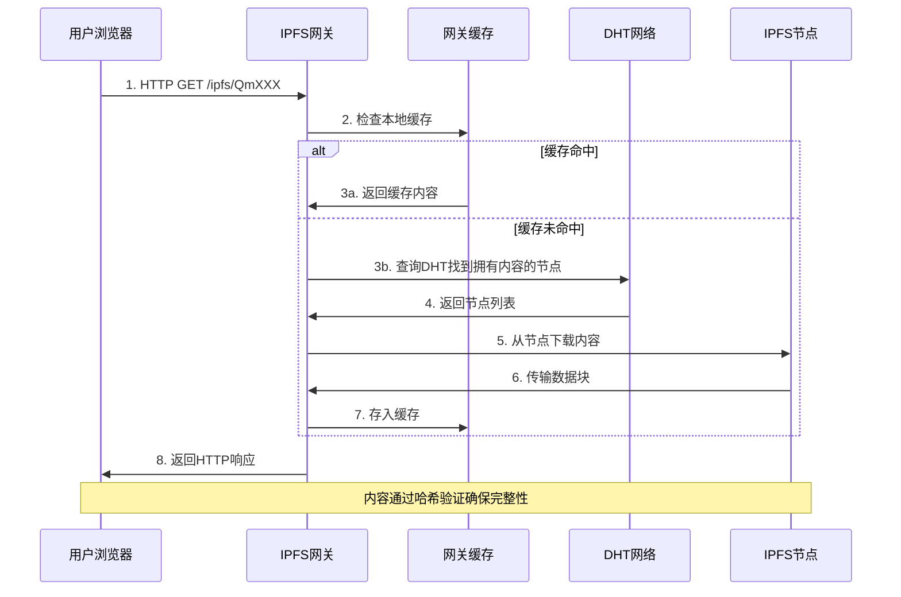
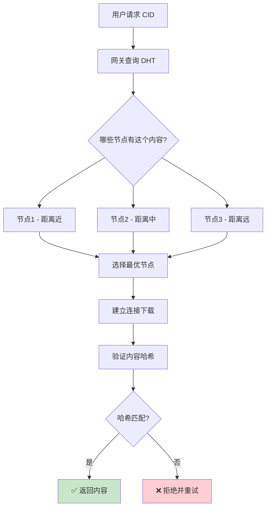
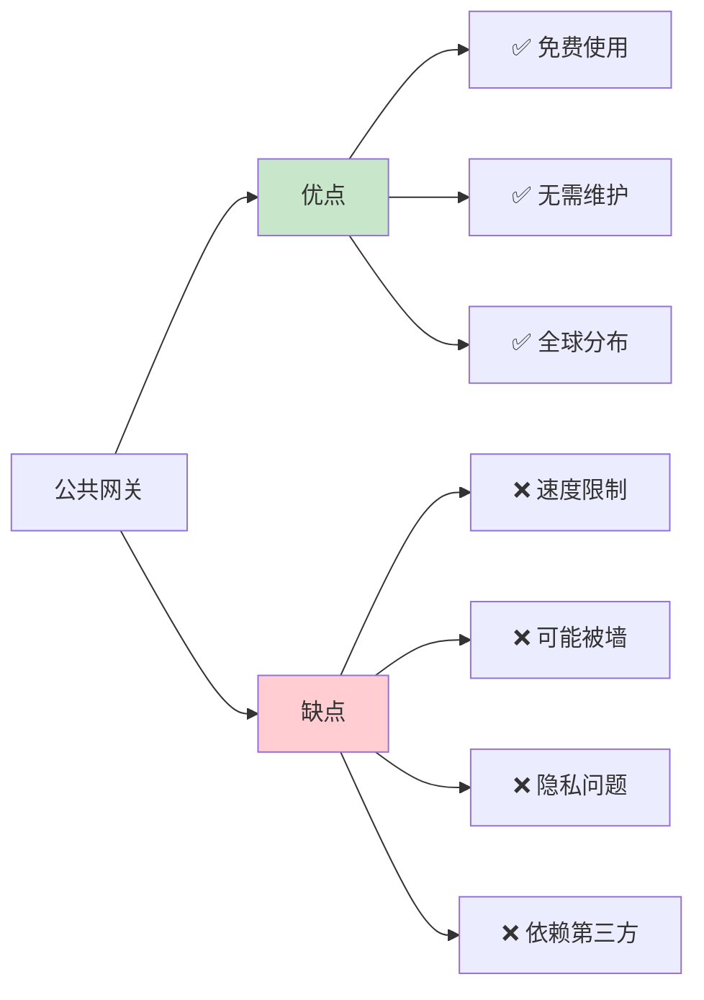
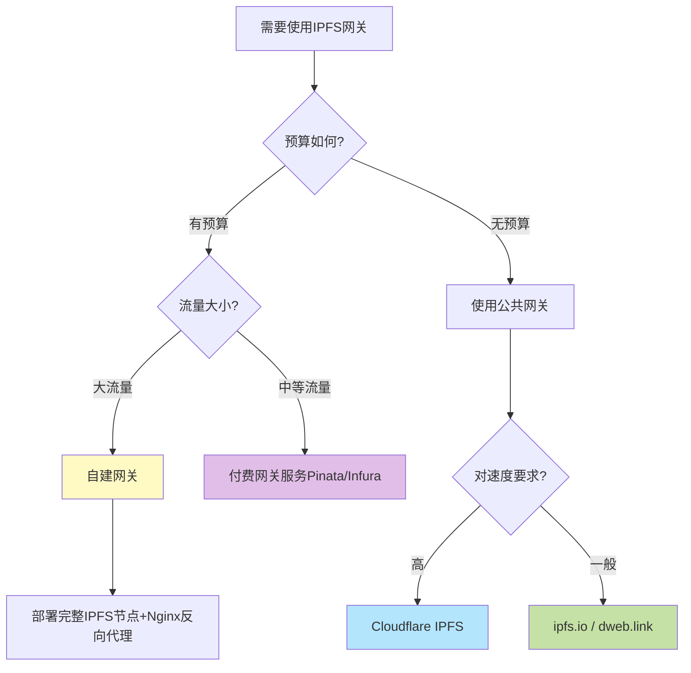
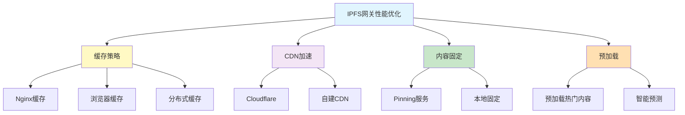
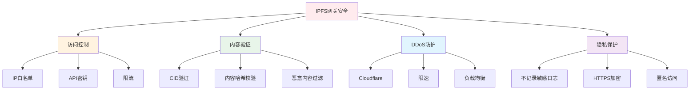
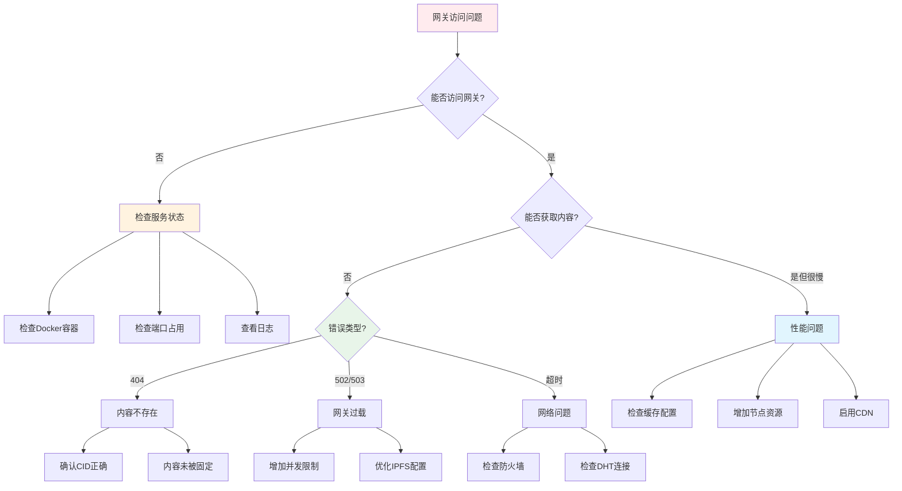

# IPFS 网关完整教程：去中心化存储的桥梁

## 目录

1. [IPFS 基础概念](#1-ipfs基础概念)
2. [什么是 IPFS 网关](#2-什么是ipfs网关)
3. [IPFS 网关的工作原理](#3-ipfs网关的工作原理)
4. [网关类型与使用场景](#4-网关类型与使用场景)
5. [实战：使用 IPFS 网关](#5-实战使用ipfs网关)
6. [搭建自己的 IPFS 网关](#6-搭建自己的ipfs网关)
7. [最佳实践与性能优化](#7-最佳实践与性能优化)

---

## 1. IPFS 基础概念

### 1.1 什么是 IPFS？

**IPFS (InterPlanetary File System)** 是一个点对点的分布式文件系统，旨在创建持久化的、去中心化的数据存储和共享网络。

#### 核心特点



### 1.2 传统 HTTP vs IPFS

| 特性       | HTTP (Web2)        | IPFS (Web3)       |
| ---------- | ------------------ | ----------------- |
| 寻址方式   | 位置寻址 (URL)     | 内容寻址 (CID)    |
| 中心化     | 中心化服务器       | 去中心化 P2P 网络 |
| 数据完整性 | 依赖服务器         | 内容哈希验证      |
| 可用性     | 服务器宕机即不可用 | 多节点备份高可用  |
| 访问速度   | 距离服务器远则慢   | 就近节点获取      |
| 审查抵抗   | 容易被审查         | 难以审查          |

### 1.3 CID (Content Identifier)

```
示例CID:
QmXoypizjW3WknFiJnKLwHCnL72vedxjQkDDP1mXWo6uco

结构解析:
┌─────────────────────────────────────────────┐
│  Qm = 多重哈希前缀 (Multihash prefix)        │
│  XoypizjW3WknFiJnKLwHCnL72vedxjQkDDP1mXWo6uco │
│  └─ 内容的加密哈希值                         │
└─────────────────────────────────────────────┘
```

---

## 2. 什么是 IPFS 网关

### 2.1 网关的定义

**IPFS 网关**是一个 HTTP 服务器，它充当**传统 Web 浏览器**和**IPFS 网络**之间的桥梁。



### 2.2 为什么需要网关？

#### 问题场景



#### 核心作用

1. **协议转换**: 将 IPFS 协议转换为 HTTP 协议
2. **降低门槛**: 普通用户无需安装 IPFS 节点
3. **兼容性**: 让现有 Web 应用能访问 IPFS 内容
4. **CDN 功能**: 提供缓存和加速服务

### 2.3 网关的访问方式

#### 方式一：路径方式（Path Gateway）

```
格式: https://gateway.ipfs.io/ipfs/[CID]
示例: https://gateway.ipfs.io/ipfs/QmXoypizjW3WknFiJnKLwHCnL72vedxjQkDDP1mXWo6uco
```

#### 方式二：子域名方式（Subdomain Gateway）

```
格式: https://[CID].ipfs.[gateway-domain]
示例: https://bafybeigdyrzt5sfp7udm7hu76uh7y26nf3efuylqabf3oclgtqy55fbzdi.ipfs.dweb.link
```

#### 方式三：本地网关

```
格式: http://localhost:8080/ipfs/[CID]
示例: http://localhost:8080/ipfs/QmXoypizjW3WknFiJnKLwHCnL72vedxjQkDDP1mXWo6uco
```

---

## 3. IPFS 网关的工作原理

### 3.1 完整请求流程



### 3.2 DHT (分布式哈希表) 查询过程



### 3.3 内容验证机制

```javascript
// 内容完整性验证流程
const verifyContent = async (cid, data) => {
  // 1. 计算下载内容的哈希
  const computedHash = await calculateHash(data);

  // 2. 从CID提取原始哈希
  const originalHash = extractHashFromCID(cid);

  // 3. 对比哈希值
  if (computedHash === originalHash) {
    return { valid: true, data };
  } else {
    throw new Error('内容已被篡改！');
  }
};
```

---

## 4. 网关类型与使用场景

### 4.1 公共网关

#### 主流公共网关列表

| 网关名称   | URL                  | 特点           | 适用场景  |
| ---------- | -------------------- | -------------- | --------- |
| IPFS.io    | ipfs.io              | 官方网关，稳定 | 开发测试  |
| Cloudflare | cloudflare-ipfs.com  | 全球 CDN 加速  | 生产环境  |
| Pinata     | gateway.pinata.cloud | 付费服务，高速 | 商业应用  |
| Infura     | infura-ipfs.io       | API 集成方便   | DApp 集成 |
| dweb.link  | dweb.link            | 支持子域名     | Web3 应用 |

#### 公共网关的优缺点



### 4.2 私有网关

#### 自建网关的优势

- **完全控制**: 自主管理，无第三方依赖
- **性能优化**: 针对业务优化缓存策略
- **隐私保护**: 内容不经过第三方
- **定制功能**: 添加认证、限流等功能

### 4.3 网关选择决策树



---

## 5. 实战：使用 IPFS 网关

### 5.1 上传文件到 IPFS

#### 方法一：使用 IPFS Desktop

```bash
# 1. 下载并安装 IPFS Desktop
# https://docs.ipfs.tech/install/ipfs-desktop/

# 2. 启动后，将文件拖入界面

# 3. 获取CID
# 例如: QmXoypizjW3WknFiJnKLwHCnL72vedxjQkDDP1mXWo6uco
```

#### 方法二：使用命令行

```bash
# 安装 IPFS CLI
brew install ipfs  # macOS
# 或访问 https://docs.ipfs.tech/install/

# 初始化IPFS节点
ipfs init

# 启动IPFS守护进程
ipfs daemon

# 上传文件
ipfs add myfile.jpg

# 输出示例:
# added QmXoypizjW3WknFiJnKLwHCnL72vedxjQkDDP1mXWo6uco myfile.jpg
```

#### 方法三：使用 Pinata（推荐用于生产）

```javascript
// 使用Pinata API上传
import axios from 'axios';
import FormData from 'form-data';
import fs from 'fs';

const uploadToPinata = async (filePath) => {
  const url = 'https://api.pinata.cloud/pinning/pinFileToIPFS';

  const data = new FormData();
  data.append('file', fs.createReadStream(filePath));

  const response = await axios.post(url, data, {
    maxBodyLength: 'Infinity',
    headers: {
      'Content-Type': `multipart/form-data; boundary=${data._boundary}`,
      pinata_api_key: 'YOUR_API_KEY',
      pinata_secret_api_key: 'YOUR_SECRET_KEY',
    },
  });

  console.log('IPFS Hash:', response.data.IpfsHash);
  return response.data.IpfsHash;
};

// 使用示例
const cid = await uploadToPinata('./image.jpg');
console.log(`访问链接: https://gateway.pinata.cloud/ipfs/${cid}`);
```

### 5.2 通过网关访问内容

#### 在浏览器中访问

```javascript
// 不同网关的访问方式
const cid = 'QmXoypizjW3WknFiJnKLwHCnL72vedxjQkDDP1mXWo6uco';

// 方式1: 官方网关
const url1 = `https://ipfs.io/ipfs/${cid}`;

// 方式2: Cloudflare网关（推荐）
const url2 = `https://cloudflare-ipfs.com/ipfs/${cid}`;

// 方式3: 子域名方式（更安全）
const url3 = `https://${cid}.ipfs.dweb.link`;

// 方式4: 本地网关（需要运行IPFS节点）
const url4 = `http://localhost:8080/ipfs/${cid}`;

console.log('访问任意链接即可查看内容');
```

#### 在 HTML 中嵌入 IPFS 内容

```html
<!DOCTYPE html>
<html>
  <head>
    <title>IPFS内容展示</title>
  </head>
  <body>
    <h1>从IPFS加载的图片</h1>

    <!-- 直接使用网关URL -->
    

    <!-- 视频 -->
    <video controls>
      <source src="https://cloudflare-ipfs.com/ipfs/QmVIDEO_CID" type="video/mp4" />
    </video>

    <!-- 音频 -->
    <audio controls>
      <source src="https://ipfs.io/ipfs/QmAUDIO_CID" type="audio/mpeg" />
    </audio>
  </body>
</html>
```

### 5.3 在 React DApp 中使用

```javascript
// components/IPFSImage.jsx
import React, { useState, useEffect } from 'react';

const IPFSImage = ({ cid, gateway = 'https://cloudflare-ipfs.com' }) => {
  const [imageUrl, setImageUrl] = useState('');
  const [loading, setLoading] = useState(true);
  const [error, setError] = useState(null);

  useEffect(() => {
    const loadImage = async () => {
      try {
        // 构建IPFS URL
        const url = `${gateway}/ipfs/${cid}`;

        // 预加载检查
        const response = await fetch(url, { method: 'HEAD' });

        if (response.ok) {
          setImageUrl(url);
        } else {
          throw new Error('内容不可用');
        }
      } catch (err) {
        setError(err.message);
      } finally {
        setLoading(false);
      }
    };

    if (cid) {
      loadImage();
    }
  }, [cid, gateway]);

  if (loading) {
    return <div className="loading">加载中...</div>;
  }

  if (error) {
    return <div className="error">加载失败: {error}</div>;
  }

  return  setError('图片加载失败')} />;
};

export default IPFSImage;
```

### 5.4 网关故障转移

```javascript
// utils/ipfsGateway.js

const GATEWAYS = [
  'https://cloudflare-ipfs.com',
  'https://ipfs.io',
  'https://gateway.pinata.cloud',
  'https://dweb.link',
];

/**
 * 尝试多个网关获取内容
 */
export const fetchFromIPFS = async (cid, maxRetries = 3) => {
  for (const gateway of GATEWAYS) {
    try {
      const url = `${gateway}/ipfs/${cid}`;

      const response = await fetch(url, {
        timeout: 5000, // 5秒超时
      });

      if (response.ok) {
        console.log(`成功从 ${gateway} 获取内容`);
        return await response.blob();
      }
    } catch (error) {
      console.warn(`网关 ${gateway} 失败:`, error.message);
      continue;
    }
  }

  throw new Error('所有网关都无法访问内容');
};

/**
 * 智能网关选择（基于速度测试）
 */
export const selectFastestGateway = async () => {
  const testCID = 'QmXoypizjW3WknFiJnKLwHCnL72vedxjQkDDP1mXWo6uco';

  const results = await Promise.allSettled(
    GATEWAYS.map(async (gateway) => {
      const start = Date.now();
      const response = await fetch(`${gateway}/ipfs/${testCID}`, {
        method: 'HEAD',
        timeout: 3000,
      });
      const latency = Date.now() - start;

      return { gateway, latency, ok: response.ok };
    }),
  );

  const successful = results
    .filter((r) => r.status === 'fulfilled' && r.value.ok)
    .map((r) => r.value)
    .sort((a, b) => a.latency - b.latency);

  return successful[0]?.gateway || GATEWAYS[0];
};

// 使用示例
const gateway = await selectFastestGateway();
console.log('最快的网关:', gateway);
```

---

## 6. 搭建自己的 IPFS 网关

### 6.1 系统要求

```
硬件要求:
- CPU: 2核或更多
- 内存: 4GB+ (建议8GB)
- 存储: 100GB+ SSD (取决于缓存需求)
- 带宽: 100Mbps+ (上下行对称更佳)

软件要求:
- 操作系统: Linux (Ubuntu 20.04+推荐)
- Docker (可选，但推荐)
- Nginx 或其他反向代理
```

### 6.2 使用 Docker 部署（推荐）

```bash
# 1. 创建工作目录
mkdir -p ~/ipfs-gateway
cd ~/ipfs-gateway

# 2. 创建 docker-compose.yml
cat > docker-compose.yml << 'EOF'
version: '3'

services:
  ipfs:
    image: ipfs/kubo:latest
    container_name: ipfs-node
    ports:
      - "4001:4001"     # P2P通信
      - "5001:5001"     # API端口
      - "8080:8080"     # 网关端口
    volumes:
      - ./ipfs-data:/data/ipfs
      - ./ipfs-staging:/export
    environment:
      - IPFS_PROFILE=server
      - IPFS_PATH=/data/ipfs
    restart: unless-stopped

  nginx:
    image: nginx:alpine
    container_name: ipfs-gateway-nginx
    ports:
      - "80:80"
      - "443:443"
    volumes:
      - ./nginx.conf:/etc/nginx/nginx.conf:ro
      - ./ssl:/etc/nginx/ssl:ro
    depends_on:
      - ipfs
    restart: unless-stopped
EOF

# 3. 启动服务
docker-compose up -d

# 4. 查看日志
docker-compose logs -f ipfs
```

### 6.3 配置 Nginx 反向代理

```nginx
# nginx.conf
events {
    worker_connections 1024;
}

http {
    # 限流配置
    limit_req_zone $binary_remote_addr zone=ipfs_limit:10m rate=10r/s;

    # 缓存配置
    proxy_cache_path /var/cache/nginx/ipfs
                     levels=1:2
                     keys_zone=ipfs_cache:100m
                     max_size=10g
                     inactive=7d;

    server {
        listen 80;
        server_name your-gateway.com;

        # 重定向到HTTPS
        return 301 https://$server_name$request_uri;
    }

    server {
        listen 443 ssl http2;
        server_name your-gateway.com;

        # SSL证书
        ssl_certificate /etc/nginx/ssl/cert.pem;
        ssl_certificate_key /etc/nginx/ssl/key.pem;

        # 限流
        limit_req zone=ipfs_limit burst=20 nodelay;

        # 日志
        access_log /var/log/nginx/ipfs-access.log;
        error_log /var/log/nginx/ipfs-error.log;

        # IPFS路径代理
        location ~ ^/ipfs/(.+)$ {
            # 缓存配置
            proxy_cache ipfs_cache;
            proxy_cache_valid 200 7d;
            proxy_cache_key "$scheme$request_method$host$request_uri";

            # 添加缓存状态头
            add_header X-Cache-Status $upstream_cache_status;

            # 代理到IPFS节点
            proxy_pass http://ipfs:8080;
            proxy_set_header Host $host;
            proxy_set_header X-Real-IP $remote_addr;

            # 超时设置
            proxy_connect_timeout 60s;
            proxy_send_timeout 60s;
            proxy_read_timeout 300s;

            # 缓冲设置
            proxy_buffering on;
            proxy_buffer_size 4k;
            proxy_buffers 8 4k;
        }

        # IPNS路径代理
        location ~ ^/ipns/(.+)$ {
            proxy_pass http://ipfs:8080;
            proxy_set_header Host $host;
        }

        # 健康检查
        location /health {
            access_log off;
            return 200 "OK";
        }
    }
}
```

### 6.4 优化 IPFS 节点配置

```bash
# 进入IPFS容器
docker exec -it ipfs-node sh

# 修改配置
ipfs config show > config.json

# 编辑配置
vi config.json

# 关键配置项:
{
  "Addresses": {
    "Gateway": "/ip4/0.0.0.0/tcp/8080",
    "API": "/ip4/0.0.0.0/tcp/5001"
  },
  "Gateway": {
    "HTTPHeaders": {
      "Access-Control-Allow-Origin": ["*"],
      "Access-Control-Allow-Methods": ["GET"],
      "Access-Control-Allow-Headers": ["Range"]
    },
    "RootRedirect": "",
    "Writable": false,
    "PathPrefixes": [],
    "NoFetch": false
  },
  "Datastore": {
    "StorageMax": "100GB",
    "GCPeriod": "1h"
  },
  "Swarm": {
    "ConnMgr": {
      "HighWater": 900,
      "LowWater": 600
    }
  }
}

# 应用配置
ipfs config replace config.json

# 重启节点
docker-compose restart ipfs
```

### 6.5 添加监控

```yaml
# 添加到 docker-compose.yml
services:
  prometheus:
    image: prom/prometheus
    ports:
      - '9090:9090'
    volumes:
      - ./prometheus.yml:/etc/prometheus/prometheus.yml
    restart: unless-stopped

  grafana:
    image: grafana/grafana
    ports:
      - '3000:3000'
    environment:
      - GF_SECURITY_ADMIN_PASSWORD=admin
    volumes:
      - grafana-data:/var/lib/grafana
    restart: unless-stopped

volumes:
  grafana-data:
```

```yaml
# prometheus.yml
global:
  scrape_interval: 15s

scrape_configs:
  - job_name: 'ipfs'
    static_configs:
      - targets: ['ipfs:5001']
    metrics_path: '/debug/metrics/prometheus'
```

---

## 7. 最佳实践与性能优化

### 7.1 性能优化策略



### 7.2 缓存策略实现

```javascript
// 前端缓存管理
class IPFSCache {
  constructor() {
    this.cache = new Map();
    this.maxSize = 50; // 最多缓存50个项目
  }

  async get(cid, gateway) {
    // 检查内存缓存
    if (this.cache.has(cid)) {
      console.log('从内存缓存获取:', cid);
      return this.cache.get(cid);
    }

    // 检查IndexedDB缓存
    const cached = await this.getFromIndexedDB(cid);
    if (cached) {
      console.log('从IndexedDB获取:', cid);
      this.cache.set(cid, cached);
      return cached;
    }

    // 从网关获取
    const url = `${gateway}/ipfs/${cid}`;
    const response = await fetch(url);
    const blob = await response.blob();

    // 保存到缓存
    this.set(cid, blob);

    return blob;
  }

  set(cid, data) {
    // LRU淘汰策略
    if (this.cache.size >= this.maxSize) {
      const firstKey = this.cache.keys().next().value;
      this.cache.delete(firstKey);
    }

    this.cache.set(cid, data);
    this.saveToIndexedDB(cid, data);
  }

  async getFromIndexedDB(cid) {
    return new Promise((resolve) => {
      const request = indexedDB.open('IPFSCache', 1);

      request.onsuccess = (event) => {
      const db = event.target.result;
      const transaction = db.transaction(['cache'], 'readwrite');
      const store = transaction.objectStore('cache');

      store.put({
        cid,
        data,
        timestamp: Date.now()
      });
    };
  }

  clear() {
    this.cache.clear();
    indexedDB.deleteDatabase('IPFSCache');
  }
}

// 使用示例
const ipfsCache = new IPFSCache();
const blob = await ipfsCache.get(cid, 'https://cloudflare-ipfs.com');
```

### 7.3 内容固定（Pinning）

```javascript
// utils/pinning.js

/**
 * 固定内容到IPFS节点
 */
export const pinContent = async (cid) => {
  try {
    const response = await fetch(`http://localhost:5001/api/v0/pin/add?arg=${cid}`, {
      method: 'POST',
    });

    const result = await response.json();
    console.log('固定成功:', result);
    return result;
  } catch (error) {
    console.error('固定失败:', error);
    throw error;
  }
};

/**
 * 取消固定
 */
export const unpinContent = async (cid) => {
  try {
    const response = await fetch(`http://localhost:5001/api/v0/pin/rm?arg=${cid}`, {
      method: 'POST',
    });

    const result = await response.json();
    console.log('取消固定成功:', result);
    return result;
  } catch (error) {
    console.error('取消固定失败:', error);
    throw error;
  }
};

/**
 * 列出所有固定的内容
 */
export const listPinnedContent = async () => {
  try {
    const response = await fetch('http://localhost:5001/api/v0/pin/ls', {
      method: 'POST',
    });

    const result = await response.json();
    return result.Keys;
  } catch (error) {
    console.error('获取固定列表失败:', error);
    throw error;
  }
};

/**
 * 使用Pinata进行远程固定
 */
export const pinToPinata = async (cid, name) => {
  const url = 'https://api.pinata.cloud/pinning/pinByHash';

  const body = {
    hashToPin: cid,
    pinataMetadata: {
      name: name,
    },
  };

  try {
    const response = await fetch(url, {
      method: 'POST',
      headers: {
        'Content-Type': 'application/json',
        pinata_api_key: process.env.PINATA_API_KEY,
        pinata_secret_api_key: process.env.PINATA_SECRET_KEY,
      },
      body: JSON.stringify(body),
    });

    const result = await response.json();
    console.log('Pinata固定成功:', result);
    return result;
  } catch (error) {
    console.error('Pinata固定失败:', error);
    throw error;
  }
};
```

### 7.4 批量上传和管理

```javascript
// utils/batchUpload.js

/**
 * 批量上传文件到IPFS
 */
export const batchUpload = async (files, onProgress) => {
  const results = [];

  for (let i = 0; i < files.length; i++) {
    const file = files[i];

    try {
      // 上传单个文件
      const formData = new FormData();
      formData.append('file', file);

      const response = await fetch('http://localhost:5001/api/v0/add', {
        method: 'POST',
        body: formData,
      });

      const result = await response.json();
      results.push({
        name: file.name,
        cid: result.Hash,
        size: result.Size,
        success: true,
      });

      // 进度回调
      if (onProgress) {
        onProgress(i + 1, files.length);
      }
    } catch (error) {
      results.push({
        name: file.name,
        error: error.message,
        success: false,
      });
    }
  }

  return results;
};

/**
 * 创建IPFS目录结构
 */
export const createDirectory = async (files) => {
  const formData = new FormData();

  files.forEach((file) => {
    formData.append('file', file, file.webkitRelativePath || file.name);
  });

  try {
    const response = await fetch('http://localhost:5001/api/v0/add?wrap-with-directory=true', {
      method: 'POST',
      body: formData,
    });

    const text = await response.text();
    const lines = text.trim().split('\n');
    const lastLine = JSON.parse(lines[lines.length - 1]);

    return {
      directoryCID: lastLine.Hash,
      files: lines.slice(0, -1).map((line) => JSON.parse(line)),
    };
  } catch (error) {
    console.error('创建目录失败:', error);
    throw error;
  }
};

// React组件示例
import React, { useState } from 'react';

const BatchUploader = () => {
  const [files, setFiles] = useState([]);
  const [uploading, setUploading] = useState(false);
  const [results, setResults] = useState([]);
  const [progress, setProgress] = useState(0);

  const handleFileChange = (e) => {
    setFiles(Array.from(e.target.files));
  };

  const handleUpload = async () => {
    setUploading(true);
    setProgress(0);

    const uploadResults = await batchUpload(files, (current, total) => {
      setProgress(Math.round((current / total) * 100));
    });

    setResults(uploadResults);
    setUploading(false);
  };

  return (
    <div className="batch-uploader">
      <h2>批量上传到IPFS</h2>

      <input type="file" multiple onChange={handleFileChange} disabled={uploading} />

      <button onClick={handleUpload} disabled={uploading || files.length === 0}>
        {uploading ? `上传中... ${progress}%` : '开始上传'}
      </button>

      {results.length > 0 && (
        <div className="results">
          <h3>上传结果</h3>
          <ul>
            {results.map((result, index) => (
              <li key={index} className={result.success ? 'success' : 'error'}>
                <strong>{result.name}</strong>
                {result.success ? (
                  <>
                    <br />
                    CID: <code>{result.cid}</code>
                    <br />
                    <a
                      href={`https://ipfs.io/ipfs/${result.cid}`}
                      target="_blank"
                      rel="noopener noreferrer"
                    >
                      在IPFS上查看
                    </a>
                  </>
                ) : (
                  <span className="error-msg">失败: {result.error}</span>
                )}
              </li>
            ))}
          </ul>
        </div>
      )}
    </div>
  );
};

export default BatchUploader;
```

### 7.5 安全最佳实践



#### 安全配置示例

```javascript
// middleware/security.js

/**
 * 访问控制中间件
 */
export const accessControl = (req, res, next) => {
  // IP白名单
  const whitelist = process.env.IP_WHITELIST?.split(',') || [];

  if (whitelist.length > 0 && !whitelist.includes(req.ip)) {
    return res.status(403).json({ error: '访问被拒绝' });
  }

  // API密钥验证
  const apiKey = req.headers['x-api-key'];
  if (process.env.REQUIRE_API_KEY && apiKey !== process.env.API_KEY) {
    return res.status(401).json({ error: '未授权' });
  }

  next();
};

/**
 * 速率限制
 */
import rateLimit from 'express-rate-limit';

export const limiter = rateLimit({
  windowMs: 15 * 60 * 1000, // 15分钟
  max: 100, // 限制100个请求
  message: '请求过于频繁，请稍后再试',
  standardHeaders: true,
  legacyHeaders: false,
});

/**
 * CID验证
 */
export const validateCID = (cid) => {
  // 基础格式验证
  const cidRegex =
    /^(Qm[1-9A-HJ-NP-Za-km-z]{44}|b[A-Za-z2-7]{58}|B[A-Z2-7]{58}|z[1-9A-HJ-NP-Za-km-z]{48}|F[0-9A-F]{50})$/;

  if (!cidRegex.test(cid)) {
    throw new Error('无效的CID格式');
  }

  return true;
};

/**
 * 内容类型白名单
 */
export const contentTypeFilter = (req, res, next) => {
  const allowedTypes = [
    'image/jpeg',
    'image/png',
    'image/gif',
    'image/webp',
    'video/mp4',
    'audio/mpeg',
    'application/json',
    'text/plain',
  ];

  // 在代理响应时检查
  const originalSend = res.send;
  res.send = function (data) {
    const contentType = res.get('Content-Type');

    if (contentType && !allowedTypes.some((type) => contentType.includes(type))) {
      return res.status(415).json({ error: '不支持的内容类型' });
    }

    originalSend.call(this, data);
  };

  next();
};

// Express应用示例
import express from 'express';
import { createProxyMiddleware } from 'http-proxy-middleware';

const app = express();

// 应用安全中间件
app.use(accessControl);
app.use('/ipfs', limiter);
app.use('/ipfs', contentTypeFilter);

// IPFS代理
app.use(
  '/ipfs',
  createProxyMiddleware({
    target: 'http://localhost:8080',
    changeOrigin: true,
    onProxyReq: (proxyReq, req, res) => {
      // 验证CID
      const cid = req.path.split('/')[2];
      try {
        validateCID(cid);
      } catch (error) {
        res.status(400).json({ error: error.message });
      }
    },
  }),
);

app.listen(3000, () => {
  console.log('安全的IPFS网关运行在端口3000');
});
```

### 7.6 监控和日志

```javascript
// utils/monitoring.js

/**
 * 网关性能监控
 */
export class GatewayMonitor {
  constructor() {
    this.metrics = {
      requests: 0,
      errors: 0,
      cacheHits: 0,
      cacheMisses: 0,
      totalLatency: 0,
      requestsByType: {},
    };
  }

  recordRequest(path, latency, cached = false, error = false) {
    this.metrics.requests++;
    this.metrics.totalLatency += latency;

    if (error) {
      this.metrics.errors++;
    }

    if (cached) {
      this.metrics.cacheHits++;
    } else {
      this.metrics.cacheMisses++;
    }

    // 记录内容类型
    const type = this.getContentType(path);
    this.metrics.requestsByType[type] = (this.metrics.requestsByType[type] || 0) + 1;
  }

  getContentType(path) {
    const ext = path.split('.').pop();
    const typeMap = {
      jpg: 'image',
      png: 'image',
      gif: 'image',
      mp4: 'video',
      mp3: 'audio',
      json: 'json',
      html: 'html',
    };
    return typeMap[ext] || 'other';
  }

  getStats() {
    const avgLatency =
      this.metrics.requests > 0 ? this.metrics.totalLatency / this.metrics.requests : 0;

    const cacheHitRate =
      this.metrics.requests > 0
        ? ((this.metrics.cacheHits / this.metrics.requests) * 100).toFixed(2)
        : 0;

    return {
      ...this.metrics,
      avgLatency: avgLatency.toFixed(2),
      cacheHitRate: `${cacheHitRate}%`,
      errorRate: `${((this.metrics.errors / this.metrics.requests) * 100).toFixed(2)}%`,
    };
  }

  reset() {
    this.metrics = {
      requests: 0,
      errors: 0,
      cacheHits: 0,
      cacheMisses: 0,
      totalLatency: 0,
      requestsByType: {},
    };
  }
}

// Express中间件
export const monitoringMiddleware = (monitor) => {
  return (req, res, next) => {
    const startTime = Date.now();

    // 监听响应完成
    res.on('finish', () => {
      const latency = Date.now() - startTime;
      const cached = res.get('X-Cache-Status') === 'HIT';
      const error = res.statusCode >= 400;

      monitor.recordRequest(req.path, latency, cached, error);
    });

    next();
  };
};

// 使用示例
const monitor = new GatewayMonitor();
app.use(monitoringMiddleware(monitor));

// 统计端点
app.get('/stats', (req, res) => {
  res.json(monitor.getStats());
});
```

### 7.7 故障排查指南



#### 常见问题解决

```bash
# 问题1: IPFS节点无法启动
# 解决方案
docker-compose logs ipfs  # 查看日志
docker-compose down       # 停止服务
rm -rf ./ipfs-data/*      # 清除数据（谨慎操作）
docker-compose up -d      # 重新启动

# 问题2: 内容访问速度慢
# 检查连接的对等节点数量
docker exec ipfs-node ipfs swarm peers | wc -l

# 手动连接到引导节点
docker exec ipfs-node ipfs bootstrap add /dnsaddr/bootstrap.libp2p.io/p2p/QmNnooDu7bfjPFoTZYxMNLWUQJyrVwtbZg5gBMjTezGAJN

# 问题3: 内容无法获取
# 尝试手动获取
docker exec ipfs-node ipfs get QmXXX -o /tmp/test

# 检查是否能解析CID
docker exec ipfs-node ipfs resolve /ipfs/QmXXX

# 问题4: 磁盘空间不足
# 运行垃圾回收
docker exec ipfs-node ipfs repo gc

# 查看存储使用情况
docker exec ipfs-node ipfs repo stat

# 问题5: 网络端口被占用
# 查看端口使用
netstat -tlnp | grep 8080

# 修改端口映射
# 编辑 docker-compose.yml
ports:
  - "8081:8080"  # 改用8081端口
```

---

## 8. Web3 应用集成案例

### 8.1 NFT 市场中的 IPFS 网关使用

```javascript
// NFT元数据和图片存储示例
import { NFTStorage, File } from 'nft.storage';

/**
 * NFT市场中上传图片和元数据到IPFS
 */
export class NFTIPFSManager {
  constructor(apiKey) {
    this.client = new NFTStorage({ token: apiKey });
  }

  /**
   * 上传NFT（图片+元数据）
   */
  async uploadNFT(imageFile, metadata) {
    try {
      // 准备元数据
      const nftMetadata = {
        name: metadata.name,
        description: metadata.description,
        image: imageFile,
        attributes: metadata.attributes || [],
      };

      // 上传到IPFS
      const result = await this.client.store(nftMetadata);

      console.log('NFT上传成功!');
      console.log('元数据CID:', result.url);
      console.log('图片CID:', result.data.image.href);

      return {
        metadataURI: result.url,
        imageCID: result.data.image.href.replace('ipfs://', ''),
        metadata: result.data,
      };
    } catch (error) {
      console.error('上传NFT失败:', error);
      throw error;
    }
  }

  /**
   * 获取网关URL
   */
  getGatewayURL(cid, gateway = 'https://nftstorage.link') {
    return `${gateway}/ipfs/${cid}`;
  }

  /**
   * 批量上传NFT集合
   */
  async uploadCollection(nftDataArray, onProgress) {
    const results = [];

    for (let i = 0; i < nftDataArray.length; i++) {
      const { imageFile, metadata } = nftDataArray[i];

      try {
        const result = await this.uploadNFT(imageFile, metadata);
        results.push({
          success: true,
          tokenId: i + 1,
          ...result,
        });
      } catch (error) {
        results.push({
          success: false,
          tokenId: i + 1,
          error: error.message,
        });
      }

      if (onProgress) {
        onProgress(i + 1, nftDataArray.length);
      }
    }

    return results;
  }
}

// React组件示例
import React, { useState } from 'react';
import { ethers } from 'ethers';

const NFTMinter = () => {
  const [file, setFile] = useState(null);
  const [metadata, setMetadata] = useState({
    name: '',
    description: '',
    attributes: [],
  });
  const [minting, setMinting] = useState(false);
  const [nftURI, setNftURI] = useState('');

  const manager = new NFTIPFSManager(process.env.NFT_STORAGE_API_KEY);

  const handleMint = async () => {
    if (!file || !metadata.name) {
      alert('请填写完整信息');
      return;
    }

    try {
      setMinting(true);

      // 1. 上传到IPFS
      const { metadataURI, imageCID } = await manager.uploadNFT(file, metadata);
      setNftURI(metadataURI);

      // 2. 铸造NFT（调用智能合约）
      const provider = new ethers.BrowserProvider(window.ethereum);
      const signer = await provider.getSigner();

      const contractAddress = 'YOUR_NFT_CONTRACT_ADDRESS';
      const abi = ['function mint(address to, string uri) returns (uint256)'];
      const contract = new ethers.Contract(contractAddress, abi, signer);

      const tx = await contract.mint(await signer.getAddress(), metadataURI);
      await tx.wait();

      alert('NFT铸造成功!');

      // 显示预览
      const imageURL = manager.getGatewayURL(imageCID);
      console.log('NFT图片:', imageURL);
    } catch (error) {
      alert('铸造失败: ' + error.message);
    } finally {
      setMinting(false);
    }
  };

  return (
    <div className="nft-minter">
      <h2>铸造NFT</h2>

      <div className="form-group">
        <label>上传图片</label>
        <input type="file" accept="image/*" onChange={(e) => setFile(e.target.files[0])} />
      </div>

      <div className="form-group">
        <label>名称</label>
        <input
          type="text"
          value={metadata.name}
          onChange={(e) => setMetadata({ ...metadata, name: e.target.value })}
        />
      </div>

      <div className="form-group">
        <label>描述</label>
        <textarea
          value={metadata.description}
          onChange={(e) => setMetadata({ ...metadata, description: e.target.value })}
        />
      </div>

      <button onClick={handleMint} disabled={minting}>
        {minting ? '铸造中...' : '铸造NFT'}
      </button>

      {nftURI && (
        <div className="result">
          <h3>铸造成功!</h3>
          <p>
            元数据URI: <code>{nftURI}</code>
          </p>
        </div>
      )}
    </div>
  );
};

export default NFTMinter;
```

### 8.2 去中心化网站托管

```javascript
/**
 * 将整个网站上传到IPFS
 */
export const deployWebsiteToIPFS = async (buildDirectory) => {
  const ipfs = require('ipfs-http-client');
  const glob = require('glob');
  const fs = require('fs').promises;
  const path = require('path');

  // 连接到本地IPFS节点
  const client = ipfs.create({ url: 'http://localhost:5001' });

  try {
    // 获取所有文件
    const files = glob.sync(`${buildDirectory}/**/*`, { nodir: true });

    // 准备上传
    const filesToAdd = [];

    for (const file of files) {
      const content = await fs.readFile(file);
      const relativePath = path.relative(buildDirectory, file);

      filesToAdd.push({
        path: relativePath,
        content: content
      });
    }

    // 上传整个目录
    const results = [];
    for await (const result of client.addAll(filesToAdd, { wrapWithDirectory: true })) {
      results.push(result);
    }

    // 获取根目录CID
    const rootCID = results[results.length - 1].cid.toString();

    console.log('网站部署成功!');
    console.log('根CID:', rootCID);
    console.log('访问地址:', `https://ipfs.io/ipfs/${rootCID}`);
    console.log('去中心化域名:', `${rootCID}.ipfs.dweb.link`);

    return {
      cid: rootCID,
      urls: {
        ipfs: `https://ipfs.io/ipfs/${rootCID}`,
        dweb: `https://${rootCID}.ipfs.dweb.link`,
        cloudflare: `https://cloudflare-ipfs.com/ipfs/${rootCID}`
      },
      files: results.length - 1
    };
  } catch (error) {
    console.error('部署失败:', error);
    throw error;
  }
};

// 命令行工具
#!/usr/bin/env node
const deployWebsiteToIPFS = require('./deploy');

const buildDir = process.argv[2] || './build';

console.log(`正在部署 ${buildDir} 到IPFS...`);

deployWebsiteToIPFS(buildDir)
  .then(result => {
    console.log('\n部署完成! 🎉\n');
    console.log('CID:', result.cid);
    console.log('\n访问链接:');
    Object.entries(result.urls).forEach(([name, url]) => {
      console.log(`  ${name}: ${url}`);
    });
    console.log(`\n共上传 ${result.files} 个文件`);
  })
  .catch(error => {
    console.error('部署失败:', error);
    process.exit(1);
  });
```

---

## 9. 进阶话题

### 9.1 IPNS (InterPlanetary Name System)

IPNS 允许你创建可变的指针指向 IPFS 内容，解决内容更新问题。

```bash
# 创建IPNS名称
ipfs name publish QmXXX

# 输出类似:
# Published to k51qzi5uqu5dlvj2baxnqndepeb86cbk3ng7n3i46uzyxzyqj2xjonzllnv0v8: /ipfs/QmXXX

# 通过IPNS访问
https://ipfs.io/ipns/k51qzi5uqu5dlvj2baxnqndepeb86cbk3ng7n3i46uzyxzyqj2xjonzllnv0v8

# 更新内容
ipfs name publish QmYYY  # 指向新的CID

# 使用DNSLink绑定域名
# 添加DNS TXT记录:
# _dnslink.yourdomain.com  TXT  "dnslink=/ipfs/QmXXX"

# 访问方式
https://ipfs.io/ipns/yourdomain.com
```

### 9.2 自定义域名绑定

```nginx
# Nginx配置绑定自定义域名到IPFS内容
server {
    listen 80;
    server_name myapp.com www.myapp.com;

    # 重定向到IPFS网关
    location / {
        # 方式1: 代理到固定CID（需要手动更新）
        proxy_pass http://localhost:8080/ipfs/QmYourLatestCID;

        # 方式2: 使用IPNS（自动更新）
        # proxy_pass http://localhost:8080/ipns/k51qzi5uqu5dlvj...;

        proxy_set_header Host $host;
        proxy_set_header X-Real-IP $remote_addr;

        # 缓存设置
        proxy_cache_valid 200 7d;
        add_header X-Cache-Status $upstream_cache_status;
    }
}
```

### 9.3 性能基准测试

```javascript
// 网关性能测试工具
export class GatewayBenchmark {
  constructor(gateways, testCID) {
    this.gateways = gateways;
    this.testCID = testCID;
  }

  async testGateway(gateway) {
    const url = `${gateway}/ipfs/${this.testCID}`;
    const start = Date.now();

    try {
      const response = await fetch(url, {
        method: 'HEAD',
        signal: AbortSignal.timeout(10000) // 10秒超时
      });

      const latency = Date.now() - start;

      return {
        gateway,
        success: response.ok,
        latency,  const db = event.target.result;
        const transaction = db.transaction(['cache'], 'readonly');
        const store = transaction.objectStore('cache');
        const getRequest = store.get(cid);

        getRequest.onsuccess = () => {
          resolve(getRequest.result?.data);
        };

        getRequest.onerror = () => resolve(null);
      };
    });
  }

  async saveToIndexedDB(cid, data) {
    const request = indexedDB.open('IPFSCache', 1);

    request.onupgradeneeded = (event) => {
      const db = event.target.result;
      if (!db.objectStoreNames.contains('cache')) {
        db.createObjectStore('cache', { keyPath: 'cid' });
      }
    };

    request.onsuccess = (event) => {

```
