# MetaMask 完整使用教程：Web3 世界的入口

## 目录

1. [什么是 MetaMask](#1-什么是metamask)
2. [安装和设置](#2-安装和设置)
3. [核心功能详解](#3-核心功能详解)
4. [安全最佳实践](#4-安全最佳实践)
5. [进阶操作](#5-进阶操作)
6. [开发者集成](#6-开发者集成)
7. [常见问题排查](#7-常见问题排查)

---

## 1. 什么是 MetaMask

### 1.1 MetaMask 简介

**MetaMask** 是最流行的以太坊和 EVM 兼容链的浏览器扩展钱包，同时也提供移动端应用。它是用户进入 Web3 世界的"桥梁"。

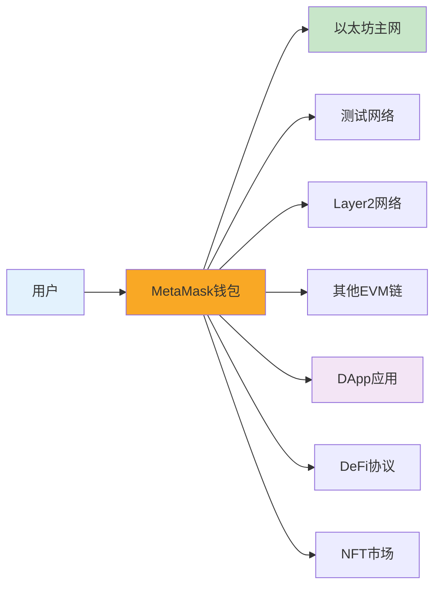

### 1.2 核心功能

| 功能分类      | 具体功能       | 说明                     |
| ------------- | -------------- | ------------------------ |
| **钱包管理**  | 创建/导入钱包  | 生成助记词或导入现有钱包 |
|               | 多账户管理     | 一个钱包可创建多个账户   |
|               | 硬件钱包连接   | 支持 Ledger、Trezor 等   |
| **资产管理**  | 查看余额       | ETH 和代币余额           |
|               | 发送/接收      | 转账功能                 |
|               | 添加代币       | 自定义代币显示           |
| **网络管理**  | 网络切换       | 主网、测试网、Layer2     |
|               | 添加自定义网络 | RPC 配置                 |
| **DApp 交互** | 连接 DApp      | 授权 DApp 访问           |
|               | 交易签名       | 确认智能合约交互         |
|               | 消息签名       | 身份验证                 |

### 1.3 MetaMask 架构

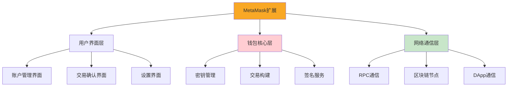

---

## 2. 安装和设置

### 2.1 安装 MetaMask

#### 浏览器扩展安装

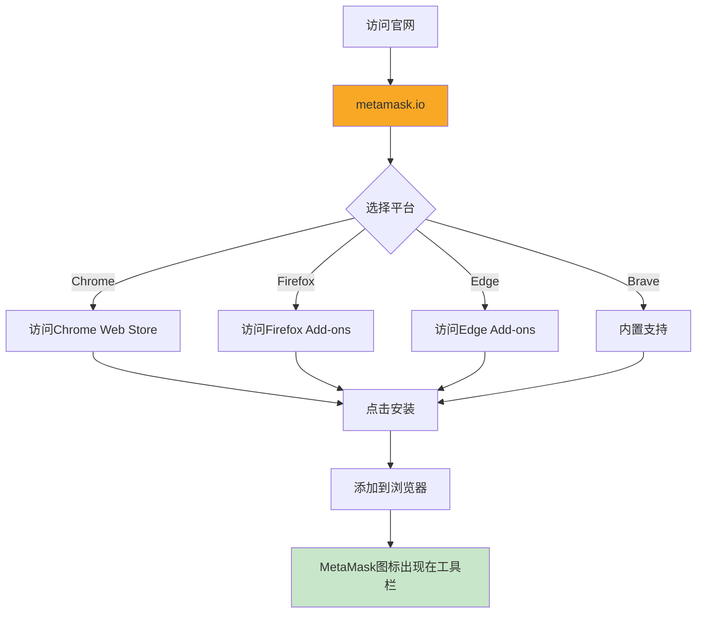

**安装步骤**：

1. 访问官方网站：https://metamask.io
2. 点击 "Download" 按钮
3. 选择你的浏览器（Chrome、Firefox、Brave、Edge）
4. 点击 "Add to Browser"（添加到浏览器）
5. 确认安装权限
6. 安装完成后，工具栏会出现狐狸图标 🦊

#### 移动端安装

- **iOS**: 访问 App Store 搜索 "MetaMask"
- **Android**: 访问 Google Play 搜索 "MetaMask"

⚠️ 确保已备份助记词！

// 方法 3：清除浏览器数据

- 仅在其他方法无效时使用
- 会清除所有本地数据
- 必须重新导入钱包

````

### 7.4 常见错误代码

```javascript
// MetaMask错误代码说明

// 4001: 用户拒绝请求
{
  code: 4001,
  message: "User rejected the request"
}
解决方案: 用户需要在MetaMask弹窗中确认操作

// 4100: 未授权
{
  code: 4100,
  message: "The requested method is not authorized"
}
解决方案: 需要先连接钱包

// 4200: 不支持的方法
{
  code: 4200,
  message: "The requested method is not supported"
}
解决方案: 检查方法名是否正确

// 4900: 未连接
{
  code: 4900,
  message: "The provider is disconnected"
}
解决方案: 检查网络连接，重新连接MetaMask

// 4901: 链未连接
{
  code: 4901,
  message: "The provider is not connected to the requested chain"
}
解决方案: 切换到正确的网络

// -32002: 请求待处理
{
  code: -32002,
  message: "Request is already pending"
}
解决方案: 等待用户处理之前的请求

// -32603: 内部错误
{
  code: -32603,
  message: "Internal JSON-RPC error"
}
解决方案: 检查参数格式，查看详细错误信息

// 错误处理示例
const handleMetaMaskError = (error) => {
  switch(error.code) {
    case 4001:
      return '您取消了操作';
    case 4100:
      return '请先连接钱包';
    case 4200:
      return '不支持的操作';
    case 4900:
      return '网络连接已断开';
    case 4901:
      return '请切换到正确的网络';
    case -32002:
      return '请在MetaMask中完成待处理的操作';
    case -32603:
      return '内部错误: ' + error.message;
    default:
      return '发生错误: ' + error.message;
  }
};

// 使用示例
try {
  await ethereum.request({ method: 'eth_requestAccounts' });
} catch (error) {
  const userMessage = handleMetaMaskError(error);
  alert(userMessage);
}
````

---

## 8. 进阶技巧

### 8.1 批量操作

```javascript
// 批量发送交易
const batchTransactions = async (transactions) => {
  const results = [];

  for (const tx of transactions) {
    try {
      const hash = await sendTransaction(tx.to, tx.amount);
      results.push({
        success: true,
        hash,
        to: tx.to,
      });

      // 等待一小段时间，避免nonce冲突
      await new Promise((resolve) => setTimeout(resolve, 1000));
    } catch (error) {
      results.push({
        success: false,
        error: error.message,
        to: tx.to,
      });
    }
  }

  return results;
};

// 使用示例
const transactions = [
  { to: '0xAddress1...', amount: '0.1' },
  { to: '0xAddress2...', amount: '0.2' },
  { to: '0xAddress3...', amount: '0.15' },
];

const results = await batchTransactions(transactions);
console.log('批量发送结果:', results);
```

### 8.2 Gas 优化技巧

```javascript
// 1. 预估Gas使用量
const estimateGas = async (transaction) => {
  try {
    const gasEstimate = await window.ethereum.request({
      method: 'eth_estimateGas',
      params: [transaction],
    });

    const gasLimit = parseInt(gasEstimate, 16);
    console.log('预估Gas:', gasLimit);

    // 添加20%缓冲
    return Math.ceil(gasLimit * 1.2);
  } catch (error) {
    console.error('Gas估算失败:', error);
    throw error;
  }
};

// 2. 获取当前Gas价格
const getGasPrice = async () => {
  const gasPrice = await window.ethereum.request({
    method: 'eth_gasPrice',
  });

  const gwei = parseInt(gasPrice, 16) / 1e9;
  console.log('当前Gas价格:', gwei, 'Gwei');
  return gwei;
};

// 3. 智能Gas策略
const smartGasStrategy = async () => {
  const currentGasPrice = await getGasPrice();

  // 根据当前网络状况选择策略
  if (currentGasPrice < 20) {
    return {
      strategy: 'low',
      maxFeePerGas: currentGasPrice * 1.1,
      maxPriorityFeePerGas: 1,
    };
  } else if (currentGasPrice < 50) {
    return {
      strategy: 'medium',
      maxFeePerGas: currentGasPrice * 1.2,
      maxPriorityFeePerGas: 2,
    };
  } else {
    return {
      strategy: 'high',
      maxFeePerGas: currentGasPrice * 1.5,
      maxPriorityFeePerGas: 5,
    };
  }
};

// 4. 在低Gas时段发送交易
const sendWhenGasIsLow = async (transaction, maxGasPrice = 30) => {
  const checkInterval = 60000; // 每分钟检查一次

  return new Promise((resolve, reject) => {
    const interval = setInterval(async () => {
      const currentGas = await getGasPrice();

      if (currentGas <= maxGasPrice) {
        clearInterval(interval);
        try {
          const result = await sendTransaction(transaction.to, transaction.amount);
          resolve(result);
        } catch (error) {
          reject(error);
        }
      } else {
        console.log(`等待Gas降低... 当前: ${currentGas} Gwei`);
      }
    }, checkInterval);
  });
};
```

### 8.3 多钱包管理

```javascript
// 切换账户
const switchAccount = async (accountIndex) => {
  try {
    // MetaMask会弹窗让用户选择账户
    const accounts = await window.ethereum.request({
      method: 'wallet_requestPermissions',
      params: [
        {
          eth_accounts: {},
        },
      ],
    });

    console.log('已切换账户');
    return accounts;
  } catch (error) {
    console.error('切换账户失败:', error);
    throw error;
  }
};

// 管理多个钱包的React组件
const MultiWalletManager = () => {
  const [wallets, setWallets] = useState([]);
  const [activeWallet, setActiveWallet] = useState(null);

  useEffect(() => {
    loadWallets();
  }, []);

  const loadWallets = async () => {
    const accounts = await window.ethereum.request({
      method: 'eth_accounts',
    });

    // 获取每个账户的余额
    const walletsWithBalance = await Promise.all(
      accounts.map(async (address) => {
        const balance = await window.ethereum.request({
          method: 'eth_getBalance',
          params: [address, 'latest'],
        });

        return {
          address,
          balance: (parseInt(balance, 16) / 1e18).toFixed(4),
        };
      }),
    );

    setWallets(walletsWithBalance);
    setActiveWallet(accounts[0]);
  };

  const handleSwitchWallet = async () => {
    await switchAccount();
    await loadWallets();
  };

  return (
    <div className="wallet-manager">
      <h3>我的钱包</h3>

      {wallets.map((wallet) => (
        <div key={wallet.address} className={wallet.address === activeWallet ? 'active' : ''}>
          <p>地址: {wallet.address.substring(0, 10)}...</p>
          <p>余额: {wallet.balance} ETH</p>
        </div>
      ))}

      <button onClick={handleSwitchWallet}>切换账户</button>
    </div>
  );
};
```

### 8.4 离线签名（冷钱包）

```javascript
// 生成未签名交易
import { ethers } from 'ethers';

const generateUnsignedTransaction = async (to, amount) => {
  const provider = new ethers.BrowserProvider(window.ethereum);
  const signer = await provider.getSigner();
  const from = await signer.getAddress();

  // 获取nonce
  const nonce = await provider.getTransactionCount(from);

  // 获取Gas价格
  const feeData = await provider.getFeeData();

  // 构建交易对象
  const transaction = {
    to: to,
    value: ethers.parseEther(amount),
    nonce: nonce,
    gasLimit: 21000,
    maxFeePerGas: feeData.maxFeePerGas,
    maxPriorityFeePerGas: feeData.maxPriorityFeePerGas,
    chainId: (await provider.getNetwork()).chainId,
  };

  console.log('未签名交易:', transaction);
  return transaction;
};

// 在冷钱包上签名（需要私钥）
const signTransactionOffline = (transaction, privateKey) => {
  const wallet = new ethers.Wallet(privateKey);
  const signedTx = wallet.signTransaction(transaction);
  return signedTx;
};

// 广播已签名交易
const broadcastSignedTransaction = async (signedTx) => {
  const provider = new ethers.BrowserProvider(window.ethereum);
  const tx = await provider.broadcastTransaction(signedTx);
  console.log('交易已广播:', tx.hash);
  return tx;
};
```

### 8.5 ENS 域名解析

```javascript
// 解析ENS域名到地址
const resolveENS = async (ensName) => {
  const provider = new ethers.BrowserProvider(window.ethereum);

  try {
    const address = await provider.resolveName(ensName);
    console.log(`${ensName} -> ${address}`);
    return address;
  } catch (error) {
    console.error('ENS解析失败:', error);
    return null;
  }
};

// 反向解析地址到ENS
const lookupAddress = async (address) => {
  const provider = new ethers.BrowserProvider(window.ethereum);

  try {
    const ensName = await provider.lookupAddress(address);
    console.log(`${address} -> ${ensName}`);
    return ensName;
  } catch (error) {
    console.error('反向解析失败:', error);
    return null;
  }
};

// 使用示例
const handleENSInput = async (input) => {
  // 检查是否是ENS域名
  if (input.endsWith('.eth')) {
    const address = await resolveENS(input);
    if (address) {
      console.log('解析的地址:', address);
      return address;
    }
  }

  // 否则直接返回地址
  return input;
};

// React组件：支持ENS的地址输入
const ENSAddressInput = ({ onChange }) => {
  const [input, setInput] = useState('');
  const [resolvedAddress, setResolvedAddress] = useState(null);
  const [loading, setLoading] = useState(false);

  const handleInputChange = async (value) => {
    setInput(value);

    if (value.endsWith('.eth')) {
      setLoading(true);
      const address = await resolveENS(value);
      setResolvedAddress(address);
      setLoading(false);

      if (onChange && address) {
        onChange(address);
      }
    } else if (value.startsWith('0x')) {
      setResolvedAddress(null);
      if (onChange) {
        onChange(value);
      }
    }
  };

  return (
    <div>
      <input
        type="text"
        value={input}
        onChange={(e) => handleInputChange(e.target.value)}
        placeholder="输入地址或ENS域名"
      />
      {loading && <span>解析中...</span>}
      {resolvedAddress && (
        <div className="resolved">
          ✅ {input} → {resolvedAddress.substring(0, 10)}...
        </div>
      )}
    </div>
  );
};
```

---

## 9. 实用工具和资源

### 9.1 推荐工具

```javascript
// MetaMask相关工具清单

// 1. 资产追踪
const trackers = {
  debank: 'https://debank.com', // 多链资产追踪
  zapper: 'https://zapper.fi', // DeFi仪表板
  zerion: 'https://zerion.io', // 资产管理
  portfolio: 'https://portfolio.metamask.io', // MetaMask官方
};

// 2. Gas追踪
const gasTrackers = {
  etherscan: 'https://etherscan.io/gastracker',
  blocknative: 'https://www.blocknative.com/gas-estimator',
  ethereumPrice: 'https://www.gasprice.io',
};

// 3. 授权管理
const approvalManagers = {
  revoke: 'https://revoke.cash', // 最流行
  approved: 'https://approved.zone', // 备选
  etherscan: 'https://etherscan.io/tokenapprovalchecker',
};

// 4. 区块浏览器
const explorers = {
  ethereum: 'https://etherscan.io',
  polygon: 'https://polygonscan.com',
  arbitrum: 'https://arbiscan.io',
  optimism: 'https://optimistic.etherscan.io',
  bsc: 'https://bscscan.com',
};

// 5. 测试网水龙头
const faucets = {
  sepolia: 'https://sepoliafaucet.com',
  goerli: 'https://goerlifaucet.com',
  mumbai: 'https://faucet.polygon.technology',
};
```

### 9.2 开发者资源

```javascript
// 官方文档
const documentation = {
  metamask: 'https://docs.metamask.io',
  ethereum: 'https://ethereum.org/developers',
  ethers: 'https://docs.ethers.org',
  web3js: 'https://web3js.readthedocs.io',
};

// 学习资源
const learning = {
  cryptozombies: 'https://cryptozombies.io', // 智能合约教程
  buildspace: 'https://buildspace.so', // Web3项目教程
  learnweb3: 'https://learnweb3.io', // Web3学习路径
  speedrunethereum: 'https://speedrunethereum.com', // 以太坊挑战
};

// 开发工具
const devTools = {
  remix: 'https://remix.ethereum.org', // 在线IDE
  hardhat: 'https://hardhat.org', // 开发框架
  truffle: 'https://trufflesuite.com', // 开发框架
  ganache: 'https://trufflesuite.com/ganache', // 本地区块链
};

// 前端库
const libraries = {
  wagmi: 'https://wagmi.sh', // React Hooks
  web3modal: 'https://web3modal.com', // 钱包连接
  rainbowkit: 'https://www.rainbowkit.com', // 钱包UI
  connectkit: 'https://docs.family.co/connectkit',
};
```

### 9.3 完整 DApp 示例

```javascript
// App.jsx - 完整的MetaMask集成示例
import React, { useState, useEffect } from 'react';
import { ethers } from 'ethers';
import './App.css';

function App() {
  const [account, setAccount] = useState(null);
  const [balance, setBalance] = useState('0');
  const [chainId, setChainId] = useState(null);
  const [isConnecting, setIsConnecting] = useState(false);

  // 检查MetaMask安装
  const hasMetaMask = typeof window.ethereum !== 'undefined';

  useEffect(() => {
    if (hasMetaMask) {
      checkConnection();
      setupListeners();
    }
  }, [hasMetaMask]);

  // 检查是否已连接
  const checkConnection = async () => {
    try {
      const accounts = await window.ethereum.request({
        method: 'eth_accounts',
      });

      if (accounts.length > 0) {
        setAccount(accounts[0]);
        updateBalance(accounts[0]);
        updateChainId();
      }
    } catch (error) {
      console.error('检查连接失败:', error);
    }
  };

  // 设置事件监听
  const setupListeners = () => {
    window.ethereum.on('accountsChanged', handleAccountsChanged);
    window.ethereum.on('chainChanged', handleChainChanged);
  };

  const handleAccountsChanged = (accounts) => {
    if (accounts.length === 0) {
      setAccount(null);
      setBalance('0');
    } else {
      setAccount(accounts[0]);
      updateBalance(accounts[0]);
    }
  };

  const handleChainChanged = () => {
    window.location.reload();
  };

  // 连接钱包
  const connectWallet = async () => {
    if (!hasMetaMask) {
      window.open('https://metamask.io/download/', '_blank');
      return;
    }

    setIsConnecting(true);
    try {
      const accounts = await window.ethereum.request({
        method: 'eth_requestAccounts',
      });

      setAccount(accounts[0]);
      updateBalance(accounts[0]);
      updateChainId();
    } catch (error) {
      console.error('连接失败:', error);
      alert(error.message);
    } finally {
      setIsConnecting(false);
    }
  };

  // 断开连接
  const disconnectWallet = () => {
    setAccount(null);
    setBalance('0');
  };

  // 更新余额
  const updateBalance = async (address) => {
    try {
      const provider = new ethers.BrowserProvider(window.ethereum);
      const balance = await provider.getBalance(address);
      setBalance(ethers.formatEther(balance));
    } catch (error) {
      console.error('获取余额失败:', error);
    }
  };

  // 更新网络ID
  const updateChainId = async () => {
    try {
      const chainId = await window.ethereum.request({
        method: 'eth_chainId',
      });
      setChainId(parseInt(chainId, 16));
    } catch (error) {
      console.error('获取网络失败:', error);
    }
  };

  // 格式化地址
  const formatAddress = (addr) => {
    return `${addr.substring(0, 6)}...${addr.substring(addr.length - 4)}`;
  };

  // 获取网络名称
  const getNetworkName = (id) => {
    const networks = {
      1: 'Ethereum Mainnet',
      5: 'Goerli',
      11155111: 'Sepolia',
      137: 'Polygon',
      42161: 'Arbitrum One',
    };
    return networks[id] || `Chain ${id}`;
  };

  return (
    <div className="App">
      <header className="App-header">
        <h1>🦊 MetaMask DApp Demo</h1>

        {!hasMetaMask ? (
          <div className="alert">
            <p>未检测到MetaMask</p>
            <button onClick={() => window.open('https://metamask.io/download/')}>
              安装MetaMask
            </button>
          </div>
        ) : !account ? (
          <button onClick={connectWallet} disabled={isConnecting} className="connect-button">
            {isConnecting ? '连接中...' : '连接钱包'}
          </button>
        ) : (
          <div className="wallet-info">
            <div className="info-card">
              <label>账户</label>
              <p>{formatAddress(account)}</p>
            </div>

            <div className="info-card">
              <label>余额</label>
              <p>{parseFloat(balance).toFixed(4)} ETH</p>
            </div>

            <div className="info-card">
              <label>网络</label>
              <p>{getNetworkName(chainId)}</p>
            </div>

            <button onClick={disconnectWallet} className="disconnect-button">
              断开连接
            </button>
          </div>
        )}
      </header>
    </div>
  );
}

export default App;
```

```css
/* App.css */
.App {
  text-align: center;
  min-height: 100vh;
  background: linear-gradient(135deg, #667eea 0%, #764ba2 100%);
}

.App-header {
  padding: 50px 20px;
  color: white;
}

h1 {
  font-size: 2.5rem;
  margin-bottom: 30px;
}

.connect-button,
.disconnect-button {
  padding: 15px 40px;
  font-size: 18px;
  font-weight: bold;
  border: none;
  border-radius: 12px;
  cursor: pointer;
  transition: all 0.3s ease;
}

.connect-button {
  background: #f9a825;
  color: #000;
}

.connect-button:hover {
  background: #f57f17;
  transform: translateY(-2px);
  box-shadow: 0 5px 20px rgba(0, 0, 0, 0.3);
}

.connect-button:disabled {
  opacity: 0.6;
  cursor: not-allowed;
}

.wallet-info {
  max-width: 600px;
  margin: 0 auto;
  background: rgba(255, 255, 255, 0.1);
  backdrop-filter: blur(10px);
  padding: 30px;
  border-radius: 20px;
}

.info-card {
  background: rgba(255, 255, 255, 0.15);
  padding: 20px;
  margin: 15px 0;
  border-radius: 12px;
}

.info-card label {
  display: block;
  font-size: 14px;
  opacity: 0.8;
  margin-bottom: 8px;
}

.info-card p {
  font-size: 18px;
  font-weight: bold;
  margin: 0;
}

.disconnect-button {
  background: rgba(255, 255, 255, 0.2);
  color: white;
  margin-top: 20px;
}

.disconnect-button:hover {
  background: rgba(255, 255, 255, 0.3);
}

.alert {
  background: rgba(255, 255, 255, 0.1);
  padding: 30px;
  border-radius: 12px;
  max-width: 400px;
  margin: 0 auto;
}
```

---

## 10. 总结

### 10.1 核心要点回顾

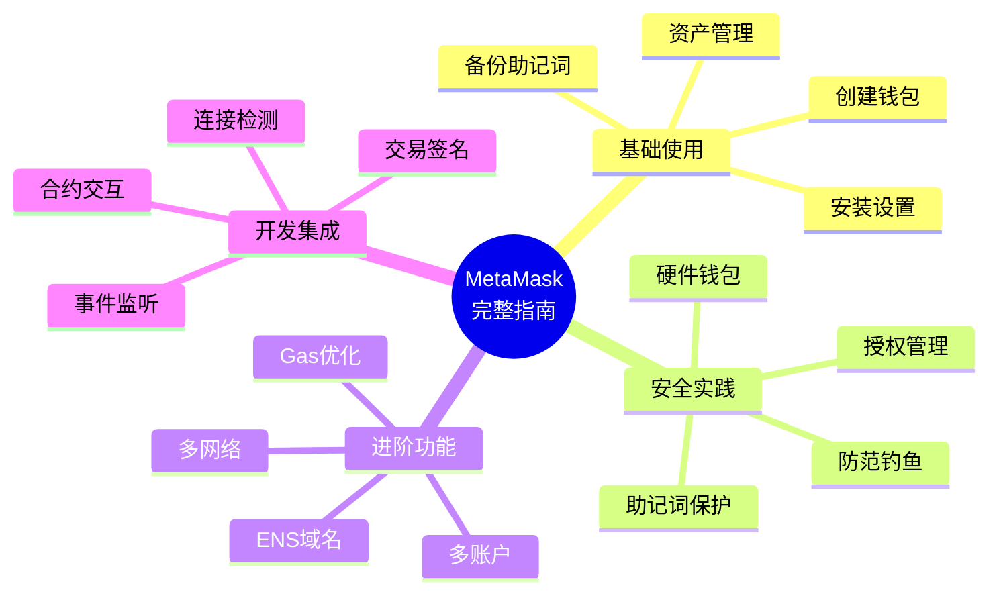

### 10.2 最佳实践清单

```javascript
// ✅ 安全清单
□ 助记词已安全备份（多份，不同位置）
□ 从未在线上分享私钥/助记词
□ 使用强密码保护MetaMask
□ 定期更新软件版本
□ 大额资产使用硬件钱包
□ 定期检查代币授权
□ 为不同用途使用不同账户
□ 只访问HTTPS网站
□ 仔细检查交易详情再签名
□ 不信任来历不明的空投链接

// ✅ 开发清单
□ 检测MetaMask安装
□ 处理连接错误
□ 监听账户和网络变化
□ 提供清晰的用户反馈
□ 实现适当的错误处理
□ 在测试网充分测试
□ 优化Gas费用
□ 支持多网络
□ 考虑移动端体验
□ 提供断开连接选项
```

### 10.3 学习路径建议

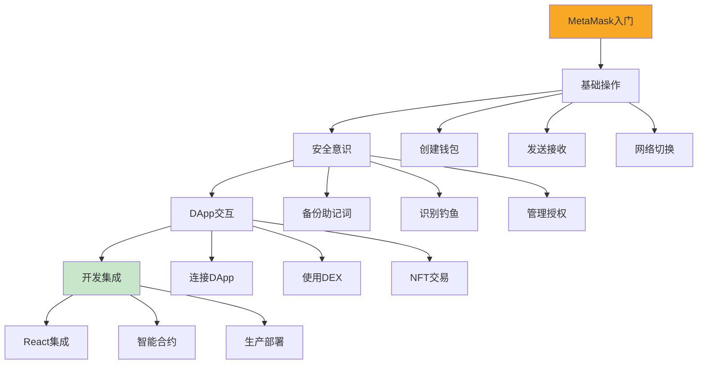

---

## 附录

### A. 快捷键

```
MetaMask快捷键（浏览器）:
- Alt + Shift + M  (Windows/Linux) - 打开MetaMask
- Option + Shift + M (Mac) - 打开MetaMask
```

### B. 常用网络配置

完整的网络配置信息请参考第 3.2 节。

### C. 相关链接

```javascript
const resources = {
  // 官方
  website: 'https://metamask.io',
  docs: 'https://docs.metamask.io',
  support: 'https://support.metamask.io',
  github: 'https://github.com/MetaMask',

  // 社区
  discord: 'https://discord.gg/metamask',
  twitter: 'https://twitter.com/MetaMask',
  forum: 'https://community.metamask.io',

  // 工具
  portfolio: 'https://portfolio.metamask.io',
  snaps: 'https://snaps.metamask.io',
};
```

---

**🎉 恭喜你完成 MetaMask 完整教程！**

现在你已经掌握了从基础使用到高级开发的所有知识。记住：安全第一，永远保护好你的助记词！

**下一步建议**：

1. 在测试网上实践所学知识
2. 开发一个简单的 DApp 项目
3. 加入 Web3 社区持续学习
4. 关注安全最佳实践

祝你在 Web3 世界的旅程顺利！🚀 **重要提示**：只从官方渠道下载，避免假冒应用！

### 2.2 创建新钱包

```mermaid
sequenceDiagram
    participant U as 用户
    participant M as MetaMask
    participant B as 区块链

    U->>M: 1. 点击"创建钱包"
    M->>U: 2. 显示服务条款
    U->>M: 3. 同意条款

    M->>U: 4. 设置密码（8位以上）
    U->>M: 5. 输入并确认密码

    M->>M: 6. 生成助记词（12个单词）
    M->>U: 7. 显示助记词

    Note over U,M: ⚠️ 必须安全保存助记词

    U->>U: 8. 抄写助记词
    M->>U: 9. 验证助记词顺序
    U->>M: 10. 按顺序选择单词

    M->>B: 11. 从助记词派生密钥
    M->>U: 12. ✅ 钱包创建成功

    style M fill:#f9a825
```

#### 详细步骤

**步骤 1：开始创建**

```
点击MetaMask图标 → "开始使用" → "创建钱包"
```

**步骤 2：设置密码**

- 密码要求：至少 8 个字符
- 建议：使用强密码（大小写+数字+符号）
- 作用：用于解锁 MetaMask 扩展

**步骤 3：备份助记词（最关键！）**

```
示例助记词（12个英文单词）：
┌─────────────────────────────────────┐
│ 1. abstract    7. network           │
│ 2. build       8. obvious           │
│ 3. close       9. pistol            │
│ 4. discover   10. question          │
│ 5. era        11. shift             │
│ 6. member     12. token             │
└─────────────────────────────────────┘
```

**⚠️ 助记词安全规则**：

- ✅ **必须做**：

  - 用纸笔抄写，存放在安全地方
  - 可以使用金属板永久保存
  - 告诉信任的家人如何找到（遗产规划）

- ❌ **绝对不要**：
  - 不要截图保存在电脑/手机
  - 不要保存在云盘、邮箱
  - 不要通过聊天软件发送
  - 不要告诉任何人（包括客服）
  - 不要输入到任何网站（除了恢复钱包）

**步骤 4：验证助记词**

- MetaMask 会要求你按顺序选择助记词
- 确保你正确记录了所有单词

**步骤 5：完成创建**

- 创建成功后，你会看到账户地址
- 格式：`0x` 开头的 42 位字符

### 2.3 导入现有钱包

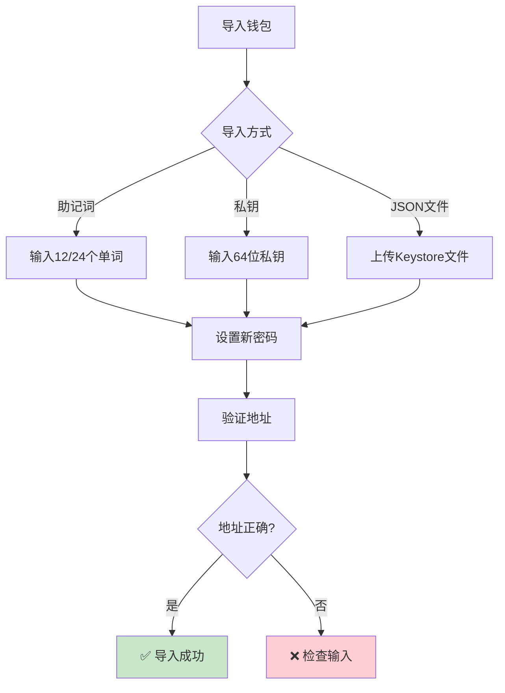

#### 通过助记词导入

```javascript
// 导入流程
1. 点击MetaMask图标
2. "开始使用" → "导入钱包"
3. 输入助记词（按顺序，空格分隔）
4. 设置新密码（这是MetaMask的解锁密码，不是原密码）
5. 点击"导入"

// 示例助记词输入格式
word1 word2 word3 word4 word5 word6 word7 word8 word9 word10 word11 word12
```

#### 通过私钥导入

```javascript
// 私钥格式
0x1234567890abcdef1234567890abcdef1234567890abcdef1234567890abcdef

// 导入步骤
1. 进入MetaMask
2. 点击右上角圆形图标
3. "导入账户"
4. 选择类型："私钥"
5. 粘贴私钥
6. 点击"导入"
```

---

## 3. 核心功能详解

### 3.1 账户管理

#### 创建多个账户

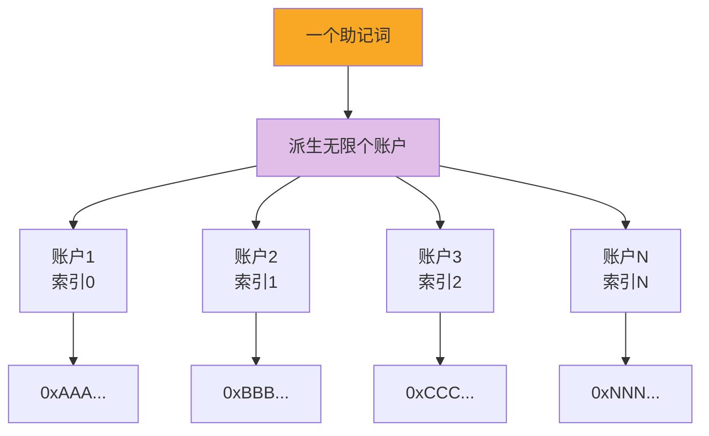

**操作步骤**：

```javascript
// 创建新账户
1. 点击右上角圆形账户图标
2. "创建账户"
3. 输入账户名称（可选）
4. 点击"创建"

// 每个账户都有：
- 独立的地址
- 独立的余额
- 但共享同一个助记词
```

#### 账户命名和管理

```javascript
// 重命名账户
1. 点击账户名称
2. 选择"账户详情"
3. 点击编辑图标（铅笔）
4. 输入新名称
5. 保存

// 账户命名建议
- "主账户" - 存放大额资产
- "DeFi操作" - 用于DeFi交互
- "NFT账户" - 存放NFT
- "测试账户" - 测试网使用
```

### 3.2 网络管理

#### 默认网络

| 网络名称         | Chain ID | 用途               | 水龙头            |
| ---------------- | -------- | ------------------ | ----------------- |
| Ethereum Mainnet | 1        | 以太坊主网         | -                 |
| Sepolia          | 11155111 | 测试网             | sepolia.dev       |
| Goerli           | 5        | 测试网（即将废弃） | goerli-faucet.com |
| Polygon          | 137      | Polygon 主网       | -                 |
| BSC              | 56       | 币安智能链         | -                 |

#### 添加自定义网络

```javascript
// 方式1：通过界面添加
1. 点击网络下拉菜单
2. "添加网络"
3. 填写网络信息：
   - 网络名称：Polygon Mainnet
   - RPC URL：https://polygon-rpc.com
   - Chain ID：137
   - 货币符号：MATIC
   - 区块浏览器：https://polygonscan.com
4. 点击"保存"

// 方式2：通过代码添加（开发者使用）
await ethereum.request({
  method: 'wallet_addEthereumChain',
  params: [{
    chainId: '0x89', // 137的十六进制
    chainName: 'Polygon Mainnet',
    nativeCurrency: {
      name: 'MATIC',
      symbol: 'MATIC',
      decimals: 18
    },
    rpcUrls: ['https://polygon-rpc.com'],
    blockExplorerUrls: ['https://polygonscan.com']
  }]
});
```

#### 常用网络配置

**Polygon Mainnet**

```json
{
  "networkName": "Polygon Mainnet",
  "rpcUrl": "https://polygon-rpc.com",
  "chainId": "137",
  "symbol": "MATIC",
  "explorer": "https://polygonscan.com"
}
```

**Arbitrum One**

```json
{
  "networkName": "Arbitrum One",
  "rpcUrl": "https://arb1.arbitrum.io/rpc",
  "chainId": "42161",
  "symbol": "ETH",
  "explorer": "https://arbiscan.io"
}
```

**Optimism**

```json
{
  "networkName": "Optimism",
  "rpcUrl": "https://mainnet.optimism.io",
  "chainId": "10",
  "symbol": "ETH",
  "explorer": "https://optimistic.etherscan.io"
}
```

### 3.3 发送和接收资产

#### 接收资产

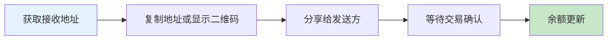

**操作步骤**：

```javascript
// 获取接收地址
1. 打开MetaMask
2. 点击账户名称下方的地址
3. 地址已复制到剪贴板

// 或使用二维码
1. 点击"账户详情"
2. 显示二维码
3. 对方扫描即可获取地址

// 你的地址格式
0x742d35Cc6634C0532925a3b844Bc9e7595f0bEb
```

#### 发送 ETH

```mermaid
sequenceDiagram
    participant U as 用户
    participant M as MetaMask
    participant B as 区块链

    U->>M: 1. 点击"发送"
    M->>U: 2. 输入接收地址
    U->>M: 3. 填写地址和金额
    M->>M: 4. 估算Gas费用
    M->>U: 5. 显示交易详情

    Note over U,M: 确认信息无误

    U->>M: 6. 确认交易
    M->>M: 7. 用私钥签名
    M->>B: 8. 广播到网络
    B->>B: 9. 打包进区块
    B->>M: 10. 交易确认
    M->>U: 11. 显示成功

    style M fill:#f9a825
```

**操作步骤**：

```javascript
// 发送ETH
1. 点击"发送"按钮
2. 输入或粘贴接收地址
   - 支持ENS域名（如 vitalik.eth）
   - 自动验证地址格式
3. 输入金额
   - 可以点击"最大值"发送所有余额
   - 注意预留Gas费
4. 选择Gas费用级别：
   - 慢速（Low）：便宜但慢
   - 市场价（Market）：推荐
   - 快速（Aggressive）：快但贵
5. 点击"下一步"
6. 确认交易详情
7. 点击"确认"

// 交易信息示例
发送金额: 0.1 ETH
接收地址: 0x742d35Cc...
Gas费用: 0.002 ETH
总计: 0.102 ETH
```

#### 发送代币（ERC-20）

```javascript
// 添加代币到列表
1. 切换到"资产"标签
2. 点击"导入代币"
3. 搜索代币名称（如 USDT）
   或输入合约地址
4. 点击"添加自定义代币"
5. 确认并导入

// 发送代币
1. 在资产列表中选择代币
2. 点击"发送"
3. 操作与发送ETH相同
4. 注意：Gas费用仍需ETH支付

// 常用ERC-20代币合约地址
USDT: 0xdAC17F958D2ee523a2206206994597C13D831ec7
USDC: 0xA0b86991c6218b36c1d19D4a2e9Eb0cE3606eB48
DAI:  0x6B175474E89094C44Da98b954EedeAC495271d0F
```

### 3.4 Gas 费用管理

#### Gas 费用组成

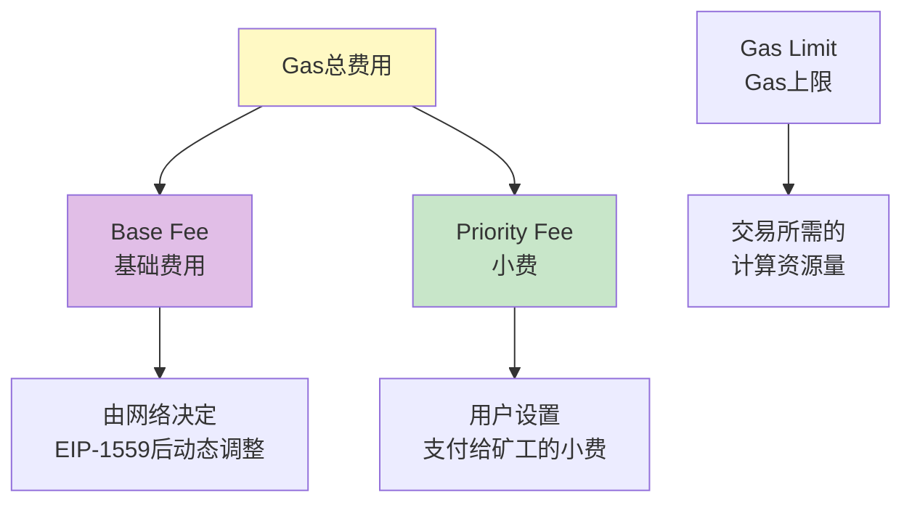

**Gas 费用计算**：

```javascript
// EIP-1559 后的Gas费用计算
总费用 = (Base Fee + Priority Fee) × Gas Used

// 示例
Base Fee: 30 Gwei
Priority Fee: 2 Gwei
Gas Used: 21000（简单转账）

总费用 = (30 + 2) × 21000 = 672,000 Gwei = 0.000672 ETH

// 如果ETH价格为$2000
Gas费用 = 0.000672 × $2000 = $1.34
```

#### 自定义 Gas 费用

```javascript
// 高级Gas控制
1. 在交易确认页面，点击"编辑"
2. 选择"高级"
3. 手动设置：
   - Gas Limit（通常不需要改）
   - Max Base Fee（最大基础费）
   - Priority Fee（优先费/小费）

// Gas费用策略
┌──────────────────────────────────────┐
│ 不急的交易：                          │
│ - Base Fee: 当前值                    │
│ - Priority Fee: 1 Gwei               │
│                                      │
│ 正常交易：                            │
│ - 使用MetaMask推荐值                  │
│                                      │
│ 紧急交易：                            │
│ - Base Fee: 当前值 × 1.5              │
│ - Priority Fee: 5-10 Gwei            │
└──────────────────────────────────────┘
```

#### 查看 Gas 费用追踪

推荐网站：

- https://etherscan.io/gastracker
- https://www.gasprice.io
- https://etherchain.org/tools/gasnow

---

## 4. 安全最佳实践

### 4.1 安全威胁类型

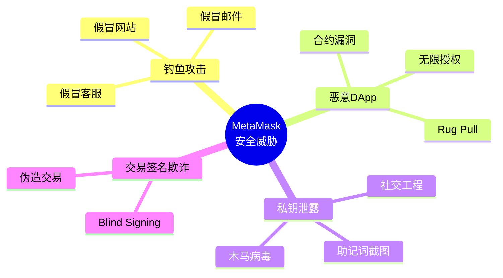

### 4.2 安全检查清单

```javascript
// 日常安全检查 ✅
□ 助记词已安全备份（纸质+金属板）
□ 从未在线上分享助记词/私钥
□ 使用强密码保护MetaMask
□ 定期更新浏览器和MetaMask
□ 只访问HTTPS网站
□ 检查网站URL拼写
□ 大额资产使用硬件钱包
□ 定期检查代币授权
□ 为不同用途使用不同账户

// 交易前检查 ✅
□ 确认网站域名正确
□ 检查接收地址正确
□ 验证交易金额和Gas费
□ 理解正在签名的内容
□ 警惕异常的授权请求
□ 不信任空投链接
```

### 4.3 防范钓鱼攻击

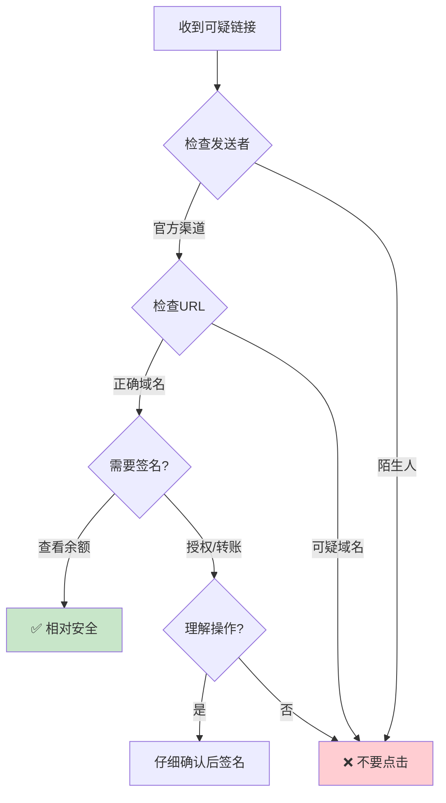

**识别钓鱼网站**：

```javascript
// ❌ 假冒网站特征
- metamаsk.io (注意'a'使用了西里尔字母)
- metamask-app.com
- metamask-wallet.net
- 使用IP地址的网站

// ✅ 正确的官方网站
- metamask.io (官网)
- portfolio.metamask.io (资产管理)
- support.metamask.io (帮助中心)

// 检查方法
1. 查看浏览器地址栏的锁图标
2. 检查SSL证书
3. 不要通过搜索引擎广告访问
4. 使用书签保存官方网址
```

### 4.4 代币授权管理

```javascript
// 什么是代币授权？
当你使用DEX（如Uniswap）交易代币时，
需要授权合约可以使用你的代币。

// 风险
- 恶意合约可能转走你的代币
- 无限授权 = 合约可以转走所有代币
- 即使不使用DApp，授权依然有效

// 检查和撤销授权
1. 访问授权管理工具：
   - https://revoke.cash
   - https://approved.zone
   - https://etherscan.io/tokenapprovalchecker

2. 连接MetaMask

3. 查看所有授权：
   - 授权给了哪个合约
   - 授权了多少数量
   - 授权时间

4. 撤销不需要的授权：
   - 点击"Revoke"
   - 确认交易（需要Gas费）

// 授权最佳实践
✅ 只授权你需要的数量
✅ 定期检查和清理授权
✅ 不用的DApp及时撤销授权
❌ 避免无限授权（除非是信任的协议）
```

### 4.5 硬件钱包集成

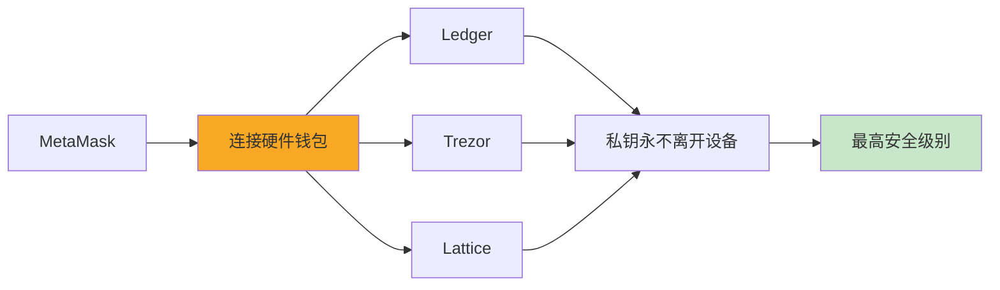

**连接 Ledger 步骤**：

```javascript
// 准备工作
1. 更新Ledger固件到最新版本
2. 安装Ethereum App到Ledger
3. 在Ledger设置中启用"Blind Signing"（盲签名）

// 连接MetaMask
1. 打开MetaMask
2. 点击账户图标 → "连接硬件钱包"
3. 选择"Ledger"
4. 连接设备（USB或蓝牙）
5. 在Ledger上打开Ethereum App
6. 选择要导入的账户
7. 点击"解锁"

// 使用硬件钱包
- 每次交易都需要在Ledger上确认
- 私钥永远不会离开Ledger设备
- 即使电脑被黑客入侵，资产也是安全的
```

---

## 5. 进阶操作

### 5.1 使用测试网络

```javascript
// 获取测试网ETH
1. 切换到Sepolia测试网
2. 复制你的地址
3. 访问水龙头网站：
   - https://sepoliafaucet.com
   - https://www.alchemy.com/faucets/ethereum-sepolia
   - https://faucet.quicknode.com/ethereum/sepolia

4. 粘贴地址，完成验证
5. 等待1-2分钟接收测试ETH

// 测试网用途
- 学习和实验
- 开发DApp测试
- 测试智能合约
- 零成本试错
```

### 5.2 Swap 功能（内置交易）

```javascript
// MetaMask内置Swap
1. 点击"Swap"按钮
2. 选择要交换的代币对
   - 从: ETH
   - 到: USDC
3. 输入金额
4. 查看报价：
   - 价格
   - Gas费
   - 滑点
   - 聚合器来源
5. 点击"查看报价"
6. 确认交易

// Swap优势
- 聚合多个DEX，获得最优价格
- 自动寻找最佳路由
- 简单易用

// 注意事项
- 比直接使用DEX稍贵一点
- 大额交易建议直接使用DEX
- 注意滑点设置
```

### 5.3 连接 DApp

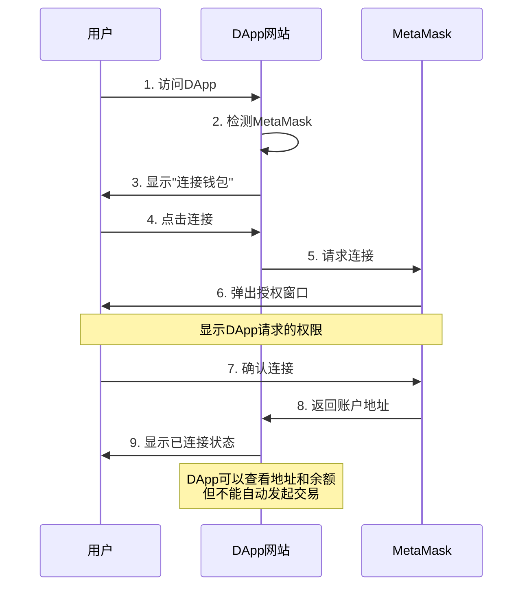

**连接 DApp 步骤**：

```javascript
// 1. DApp检测MetaMask
if (typeof window.ethereum !== 'undefined') {
  console.log('MetaMask已安装');
}

// 2. 用户点击"连接钱包"后
// DApp请求连接
const accounts = await ethereum.request({
  method: 'eth_requestAccounts'
});

// 3. MetaMask弹窗显示：
┌────────────────────────────────┐
│  uniswap.org 想要连接到         │
│  你的MetaMask账户               │
│                                │
│  这将允许DApp查看：             │
│  - 你的账户地址                 │
│  - 账户余额                     │
│  - 发起交易请求                 │
│                                │
│  [ 取消 ]  [ 下一步 ]          │
└────────────────────────────────┘

// 4. 选择要连接的账户
// 5. 确认连接

// 管理已连接的DApp
1. 打开MetaMask
2. 点击三个点 → "已连接的站点"
3. 查看所有已连接的DApp
4. 可以断开不需要的连接
```

### 5.4 签名消息（身份验证）

```javascript
// 什么是消息签名？
DApp请求你签名一条消息来验证身份，
类似"证明你拥有这个地址"

// 个人签名示例
const message = "登录到 OpenSea";
const signature = await ethereum.request({
  method: 'personal_sign',
  params: [message, account]
});

// MetaMask显示：
┌────────────────────────────────┐
│  签名请求                       │
│                                │
│  消息：                         │
│  登录到 OpenSea                 │
│                                │
│  签名是免费的，不会发送交易     │
│                                │
│  [ 取消 ]  [ 签名 ]            │
└────────────────────────────────┘

// ⚠️ 警惕签名钓鱼
✅ 安全的签名请求：
- 登录验证
- 身份证明
- 无资产转移

❌ 危险的签名请求：
- 要求签名复杂的十六进制数据
- 不明确说明用途
- 可能是隐藏的转账授权
```

### 5.5 添加和管理 NFT

```javascript
// 自动检测NFT（需要设置）
1. 打开MetaMask
2. 设置 → 安全和隐私
3. 开启"自动检测NFT"
4. MetaMask会自动发现你的NFT

// 手动添加NFT
1. 切换到"NFT"标签
2. 点击"导入NFT"
3. 输入：
   - NFT合约地址
   - Token ID
4. 点击"添加"

// 查看NFT详情
- 点击NFT缩略图
- 查看元数据
- 查看在OpenSea等市场的链接
- 发送NFT功能

// 示例：添加Bored Ape
合约地址: 0xBC4CA0EdA7647A8aB7C2061c2E118A18a936f13D
Token ID: 1234
```

### 5.6 账户活动和交易历史

```javascript
// 查看交易历史
1. 打开MetaMask
2. 点击"活动"标签
3. 查看所有交易记录：
   - 发送
   - 接收
   - 合约交互
   - Swap

// 交易状态
┌─────────────────────────────┐
│ ⏳ 待处理 (Pending)         │
│    交易已提交，等待打包      │
│                             │
│ ✅ 成功 (Success)           │
│    交易已确认               │
│                             │
│ ❌ 失败 (Failed)            │
│    交易被拒绝或失败          │
│                             │
│ 🚫 已取消 (Canceled)        │
│    用户取消交易             │
└─────────────────────────────┘

// 加速/取消交易
1. 点击待处理的交易
2. 选择"加速"或"取消"
3. 加速：提高Gas费用
4. 取消：发送0 ETH到自己，相同nonce

// 在区块浏览器查看
- 点击交易 → "在Etherscan上查看"
- 查看详细信息：
  - 区块号
  - Gas使用情况
  - 输入数据
  - 事件日志
```

---

## 6. 开发者集成

### 6.1 检测 MetaMask

```javascript
// 检测MetaMask是否安装
const detectMetaMask = () => {
  if (typeof window.ethereum !== 'undefined') {
    console.log('MetaMask已安装!');

    // 检查是否是MetaMask（而非其他钱包）
    if (window.ethereum.isMetaMask) {
      console.log('确认是MetaMask');
      return true;
    }
  } else {
    console.log('请安装MetaMask!');
    return false;
  }
};

// 引导用户安装
const installMetaMask = () => {
  window.open('https://metamask.io/download/', '_blank');
};

// React组件示例
import React, { useState, useEffect } from 'react';

const MetaMaskDetector = () => {
  const [hasMetaMask, setHasMetaMask] = useState(false);

  useEffect(() => {
    setHasMetaMask(detectMetaMask());
  }, []);

  if (!hasMetaMask) {
    return (
      <div className="alert">
        <p>未检测到MetaMask</p>
        <button onClick={installMetaMask}>安装MetaMask</button>
      </div>
    );
  }

  return <div>MetaMask已就绪</div>;
};
```

### 6.2 连接钱包

```javascript
// 请求连接用户账户
const connectWallet = async () => {
  try {
    // 请求账户访问权限
    const accounts = await window.ethereum.request({
      method: 'eth_requestAccounts',
    });

    const account = accounts[0];
    console.log('已连接账户:', account);

    return account;
  } catch (error) {
    if (error.code === 4001) {
      // 用户拒绝连接
      console.log('用户拒绝了连接请求');
    } else {
      console.error('连接失败:', error);
    }
    throw error;
  }
};

// 获取当前连接的账户（不弹窗）
const getAccounts = async () => {
  try {
    const accounts = await window.ethereum.request({
      method: 'eth_accounts',
    });

    if (accounts.length > 0) {
      console.log('当前账户:', accounts[0]);
      return accounts[0];
    } else {
      console.log('未连接账户');
      return null;
    }
  } catch (error) {
    console.error('获取账户失败:', error);
    throw error;
  }
};

// React Hook示例
import { useState, useEffect } from 'react';

const useMetaMask = () => {
  const [account, setAccount] = useState(null);
  const [chainId, setChainId] = useState(null);
  const [isConnecting, setIsConnecting] = useState(false);

  useEffect(() => {
    // 检查是否已连接
    checkConnection();

    // 监听账户变化
    if (window.ethereum) {
      window.ethereum.on('accountsChanged', handleAccountsChanged);
      window.ethereum.on('chainChanged', handleChainChanged);
    }

    return () => {
      if (window.ethereum) {
        window.ethereum.removeListener('accountsChanged', handleAccountsChanged);
        window.ethereum.removeListener('chainChanged', handleChainChanged);
      }
    };
  }, []);

  const checkConnection = async () => {
    const accounts = await getAccounts();
    if (accounts) {
      setAccount(accounts);
      const chain = await window.ethereum.request({ method: 'eth_chainId' });
      setChainId(parseInt(chain, 16));
    }
  };

  const handleAccountsChanged = (accounts) => {
    if (accounts.length === 0) {
      console.log('请连接MetaMask');
      setAccount(null);
    } else {
      setAccount(accounts[0]);
    }
  };

  const handleChainChanged = (chainId) => {
    console.log('网络已切换:', chainId);
    setChainId(parseInt(chainId, 16));
    window.location.reload(); // 推荐重新加载页面
  };

  const connect = async () => {
    setIsConnecting(true);
    try {
      const acc = await connectWallet();
      setAccount(acc);
      const chain = await window.ethereum.request({ method: 'eth_chainId' });
      setChainId(parseInt(chain, 16));
    } catch (error) {
      console.error('连接失败:', error);
    } finally {
      setIsConnecting(false);
    }
  };

  const disconnect = () => {
    setAccount(null);
  };

  return {
    account,
    chainId,
    isConnecting,
    connect,
    disconnect,
  };
};

export default useMetaMask;
```

### 6.3 发送交易

```javascript
// 发送ETH转账
const sendTransaction = async (toAddress, amount) => {
  try {
    const accounts = await window.ethereum.request({
      method: 'eth_accounts',
    });

    const from = accounts[0];

    // 将ETH转换为Wei（1 ETH = 10^18 Wei）
    const value = (amount * 1e18).toString(16);

    const transactionParameters = {
      from: from,
      to: toAddress,
      value: '0x' + value, // 十六进制Wei值
      // gas: '0x5208', // 可选，21000 gas
      // gasPrice: '0x09184e72a000', // 可选
    };

    // 发送交易
    const txHash = await window.ethereum.request({
      method: 'eth_sendTransaction',
      params: [transactionParameters],
    });

    console.log('交易哈希:', txHash);
    return txHash;
  } catch (error) {
    console.error('交易失败:', error);
    throw error;
  }
};

// 使用ethers.js发送交易（推荐）
import { ethers } from 'ethers';

const sendEthWithEthers = async (toAddress, amount) => {
  try {
    // 创建Provider
    const provider = new ethers.BrowserProvider(window.ethereum);

    // 获取Signer
    const signer = await provider.getSigner();

    // 发送交易
    const tx = await signer.sendTransaction({
      to: toAddress,
      value: ethers.parseEther(amount.toString()),
    });

    console.log('交易哈希:', tx.hash);

    // 等待确认
    const receipt = await tx.wait();
    console.log('交易已确认:', receipt);

    return receipt;
  } catch (error) {
    console.error('交易失败:', error);
    throw error;
  }
};

// React组件示例
const SendEthForm = () => {
  const [toAddress, setToAddress] = useState('');
  const [amount, setAmount] = useState('');
  const [txHash, setTxHash] = useState('');
  const [loading, setLoading] = useState(false);

  const handleSubmit = async (e) => {
    e.preventDefault();

    if (!toAddress || !amount) {
      alert('请填写完整信息');
      return;
    }

    setLoading(true);
    try {
      const hash = await sendTransaction(toAddress, amount);
      setTxHash(hash);
      alert('交易已提交!');
    } catch (error) {
      alert('交易失败: ' + error.message);
    } finally {
      setLoading(false);
    }
  };

  return (
    <form onSubmit={handleSubmit}>
      <input
        type="text"
        placeholder="接收地址"
        value={toAddress}
        onChange={(e) => setToAddress(e.target.value)}
      />
      <input
        type="number"
        step="0.001"
        placeholder="金额 (ETH)"
        value={amount}
        onChange={(e) => setAmount(e.target.value)}
      />
      <button type="submit" disabled={loading}>
        {loading ? '发送中...' : '发送'}
      </button>

      {txHash && (
        <div>
          交易哈希:{' '}
          <a href={`https://etherscan.io/tx/${txHash}`} target="_blank">
            {txHash}
          </a>
        </div>
      )}
    </form>
  );
};
```

### 6.4 调用智能合约

```javascript
// 使用ethers.js与智能合约交互
import { ethers } from 'ethers';

// ERC-20代币ABI（简化版）
const ERC20_ABI = [
  'function balanceOf(address owner) view returns (uint256)',
  'function transfer(address to, uint256 amount) returns (bool)',
  'function approve(address spender, uint256 amount) returns (bool)',
  'function allowance(address owner, address spender) view returns (uint256)',
];

// 读取合约数据（无需Gas）
const getTokenBalance = async (tokenAddress, userAddress) => {
  const provider = new ethers.BrowserProvider(window.ethereum);
  const contract = new ethers.Contract(tokenAddress, ERC20_ABI, provider);

  const balance = await contract.balanceOf(userAddress);
  const formatted = ethers.formatUnits(balance, 18); // 假设18位小数

  console.log('代币余额:', formatted);
  return formatted;
};

// 写入合约数据（需要Gas）
const transferToken = async (tokenAddress, toAddress, amount) => {
  const provider = new ethers.BrowserProvider(window.ethereum);
  const signer = await provider.getSigner();
  const contract = new ethers.Contract(tokenAddress, ERC20_ABI, signer);

  // 转换金额（假设18位小数）
  const amountInWei = ethers.parseUnits(amount.toString(), 18);

  // 发送交易
  const tx = await contract.transfer(toAddress, amountInWei);
  console.log('交易哈希:', tx.hash);

  // 等待确认
  const receipt = await tx.wait();
  console.log('交易已确认:', receipt);

  return receipt;
};

// 授权代币
const approveToken = async (tokenAddress, spenderAddress, amount) => {
  const provider = new ethers.BrowserProvider(window.ethereum);
  const signer = await provider.getSigner();
  const contract = new ethers.Contract(tokenAddress, ERC20_ABI, signer);

  const amountInWei = ethers.parseUnits(amount.toString(), 18);

  const tx = await contract.approve(spenderAddress, amountInWei);
  await tx.wait();

  console.log('授权成功');
  return tx;
};

// React Hook: 合约交互
const useContract = (address, abi) => {
  const [contract, setContract] = useState(null);
  const [loading, setLoading] = useState(false);

  useEffect(() => {
    const initContract = async () => {
      if (window.ethereum && address && abi) {
        const provider = new ethers.BrowserProvider(window.ethereum);
        const signer = await provider.getSigner();
        const contractInstance = new ethers.Contract(address, abi, signer);
        setContract(contractInstance);
      }
    };

    initContract();
  }, [address, abi]);

  const call = async (method, ...args) => {
    if (!contract) return;

    setLoading(true);
    try {
      const result = await contract[method](...args);

      // 如果是交易，等待确认
      if (result.wait) {
        await result.wait();
      }

      return result;
    } catch (error) {
      console.error('合约调用失败:', error);
      throw error;
    } finally {
      setLoading(false);
    }
  };

  return { contract, call, loading };
};

// 使用示例
const TokenTransfer = ({ tokenAddress }) => {
  const { call, loading } = useContract(tokenAddress, ERC20_ABI);
  const [recipient, setRecipient] = useState('');
  const [amount, setAmount] = useState('');

  const handleTransfer = async () => {
    try {
      await call('transfer', recipient, ethers.parseUnits(amount, 18));
      alert('转账成功!');
    } catch (error) {
      alert('转账失败: ' + error.message);
    }
  };

  return (
    <div>
      <input
        value={recipient}
        onChange={(e) => setRecipient(e.target.value)}
        placeholder="接收地址"
      />
      <input value={amount} onChange={(e) => setAmount(e.target.value)} placeholder="数量" />
      <button onClick={handleTransfer} disabled={loading}>
        {loading ? '处理中...' : '转账'}
      </button>
    </div>
  );
};
```

### 6.5 签名和验证

```javascript
// 个人签名
const signMessage = async (message) => {
  try {
    const accounts = await window.ethereum.request({
      method: 'eth_accounts',
    });

    const signature = await window.ethereum.request({
      method: 'personal_sign',
      params: [message, accounts[0]],
    });

    console.log('签名:', signature);
    return signature;
  } catch (error) {
    console.error('签名失败:', error);
    throw error;
  }
};

// 验证签名
import { ethers } from 'ethers';

const verifySignature = (message, signature, expectedAddress) => {
  try {
    const recoveredAddress = ethers.verifyMessage(message, signature);
    const isValid = recoveredAddress.toLowerCase() === expectedAddress.toLowerCase();

    console.log('签名有效:', isValid);
    return isValid;
  } catch (error) {
    console.error('验证失败:', error);
    return false;
  }
};

// EIP-712结构化数据签名（推荐用于DApp）
const signTypedData = async () => {
  const accounts = await window.ethereum.request({
    method: 'eth_accounts',
  });

  const domain = {
    name: 'MyDApp',
    version: '1',
    chainId: 1,
    verifyingContract: '0x...',
  };

  const types = {
    Mail: [
      { name: 'from', type: 'address' },
      { name: 'to', type: 'address' },
      { name: 'contents', type: 'string' },
    ],
  };

  const message = {
    from: accounts[0],
    to: '0x...',
    contents: 'Hello World',
  };

  try {
    const signature = await window.ethereum.request({
      method: 'eth_signTypedData_v4',
      params: [
        accounts[0],
        JSON.stringify({
          domain,
          types,
          primaryType: 'Mail',
          message,
        }),
      ],
    });

    return signature;
  } catch (error) {
    console.error('签名失败:', error);
    throw error;
  }
};

// 实际应用：登录验证
const loginWithMetaMask = async () => {
  try {
    // 1. 连接钱包
    const accounts = await connectWallet();
    const address = accounts[0];

    // 2. 从服务器获取随机消息
    const response = await fetch('/api/auth/nonce', {
      method: 'POST',
      headers: { 'Content-Type': 'application/json' },
      body: JSON.stringify({ address }),
    });
    const { nonce } = await response.json();

    // 3. 签名消息
    const message = `登录到 MyDApp\n\nNonce: ${nonce}`;
    const signature = await signMessage(message);

    // 4. 发送到服务器验证
    const loginResponse = await fetch('/api/auth/login', {
      method: 'POST',
      headers: { 'Content-Type': 'application/json' },
      body: JSON.stringify({
        address,
        signature,
        message,
      }),
    });

    const { token } = await loginResponse.json();

    // 5. 保存token
    localStorage.setItem('authToken', token);

    console.log('登录成功!');
    return token;
  } catch (error) {
    console.error('登录失败:', error);
    throw error;
  }
};
```

### 6.6 监听事件

```javascript
// 监听账户变化
window.ethereum.on('accountsChanged', (accounts) => {
  if (accounts.length === 0) {
    console.log('用户断开连接');
    // 清理应用状态
  } else {
    console.log('账户已切换:', accounts[0]);
    // 更新应用状态
  }
});

// 监听网络变化
window.ethereum.on('chainChanged', (chainId) => {
  console.log('网络已切换:', parseInt(chainId, 16));
  // 推荐：重新加载页面
  window.location.reload();
});

// 监听连接状态
window.ethereum.on('connect', (connectInfo) => {
  console.log('已连接到网络:', connectInfo.chainId);
});

window.ethereum.on('disconnect', (error) => {
  console.log('已断开连接:', error);
});

// React Hook: 事件监听
const useMetaMaskEvents = () => {
  const [account, setAccount] = useState(null);
  const [chainId, setChainId] = useState(null);
  const [isConnected, setIsConnected] = useState(false);

  useEffect(() => {
    if (!window.ethereum) return;

    const handleAccountsChanged = (accounts) => {
      if (accounts.length > 0) {
        setAccount(accounts[0]);
        setIsConnected(true);
      } else {
        setAccount(null);
        setIsConnected(false);
      }
    };

    const handleChainChanged = (chainId) => {
      setChainId(parseInt(chainId, 16));
    };

    const handleConnect = (connectInfo) => {
      setChainId(parseInt(connectInfo.chainId, 16));
      setIsConnected(true);
    };

    const handleDisconnect = () => {
      setIsConnected(false);
      setAccount(null);
    };

    // 添加监听器
    window.ethereum.on('accountsChanged', handleAccountsChanged);
    window.ethereum.on('chainChanged', handleChainChanged);
    window.ethereum.on('connect', handleConnect);
    window.ethereum.on('disconnect', handleDisconnect);

    // 清理
    return () => {
      window.ethereum.removeListener('accountsChanged', handleAccountsChanged);
      window.ethereum.removeListener('chainChanged', handleChainChanged);
      window.ethereum.removeListener('connect', handleConnect);
      window.ethereum.removeListener('disconnect', handleDisconnect);
    };
  }, []);

  return { account, chainId, isConnected };
};
```

---

## 7. 常见问题排查

### 7.1 连接问题

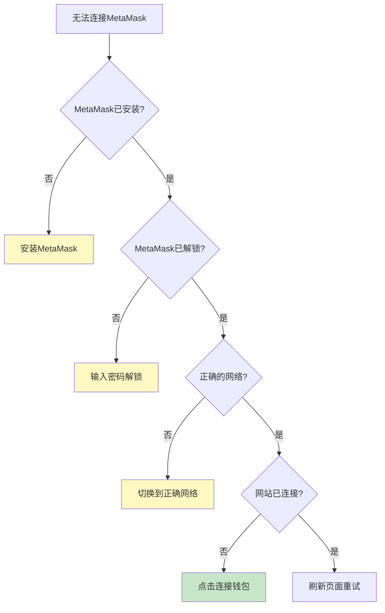

#### 问题 1：MetaMask 未检测到

```javascript
// 解决方案
1. 确认已安装MetaMask扩展
2. 刷新页面
3. 检查浏览器是否禁用了扩展
4. 尝试重启浏览器
5. 确认不是在隐身/无痕模式

// 代码中添加等待逻辑
const waitForMetaMask = () => {
  return new Promise((resolve, reject) => {
    let attempts = 0;
    const maxAttempts = 50; // 5秒超时

    const interval = setInterval(() => {
      if (window.ethereum) {
        clearInterval(interval);
        resolve(window.ethereum);
      }

      attempts++;
      if (attempts >= maxAttempts) {
        clearInterval(interval);
        reject(new Error('MetaMask未检测到'));
      }
    }, 100);
  });
};
```

#### 问题 2：交易一直待处理

```javascript
// 原因
- Gas费设置过低
- 网络拥堵
- Nonce冲突

// 解决方案
1. 加速交易：
   - 点击待处理交易
   - 选择"加速"
   - 提高Gas费用
   - 确认

2. 取消交易：
   - 点击待处理交易
   - 选择"取消"
   - 支付取消费用（发送0 ETH到自己）

3. 重置账户（最后手段）：
   - 设置 → 高级
   - "重置账户"
   - ⚠️ 这会清除交易历史，但不会丢失资产
```

#### 问题 3：余额不显示或不正确

```javascript
// 解决方案
1. 刷新：
   - 关闭并重新打开MetaMask
   - 或刷新浏览器页面

2. 切换网络：
   - 切换到其他网络
   - 再切换回来

3. 检查区块浏览器：
   - 在Etherscan上查看实际余额
   - https://etherscan.io/address/你的地址

4. 清除缓存（谨慎）：
   - 设置 → 高级 → "重置账户"
```

### 7.2 安全问题

#### 问题 1：怀疑私钥泄露

```javascript
// 立即行动清单
□ 1. 创建新钱包（新助记词）
□ 2. 将所有资产转移到新钱包
□ 3. 撤销所有代币授权（revoke.cash）
□ 4. 断开所有DApp连接
□ 5. 扫描电脑病毒
□ 6. 更改所有相关密码
□ 7. 不再使用旧钱包

// 预防措施
- 永远不要分享助记词/私钥
- 使用硬件钱包存储大额资产
- 定期检查授权
- 保持软件更新
```

#### 问题 2：遇到钓鱼网站

```javascript
// 如果已经连接或签名
1. 立即断开网站连接：
   - MetaMask → 已连接的站点
   - 找到可疑网站并断开

2. 检查授权：
   - 访问 revoke.cash
   - 撤销可疑授权

3. 如果已发送交易：
   - 无法撤回，但可以尝试：
   - 立即转移剩余资产到新地址
   - 向区块浏览器报告诈骗地址

4. 报告钓鱼网站：
   - https://metamask.io/phishing/
```

### 7.3 恢复和重置

#### 恢复钱包

```javascript
// 使用助记词恢复
1. 打开MetaMask
2. "导入钱包"
3. 按顺序输入12/24个助记词
4. 设置新密码
5. 确认

// 恢复后找不到资产？
- 确认使用了正确的助记词
- 检查是否在正确的网络
- 尝试添加更多账户（可能在索引1、2、3...）
- 手动添加代币合约地址
```

#### 重置 MetaMask

```javascript
// 方法1：重置账户（保留钱包）
设置 → 高级 → "重置账户"
- 清除交易历史
- 重置nonce
- 不会删除钱包

// 方法2：完全卸载重装
1. 浏览器扩展管理
2. 移除MetaMask
3. 重新安装
4. 用助记词恢复钱包
⚠️
```
