# Web3 与 Web2 核心区别完全指南

## 目录

- [什么是 Web2 和 Web3](#什么是web2和web3)
- [核心区别对比](#核心区别对比)
- [架构对比](#架构对比)
- [数据所有权](#数据所有权)
- [身份认证机制](#身份认证机制)
- [商业模式对比](#商业模式对比)
- [技术栈对比](#技术栈对比)
- [典型应用场景](#典型应用场景)
- [优缺点分析](#优缺点分析)
- [迁移路径](#迁移路径)
- [未来展望](#未来展望)
- [参考资料](#参考资料)

---

## 什么是 Web2 和 Web3

### Web 演进历史

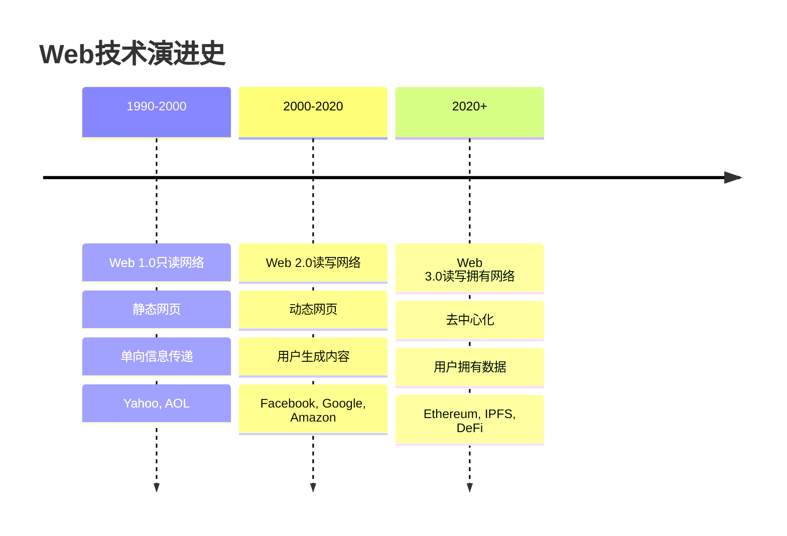
```mermaid
timeline
    title Web技术演进史

    1990-2000 : Web 1.0只读网络
              : 静态网页
              : 单向信息传递
              : Yahoo, AOL

    2000-2020 : Web 2.0读写网络
              : 动态网页
              : 用户生成内容
              : Facebook, Google, Amazon

    2020+ : Web 3.0读写拥有网络
          : 去中心化
          : 用户拥有数据
          : Ethereum, IPFS, DeFi
```

### Web1.0 vs Web2.0 vs Web3.0

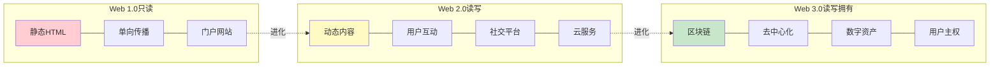
```mermaid
graph LR
    subgraph "Web 1.0只读"
        W1_1[静态HTML]
        W1_2[单向传播]
        W1_3[门户网站]

        W1_1 --- W1_2 --- W1_3
    end

    subgraph "Web 2.0读写"
        W2_1[动态内容]
        W2_2[用户互动]
        W2_3[社交平台]
        W2_4[云服务]

        W2_1 --- W2_2 --- W2_3 --- W2_4
    end

    subgraph "Web 3.0读写拥有"
        W3_1[区块链]
        W3_2[去中心化]
        W3_3[数字资产]
        W3_4[用户主权]

        W3_1 --- W3_2 --- W3_3 --- W3_4
    end

    W1_3 -.进化.-> W2_1
    W2_4 -.进化.-> W3_1

    style W1_1 fill:#ffcdd2
    style W2_1 fill:#fff9c4
    style W3_1 fill:#c8e6c9
```

### 定义

**Web2.0（2000-2020）**

```
核心特征：平台中心化
- 用户生成内容
- 平台拥有数据
- 依赖广告模式
- 中心化服务器

代表：Facebook, Google, Amazon, Twitter
```

**Web3.0（2020+）**

```
核心特征：去中心化
- 用户拥有数据
- 区块链基础设施
- 代币经济
- 无需信任

代表：Ethereum, IPFS, Uniswap, OpenSea
```

---

## 核心区别对比

### 一图看懂核心差异

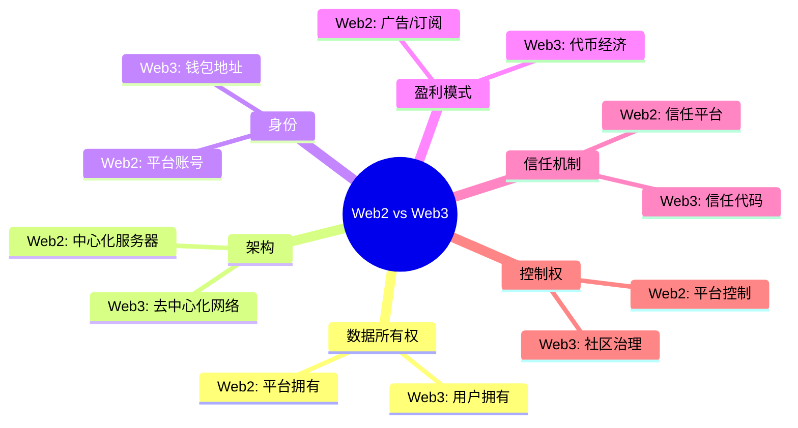
```mermaid
mindmap
  root((Web2 vs Web3))
    数据所有权
      Web2: 平台拥有
      Web3: 用户拥有
    架构
      Web2: 中心化服务器
      Web3: 去中心化网络
    身份
      Web2: 平台账号
      Web3: 钱包地址
    盈利模式
      Web2: 广告/订阅
      Web3: 代币经济
    信任机制
      Web2: 信任平台
      Web3: 信任代码
    控制权
      Web2: 平台控制
      Web3: 社区治理
```

### 详细对比表

| 维度           | Web2           | Web3             |
| -------------- | -------------- | ---------------- |
| **数据存储**   | 中心化数据库   | 分布式区块链     |
| **数据所有权** | 平台所有       | 用户所有         |
| **身份认证**   | 用户名+密码    | 钱包+私钥        |
| **内容审核**   | 平台审核       | 社区治理         |
| **收益分配**   | 平台获取大部分 | 创作者获取大部分 |
| **互操作性**   | 封闭生态       | 开放协议         |
| **抗审查性**   | 可被审查       | 难以审查         |
| **服务中断**   | 单点故障       | 高可用性         |
| **隐私保护**   | 平台收集       | 用户控制         |
| **价值捕获**   | 股东           | 代币持有者       |

---

## 架构对比

### Web2 架构

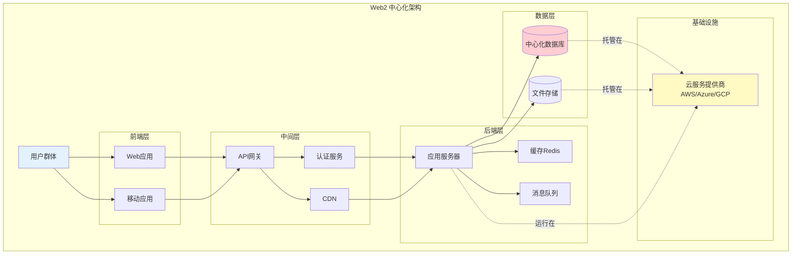
```mermaid
graph TB
    subgraph "Web2 中心化架构"
        Users[用户群体]

        subgraph "前端层"
            Web[Web应用]
            Mobile[移动应用]
        end

        subgraph "中间层"
            API[API网关]
            Auth[认证服务]
            CDN[CDN]
        end

        subgraph "后端层"
            Server[应用服务器]
            Cache[缓存Redis]
            Queue[消息队列]
        end

        subgraph "数据层"
            DB[(中心化数据库)]
            Storage[(文件存储)]
        end

        subgraph "基础设施"
            Cloud[云服务提供商AWS/Azure/GCP]
        end
    end

    Users --> Web
    Users --> Mobile

    Web --> API
    Mobile --> API

    API --> Auth
    API --> CDN

    Auth --> Server
    CDN --> Server

    Server --> Cache
    Server --> Queue
    Server --> DB
    Server --> Storage

    DB -.托管在.-> Cloud
    Storage -.托管在.-> Cloud
    Server -.运行在.-> Cloud

    style Users fill:#e3f2fd
    style DB fill:#ffcdd2
    style Cloud fill:#fff9c4
```

**Web2 架构特点：**

```
✅ 成熟稳定
✅ 性能优秀
✅ 易于扩展

❌ 单点故障
❌ 数据孤岛
❌ 平台垄断
❌ 隐私泄露风险
```

### Web3 架构

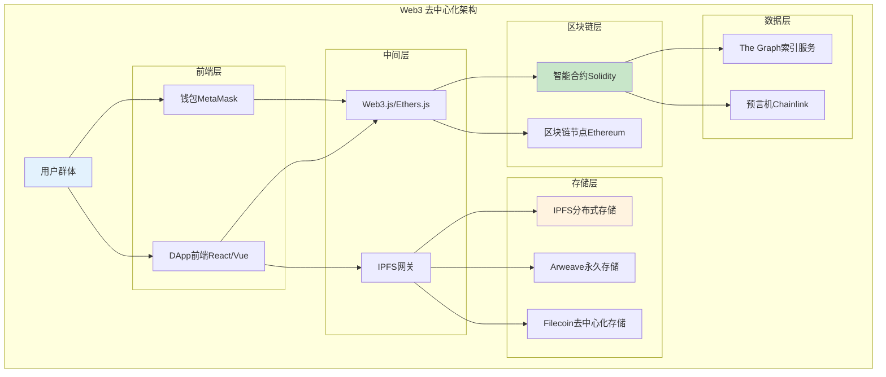
```mermaid
graph TB
    subgraph "Web3 去中心化架构"
        Users[用户群体]

        subgraph "前端层"
            DApp[DApp前端React/Vue]
            Wallet[钱包MetaMask]
        end

        subgraph "中间层"
            Web3JS[Web3.js/Ethers.js]
            IPFS_Gateway[IPFS网关]
        end

        subgraph "区块链层"
            SmartContract[智能合约Solidity]
            Node[区块链节点Ethereum]
        end

        subgraph "存储层"
            IPFS[IPFS分布式存储]
            Arweave[Arweave永久存储]
            Filecoin[Filecoin去中心化存储]
        end

        subgraph "数据层"
            TheGraph[The Graph索引服务]
            Oracle[预言机Chainlink]
        end
    end

    Users --> DApp
    Users --> Wallet

    DApp --> Web3JS
    Wallet --> Web3JS

    Web3JS --> SmartContract
    Web3JS --> Node

    SmartContract --> TheGraph
    SmartContract --> Oracle

    DApp --> IPFS_Gateway
    IPFS_Gateway --> IPFS
    IPFS_Gateway --> Arweave
    IPFS_Gateway --> Filecoin

    style Users fill:#e3f2fd
    style SmartContract fill:#c8e6c9
    style IPFS fill:#fff3e0
```

**Web3 架构特点：**

```
✅ 去中心化
✅ 无需信任
✅ 抗审查
✅ 用户主权

❌ 性能较低
❌ 成本较高
❌ 用户体验待优化
❌ 扩展性挑战
```

---

## 数据所有权

### Web2 数据流

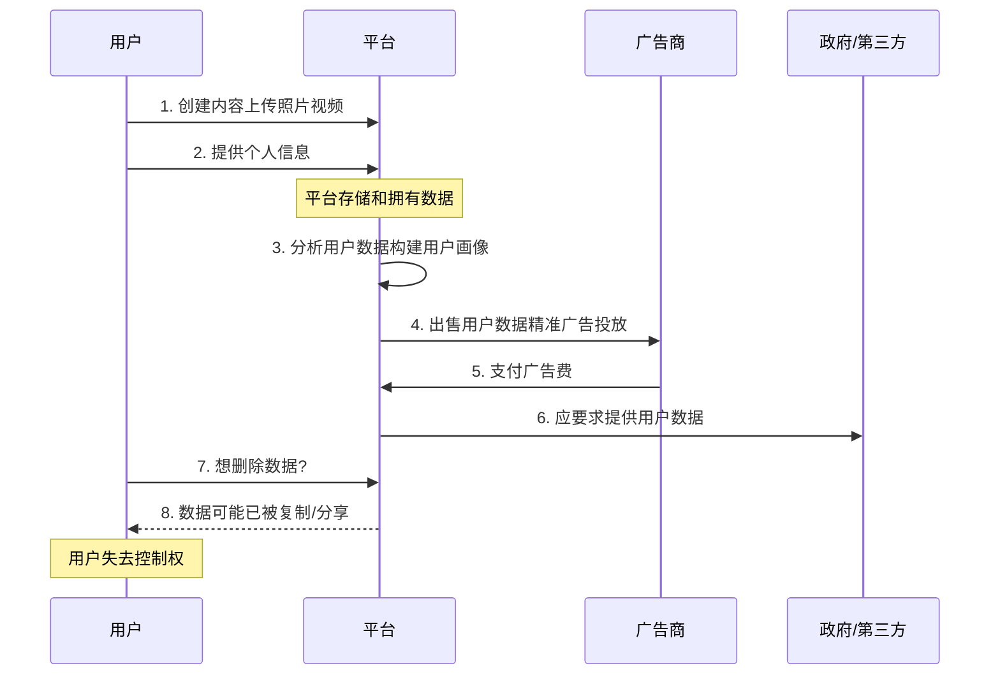
```mermaid
sequenceDiagram
    participant U as 用户
    participant P as 平台
    participant A as 广告商
    participant G as 政府/第三方

    U->>P: 1. 创建内容上传照片视频
    U->>P: 2. 提供个人信息

    Note over P: 平台存储和拥有数据

    P->>P: 3. 分析用户数据构建用户画像

    P->>A: 4. 出售用户数据精准广告投放
    A->>P: 5. 支付广告费

    P->>G: 6. 应要求提供用户数据

    U->>P: 7. 想删除数据?
    P-->>U: 8. 数据可能已被复制/分享

    Note over U: 用户失去控制权

```

**Web2 数据问题：**

```
❌ 数据被平台拥有和控制
❌ 用户无法真正删除数据
❌ 隐私被商业化利用
❌ 数据泄露风险高
❌ 用户无法从数据中获益
```

### Web3 数据流

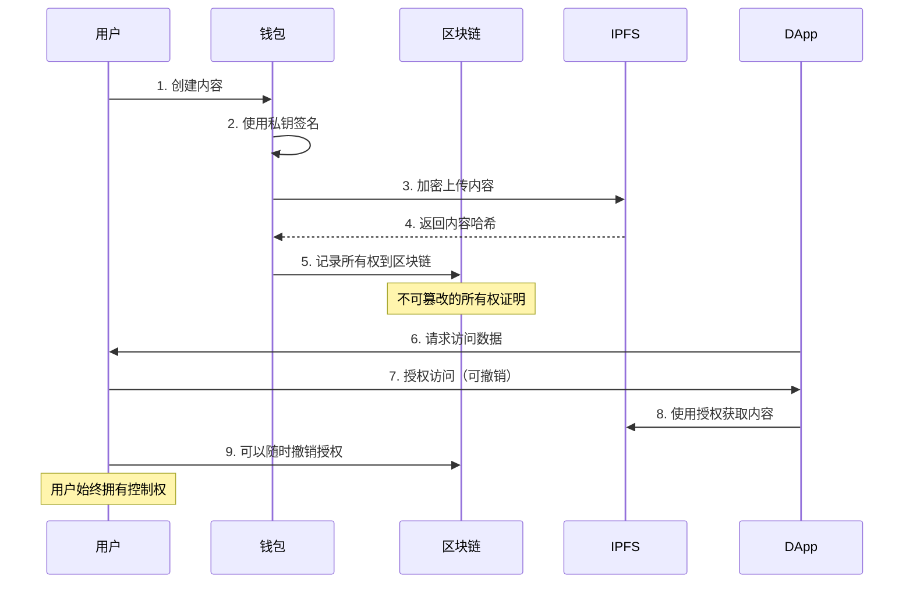
```mermaid
sequenceDiagram
    participant U as 用户
    participant W as 钱包
    participant BC as 区块链
    participant IPFS as IPFS
    participant DApp as DApp

    U->>W: 1. 创建内容
    W->>W: 2. 使用私钥签名

    W->>IPFS: 3. 加密上传内容
    IPFS-->>W: 4. 返回内容哈希

    W->>BC: 5. 记录所有权到区块链
    Note over BC: 不可篡改的所有权证明

    DApp->>U: 6. 请求访问数据
    U->>DApp: 7. 授权访问（可撤销）

    DApp->>IPFS: 8. 使用授权获取内容

    U->>BC: 9. 可以随时撤销授权

    Note over U: 用户始终拥有控制权

```

**Web3 数据优势：**

```
✅ 用户真正拥有数据
✅ 加密保护隐私
✅ 可选择性分享
✅ 可撤销的授权
✅ 用户从数据中获益
```

### 数据所有权对比

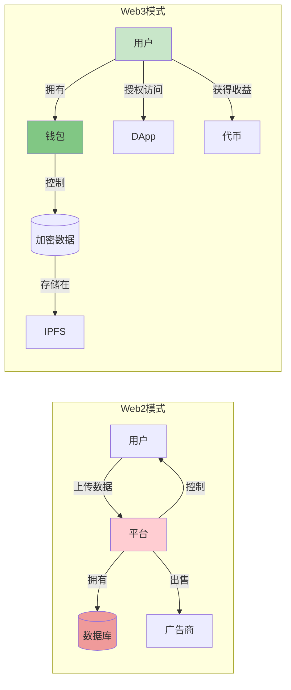
```mermaid
graph LR
    subgraph "Web2模式"
        U1[用户] -->|上传数据| P1[平台]
        P1 -->|拥有| D1[(数据库)]
        P1 -->|出售| Ad1[广告商]
        P1 -->|控制| U1
    end

    subgraph "Web3模式"
        U2[用户] -->|拥有| W2[钱包]
        W2 -->|控制| D2[(加密数据)]
        D2 -->|存储在| IPFS2[IPFS]
        U2 -->|授权访问| DApp2[DApp]
        U2 -->|获得收益| Token2[代币]
    end

    style P1 fill:#ffcdd2
    style D1 fill:#ef9a9a
    style U2 fill:#c8e6c9
    style W2 fill:#81c784
```

---

## 身份认证机制

### Web2 身份认证

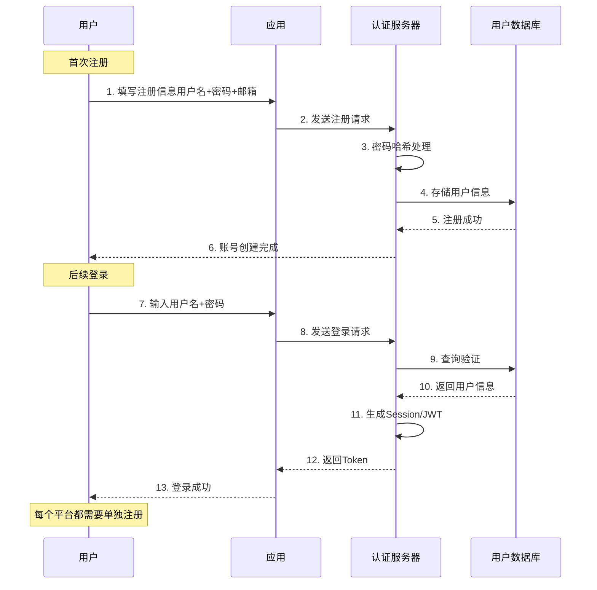
```mermaid
sequenceDiagram
    participant U as 用户
    participant App as 应用
    participant Auth as 认证服务器
    participant DB as 用户数据库

    Note over U: 首次注册
    U->>App: 1. 填写注册信息用户名+密码+邮箱
    App->>Auth: 2. 发送注册请求
    Auth->>Auth: 3. 密码哈希处理
    Auth->>DB: 4. 存储用户信息
    DB-->>Auth: 5. 注册成功
    Auth-->>U: 6. 账号创建完成

    Note over U: 后续登录
    U->>App: 7. 输入用户名+密码
    App->>Auth: 8. 发送登录请求
    Auth->>DB: 9. 查询验证
    DB-->>Auth: 10. 返回用户信息
    Auth->>Auth: 11. 生成Session/JWT
    Auth-->>App: 12. 返回Token
    App-->>U: 13. 登录成功

    Note over U: 每个平台都需要单独注册

```

**Web2 身份问题：**

```
❌ 多个平台需要多个账号
❌ 密码管理困难
❌ 忘记密码需要重置
❌ 账号可能被封禁
❌ 平台掌握用户身份
❌ 数据泄露风险
```

### Web3 身份认证

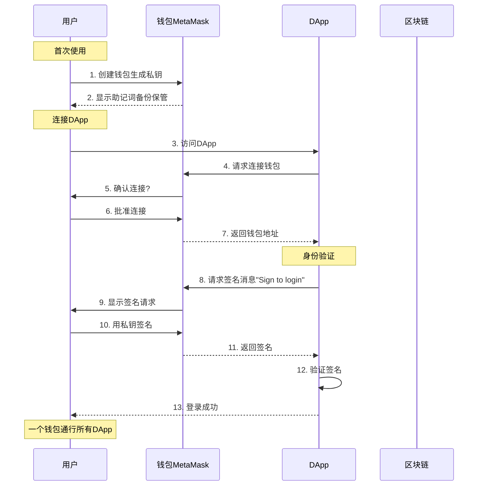
```mermaid
sequenceDiagram
    participant U as 用户
    participant W as 钱包MetaMask
    participant DApp as DApp
    participant BC as 区块链

    Note over U: 首次使用
    U->>W: 1. 创建钱包生成私钥
    W-->>U: 2. 显示助记词备份保管

    Note over U: 连接DApp
    U->>DApp: 3. 访问DApp
    DApp->>W: 4. 请求连接钱包
    W->>U: 5. 确认连接?
    U->>W: 6. 批准连接
    W-->>DApp: 7. 返回钱包地址

    Note over DApp: 身份验证
    DApp->>W: 8. 请求签名消息"Sign to login"
    W->>U: 9. 显示签名请求
    U->>W: 10. 用私钥签名
    W-->>DApp: 11. 返回签名
    DApp->>DApp: 12. 验证签名
    DApp-->>U: 13. 登录成功

    Note over U: 一个钱包通行所有DApp

```

**Web3 身份优势：**

```
✅ 一个钱包，通行所有DApp
✅ 无需密码（私钥即身份）
✅ 去中心化身份
✅ 用户完全控制
✅ 跨平台身份
✅ 隐私保护
```

### 身份系统对比

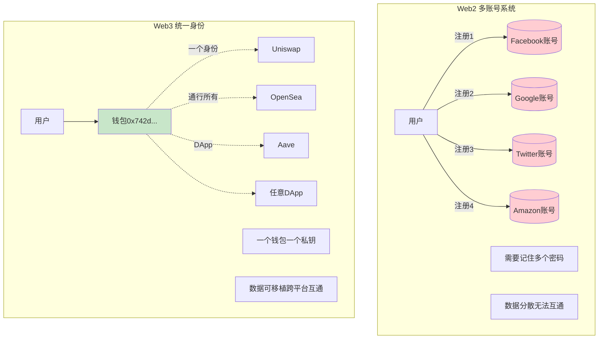
```mermaid
graph TB
    subgraph "Web2 多账号系统"
        User1[用户]

        FB[(Facebook账号)]
        Google[(Google账号)]
        Twitter[(Twitter账号)]
        Amazon[(Amazon账号)]

        User1 -->|注册1| FB
        User1 -->|注册2| Google
        User1 -->|注册3| Twitter
        User1 -->|注册4| Amazon

        Note1[需要记住多个密码]
        Note2[数据分散无法互通]
    end

    subgraph "Web3 统一身份"
        User2[用户]
        Wallet[钱包0x742d...]

        DApp1[Uniswap]
        DApp2[OpenSea]
        DApp3[Aave]
        DApp4[任意DApp]

        User2 --> Wallet
        Wallet -.一个身份.-> DApp1
        Wallet -.通行所有.-> DApp2
        Wallet -.DApp.-> DApp3
        Wallet -.-> DApp4

        Note3[一个钱包一个私钥]
        Note4[数据可移植跨平台互通]
    end

    style FB fill:#ffcdd2
    style Google fill:#ffcdd2
    style Twitter fill:#ffcdd2
    style Amazon fill:#ffcdd2
    style Wallet fill:#c8e6c9
```

---

## 商业模式对比

### Web2 商业模式

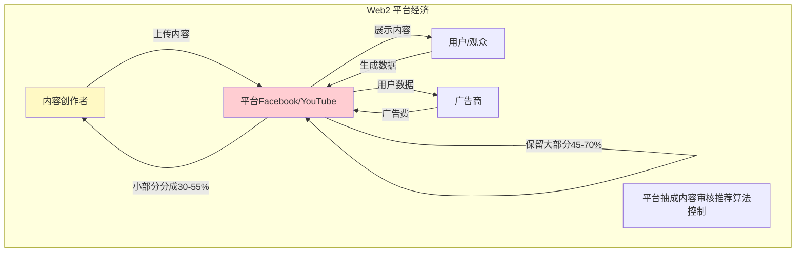
```mermaid
graph TB
    subgraph "Web2 平台经济"
        Creator[内容创作者]
        Platform[平台Facebook/YouTube]
        User[用户/观众]
        Advertiser[广告商]

        Creator -->|上传内容| Platform
        Platform -->|展示内容| User
        User -->|生成数据| Platform

        Platform -->|用户数据| Advertiser
        Advertiser -->|广告费| Platform

        Platform -->|小部分分成30-55%| Creator
        Platform -->|保留大部分45-70%| Platform

        Note1[平台抽成内容审核推荐算法控制]
    end

    style Platform fill:#ffcdd2
    style Creator fill:#fff9c4
```

**Web2 盈利模式：**

```
主要收入：
1. 广告收入（主要）
   - Facebook, Google

2. 订阅费
   - Netflix, Spotify

3. 交易佣金
   - Amazon, Uber, Airbnb

4. 数据销售
   - 用户数据商业化

问题：
❌ 创作者分成少（30-55%）
❌ 平台拥有流量控制权
❌ 用户数据被商业化
❌ 中间商抽成高
```

### Web3 商业模式

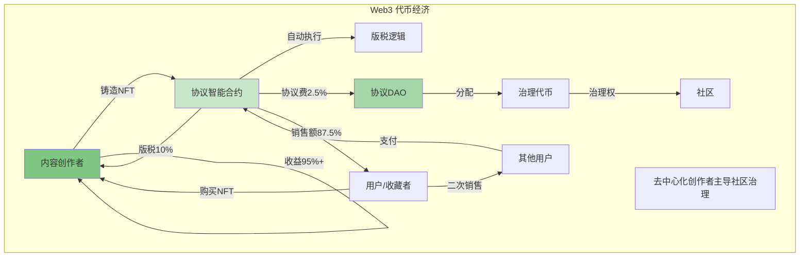
```mermaid
graph TB
    subgraph "Web3 代币经济"
        Creator[内容创作者]
        Protocol[协议智能合约]
        User[用户/收藏者]

        Creator -->|铸造NFT| Protocol
        Protocol -->|自动执行| RoyaltyLogic[版税逻辑]

        User -->|购买NFT| Creator
        Creator -->|收益95%+| Creator

        User -->|二次销售| User2[其他用户]
        User2 -->|支付| Protocol
        Protocol -->|版税10%| Creator
        Protocol -->|协议费2.5%| DAO[协议DAO]
        Protocol -->|销售额87.5%| User

        Token[治理代币]
        DAO -->|分配| Token
        Token -->|治理权| Community[社区]

        Note1[去中心化创作者主导社区治理]
    end

    style Protocol fill:#c8e6c9
    style Creator fill:#81c784
    style DAO fill:#a5d6a7
```

**Web3 盈利模式：**

```
主要收入：
1. NFT销售
   - 创作者直接获利95%+

2. 版税收入
   - 二次销售永久版税

3. 代币升值
   - 早期用户/贡献者获益

4. 质押收益
   - DeFi, Staking

5. DAO治理
   - 社区共同决策

优势：
✅ 创作者获得大部分收益
✅ 用户也能获益（持有代币）
✅ 透明的规则（智能合约）
✅ 社区治理
```

---

## 技术栈对比

### Web2 技术栈

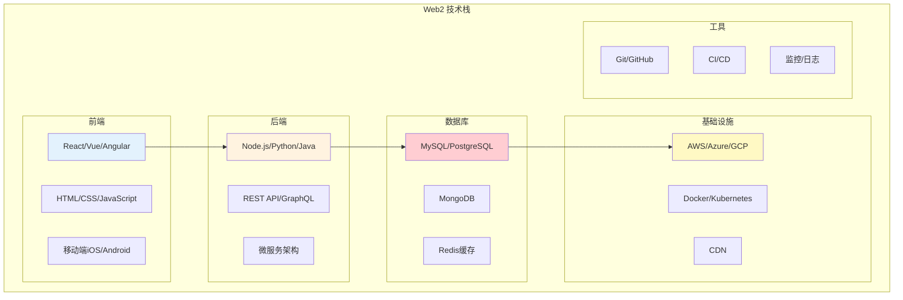
```mermaid
graph TB
    subgraph "Web2 技术栈"
        subgraph "前端"
            FE1[React/Vue/Angular]
            FE2[HTML/CSS/JavaScript]
            FE3[移动端iOS/Android]
        end

        subgraph "后端"
            BE1[Node.js/Python/Java]
            BE2[REST API/GraphQL]
            BE3[微服务架构]
        end

        subgraph "数据库"
            DB1[MySQL/PostgreSQL]
            DB2[MongoDB]
            DB3[Redis缓存]
        end

        subgraph "基础设施"
            INF1[AWS/Azure/GCP]
            INF2[Docker/Kubernetes]
            INF3[CDN]
        end

        subgraph "工具"
            TOOL1[Git/GitHub]
            TOOL2[CI/CD]
            TOOL3[监控/日志]
        end
    end

    FE1 --> BE1
    BE1 --> DB1
    DB1 --> INF1

    style FE1 fill:#e3f2fd
    style BE1 fill:#fff3e0
    style DB1 fill:#ffcdd2
    style INF1 fill:#fff9c4
```

### Web3 技术栈

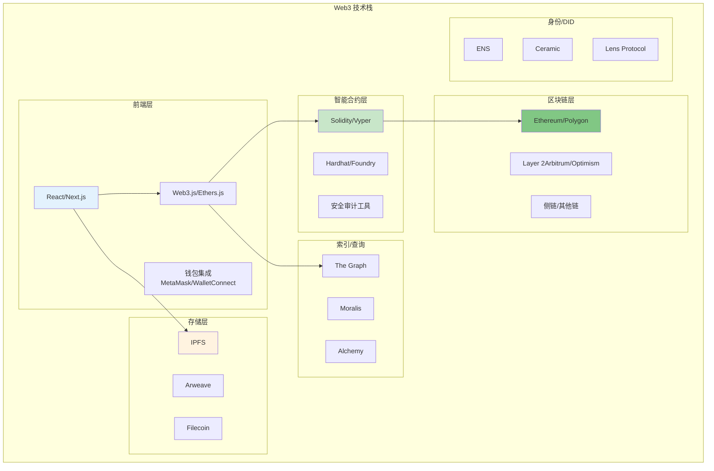
```mermaid
graph TB
    subgraph "Web3 技术栈"
        subgraph "前端层"
            DApp1[React/Next.js]
            DApp2[Web3.js/Ethers.js]
            DApp3[钱包集成MetaMask/WalletConnect]
        end

        subgraph "智能合约层"
            SC1[Solidity/Vyper]
            SC2[Hardhat/Foundry]
            SC3[安全审计工具]
        end

        subgraph "区块链层"
            BC1[Ethereum/Polygon]
            BC2[Layer 2Arbitrum/Optimism]
            BC3[侧链/其他链]
        end

        subgraph "存储层"
            ST1[IPFS]
            ST2[Arweave]
            ST3[Filecoin]
        end

        subgraph "索引/查询"
            IDX1[The Graph]
            IDX2[Moralis]
            IDX3[Alchemy]
        end

        subgraph "身份/DID"
            ID1[ENS]
            ID2[Ceramic]
            ID3[Lens Protocol]
        end
    end

    DApp1 --> DApp2
    DApp2 --> SC1
    SC1 --> BC1
    DApp1 --> ST1
    DApp2 --> IDX1

    style DApp1 fill:#e3f2fd
    style SC1 fill:#c8e6c9
    style BC1 fill:#81c784
    style ST1 fill:#fff3e0
```

### 技术栈详细对比

| 层级         | Web2                  | Web3                     |
| ------------ | --------------------- | ------------------------ |
| **前端框架** | React, Vue, Angular   | React, Next.js + Web3 库 |
| **状态管理** | Redux, MobX           | Wagmi, RainbowKit        |
| **身份认证** | OAuth, JWT            | 钱包签名                 |
| **后端**     | Node.js, Python, Java | 智能合约（Solidity）     |
| **API**      | REST, GraphQL         | RPC, The Graph           |
| **数据库**   | MySQL, MongoDB        | 区块链, IPFS             |
| **存储**     | S3, 云存储            | IPFS, Arweave            |
| **支付**     | Stripe, PayPal        | 加密货币                 |
| **部署**     | AWS, Vercel           | IPFS, Fleek              |

---

## 典型应用场景

### Web2 应用示例

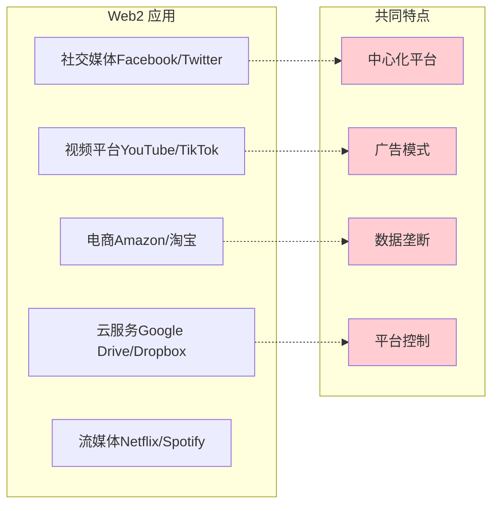
```mermaid
graph LR
    subgraph "Web2 应用"
        Social[社交媒体Facebook/Twitter]
        Video[视频平台YouTube/TikTok]
        Ecommerce[电商Amazon/淘宝]
        Cloud[云服务Google Drive/Dropbox]
        Streaming[流媒体Netflix/Spotify]
    end

    subgraph "共同特点"
        Central[中心化平台]
        Ads[广告模式]
        Data[数据垄断]
        Control[平台控制]
    end

    Social -.-> Central
    Video -.-> Ads
    Ecommerce -.-> Data
    Cloud -.-> Control

    style Central fill:#ffcdd2
    style Ads fill:#ffcdd2
    style Data fill:#ffcdd2
    style Control fill:#ffcdd2
```

### Web3 应用示例

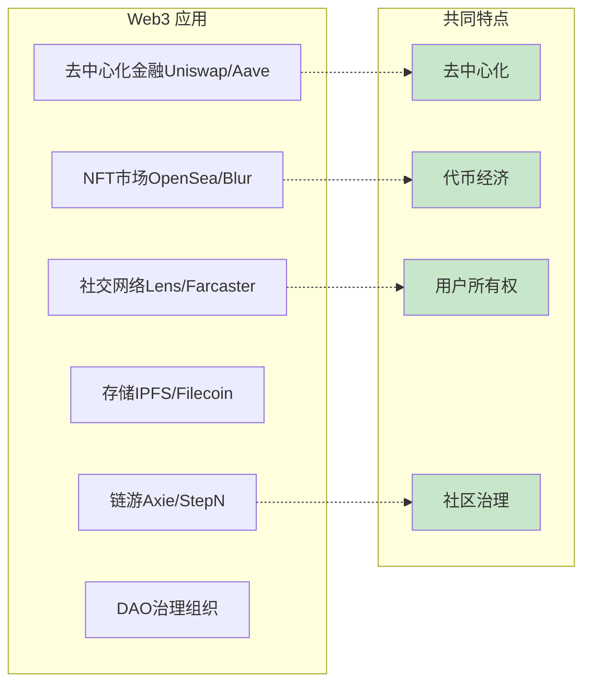
```mermaid
graph LR
    subgraph "Web3 应用"
        DeFi[去中心化金融Uniswap/Aave]
        NFT[NFT市场OpenSea/Blur]
        Social3[社交网络Lens/Farcaster]
        Storage[存储IPFS/Filecoin]
        Gaming[链游Axie/StepN]
        DAO[DAO治理组织]
    end

    subgraph "共同特点"
        Decentral[去中心化]
        Token[代币经济]
        Ownership[用户所有权]
        Community[社区治理]
    end

    DeFi -.-> Decentral
    NFT -.-> Token
    Social3 -.-> Ownership
    Gaming -.-> Community

    style Decentral fill:#c8e6c9
    style Token fill:#c8e6c9
    style Ownership fill:#c8e6c9
    style Community fill:#c8e6c9
```

### 具体应用对比

#### 社交媒体

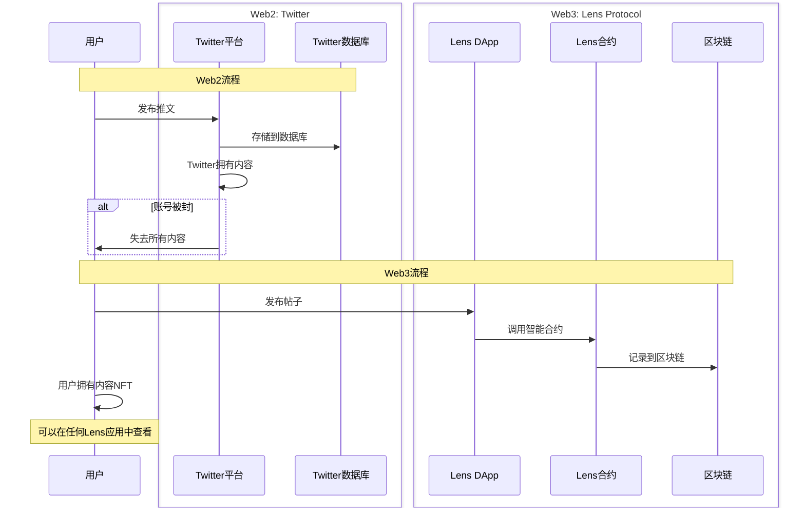
```mermaid
sequenceDiagram
    participant U as 用户

    box Web2: Twitter
        participant T as Twitter平台
        participant TDB as Twitter数据库
    end

    box Web3: Lens Protocol
        participant L as Lens DApp
        participant LC as Lens合约
        participant BC as 区块链
    end

    Note over U,TDB: Web2流程
    U->>T: 发布推文
    T->>TDB: 存储到数据库
    T->>T: Twitter拥有内容

    alt 账号被封
        T->>U: 失去所有内容
    end

    Note over U,BC: Web3流程
    U->>L: 发布帖子
    L->>LC: 调用智能合约
    LC->>BC: 记录到区块链
    U->>U: 用户拥有内容NFT

    Note over U: 可以在任何Lens应用中查看
```

#### 音乐流媒体

**Web2: Spotify**

```
艺术家 → Spotify → 用户

收益分配：
- Spotify: 30%
- 唱片公司: 50%
- 艺术家: 20%

问题：
❌ 艺术家收益少
❌ 平台控制推荐算法
❌ 用户不拥有音乐
```

**Web3: Audius**

```
艺术家 → 智能合约 → 用户

收益分配：
- 协议费: 10%
- 艺术家: 90%

优势：
✅ 艺术家直接获益
✅ 社区治理
✅ 用户可持有代币
```

---

## 优缺点分析

### Web2 优缺点

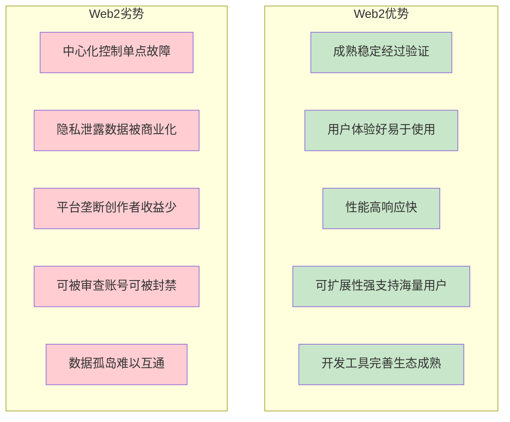
```mermaid
graph TB
    subgraph "Web2优势"
        W2_P1[成熟稳定经过验证]
        W2_P2[用户体验好易于使用]
        W2_P3[性能高响应快]
        W2_P4[可扩展性强支持海量用户]
        W2_P5[开发工具完善生态成熟]
    end

    subgraph "Web2劣势"
        W2_N1[中心化控制单点故障]
        W2_N2[隐私泄露数据被商业化]
        W2_N3[平台垄断创作者收益少]
        W2_N4[可被审查账号可被封禁]
        W2_N5[数据孤岛难以互通]
    end

    style W2_P1 fill:#c8e6c9
    style W2_P2 fill:#c8e6c9
    style W2_P3 fill:#c8e6c9
    style W2_P4 fill:#c8e6c9
    style W2_P5 fill:#c8e6c9
    style W2_N1 fill:#ffcdd2
    style W2_N2 fill:#ffcdd2
    style W2_N3 fill:#ffcdd2
    style W2_N4 fill:#ffcdd2
    style W2_N5 fill:#ffcdd2
```

### Web3 优缺点

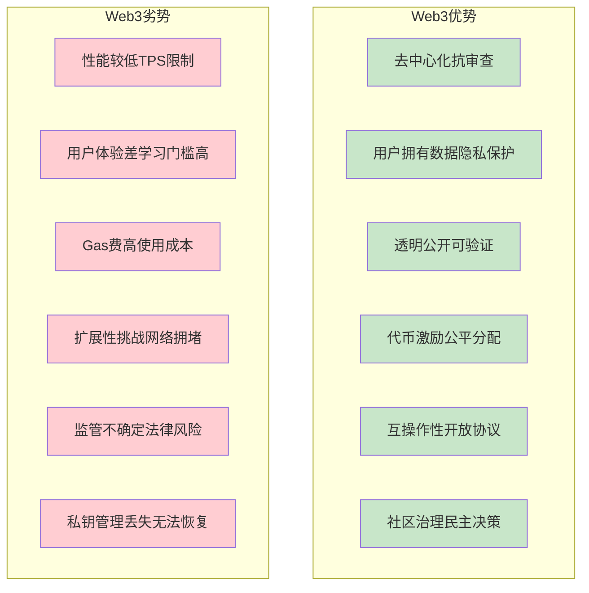
```mermaid
graph TB
    subgraph "Web3优势"
        W3_P1[去中心化抗审查]
        W3_P2[用户拥有数据隐私保护]
        W3_P3[透明公开可验证]
        W3_P4[代币激励公平分配]
        W3_P5[互操作性开放协议]
        W3_P6[社区治理民主决策]
    end

    subgraph "Web3劣势"
        W3_N1[性能较低TPS限制]
        W3_N2[用户体验差学习门槛高]
        W3_N3[Gas费高使用成本]
        W3_N4[扩展性挑战网络拥堵]
        W3_N5[监管不确定法律风险]
        W3_N6[私钥管理丢失无法恢复]
    end

    style W3_P1 fill:#c8e6c9
    style W3_P2 fill:#c8e6c9
    style W3_P3 fill:#c8e6c9
    style W3_P4 fill:#c8e6c9
    style W3_P5 fill:#c8e6c9
    style W3_P6 fill:#c8e6c9
    style W3_N1 fill:#ffcdd2
    style W3_N2 fill:#ffcdd2
    style W3_N3 fill:#ffcdd2
    style W3_N4 fill:#ffcdd2
    style W3_N5 fill:#ffcdd2
    style W3_N6 fill:#ffcdd2
```

### 详细对比分析

| 维度         | Web2       | Web3       | 未来趋势     |
| ------------ | ---------- | ---------- | ------------ |
| **性能**     | ⭐⭐⭐⭐⭐ | ⭐⭐⭐     | Layer 2 提升 |
| **用户体验** | ⭐⭐⭐⭐⭐ | ⭐⭐⭐     | 账户抽象改善 |
| **去中心化** | ⭐         | ⭐⭐⭐⭐⭐ | 保持优势     |
| **隐私保护** | ⭐⭐       | ⭐⭐⭐⭐   | ZK 技术增强  |
| **成本**     | ⭐⭐⭐⭐   | ⭐⭐       | L2 降低成本  |
| **可扩展性** | ⭐⭐⭐⭐⭐ | ⭐⭐⭐     | 分片/L2 解决 |
| **开发难度** | ⭐⭐⭐     | ⭐⭐⭐⭐   | 工具改善     |
| **互操作性** | ⭐⭐       | ⭐⭐⭐⭐⭐ | 跨链桥发展   |

---

## 迁移路径

### 从 Web2 到 Web3 的迁移

```mermaid
graph LR
    subgraph "渐进式迁移策略"
        Phase1[阶段1学习探索]
        Phase2[阶段2混合架构]
        Phase3[阶段3部分迁移]
        Phase4[阶段4全面Web3]

        Phase1 --> Phase2 --> Phase3 --> Phase4
    end

    subgraph "阶段1详情"
        P1_1[了解区块链]
        P1_2[学习钱包使用]
        P1_3[体验DApp]
    end

    subgraph "阶段2详情"
        P2_1[集成钱包登录]
        P2_2[NFT功能]
        P2_3[代币奖励]
    end

    subgraph "阶段3详情"
        P3_1[核心功能上链]
        P3_2[去中心化存储]
        P3_3[DAO治理]
    end

    subgraph "阶段4详情"
        P4_1[完全去中心化]
        P4_2[社区运营]
        P4_3[代币经济]
    end

    Phase1 -.-> P1_1
    Phase2 -.-> P2_1
    Phase3 -.-> P3_1
    Phase4 -.-> P4_1

    style Phase1 fill:#e3f2fd
    style Phase2 fill:#c8e6c9
    style Phase3 fill:#fff9c4
    style Phase4 fill:#81c784
```

### 混合架构示例

```mermaid
graph TB
    subgraph "混合架构（过渡期）"
        Users[用户]

        subgraph "Web2组件"
            Web2_FE[传统前端]
            Web2_BE[中心化后端]
            Web2_DB[(SQL数据库)]
        end

        subgraph "Web3组件"
            Wallet[钱包集成]
            SmartContract[智能合约]
            IPFS[IPFS存储]
        end

        subgraph "桥接层"
            Bridge[适配器Web2↔Web3]
        end
    end

    Users --> Web2_FE
    Users --> Wallet

    Web2_FE --> Web2_BE
    Web2_FE --> Bridge

    Web2_BE --> Web2_DB

    Bridge --> SmartContract
    Bridge --> IPFS

    Wallet --> SmartContract

    style Web2_FE fill:#fff9c4
    style Bridge fill:#ffb74d
    style SmartContract fill:#c8e6c9
```

### 迁移建议

**适合 Web2 的场景：**

```
✅ 需要高性能（秒级响应）
✅ 复杂的业务逻辑
✅ 频繁的数据更新
✅ 需要灵活的权限控制
✅ 面向普通用户

示例：
- 实时聊天
- 复杂的ERP系统
- 高频交易平台
```

**适合 Web3 的场景：**

```
✅ 需要去中心化
✅ 数字资产所有权
✅ 透明度要求高
✅ 抗审查需求
✅ 社区治理

示例：
- NFT市场
- DeFi协议
- DAO组织
- 去中心化社交
```

**混合架构适合：**

```
✅ 游戏（资产上链，游戏逻辑off-chain）
✅ 内容平台（内容上链，推荐算法off-chain）
✅ 电商（支付上链，订单管理off-chain）
```

---

## 未来展望

### Web3 发展路线图

```mermaid
timeline
    title Web3技术演进路线

    2020-2023 : 基础设施建设
              : Layer 2扩容
              : 钱包体验改善
              : DeFi/NFT爆发

    2024-2025 : 用户体验优化
              : 账户抽象AA
              : 零知识证明应用
              : 跨链互操作性

    2026-2027 : 大规模采用
              : Web3游戏成熟
              : 企业级应用
              : 监管框架完善

    2028+ : Web3成为主流
          : 与Web2共存
          : 新商业模式
          : 元宇宙融合
```

### 关键技术趋势

```mermaid
mindmap
  root((Web3未来))
    扩展性
      Layer 2普及
      分片技术
      并行执行
      模块化区块链
    用户体验
      账户抽象
      社交恢复
      Gas代付
      一键登录
    隐私保护
      零知识证明
      隐私计算
      加密通信
      匿名交易
    互操作性
      跨链桥
      多链钱包
      统一标准
      链抽象
    应用创新
      SocialFi
      GameFi
      DeSci
      RWA代币化
```

### Web2 与 Web3 融合

```mermaid
graph TB
    subgraph "未来：Web2.5"
        subgraph "保留Web2优势"
            W2_Keep1[高性能]
            W2_Keep2[好体验]
            W2_Keep3[易用性]
        end

        subgraph "引入Web3特性"
            W3_Add1[用户拥有数据]
            W3_Add2[代币激励]
            W3_Add3[社区治理]
        end

        subgraph "新范式"
            New1[混合架构]
            New2[渐进式去中心化]
            New3[可选择的主权]
            New4[最佳实践结合]
        end
    end

    W2_Keep1 --> New1
    W3_Add1 --> New1

    W2_Keep2 --> New2
    W3_Add2 --> New2

    W2_Keep3 --> New3
    W3_Add3 --> New3

    New1 --> New4
    New2 --> New4
    New3 --> New4

    style New1 fill:#81c784
    style New2 fill:#81c784
    style New3 fill:#81c784
    style New4 fill:#4caf50
```

### 预测与展望

**短期（1-2 年）：**

```
✅ Layer 2成为主流
✅ 账户抽象广泛应用
✅ Web3游戏突破
✅ 更多企业试水
✅ 监管逐步明确
```

**中期（3-5 年）：**

```
✅ Web3用户达到1亿+
✅ 主流品牌深度参与
✅ Web2和Web3融合
✅ 去中心化社交崛起
✅ RWA代币化普及
```

**长期（5-10 年）：**

```
✅ Web3成为基础设施
✅ 数字身份标准化
✅ 元宇宙经济体系
✅ AI与区块链结合
✅ 新的互联网范式
```

---

## 实践建议

### 对于用户

**入门 Web3：**

```mermaid
graph LR
    Start[开始] --> Step1[创建钱包MetaMask]
    Step1 --> Step2[获取测试币水龙头]
    Step2 --> Step3[体验DAppUniswap/OpenSea]
    Step3 --> Step4[加入社区Discord/Twitter]
    Step4 --> Step5[持续学习跟上趋势]

    style Start fill:#4caf50
    style Step5 fill:#81c784
```

**注意事项：**

```
⚠️ 安全第一
- 备份助记词
- 不要分享私钥
- 识别钓鱼网站
- 使用硬件钱包

⚠️ 从小额开始
- 先用测试网
- 理解再投资
- 分散风险
```

### 对于开发者

**学习路径：**

```mermaid
graph TB
    Dev[Web2开发者]

    Learn1[学习区块链基础]
    Learn2[学习Solidity]
    Learn3[学习Web3.js]
    Learn4[实践项目]

    Project1[构建简单DApp]
    Project2[参与Hackathon]
    Project3[贡献开源]

    Dev --> Learn1 --> Learn2 --> Learn3 --> Learn4
    Learn4 --> Project1 --> Project2 --> Project3

    style Dev fill:#e3f2fd
    style Learn4 fill:#c8e6c9
    style Project3 fill:#81c784
```

**技能清单：**

```
✅ 必备技能：
- Solidity/Vyper
- Web3.js/Ethers.js
- 钱包集成
- 智能合约安全

✅ 进阶技能：
- Layer 2开发
- 跨链技术
- ZK知识
- 代币经济设计
```

### 对于企业

**评估框架：**

```mermaid
graph TB
    Evaluate[企业评估Web3]

    Q1{业务需要去中心化?}
    Q2{用户需要资产所有权?}
    Q3{能承受技术风险?}
    Q4{有技术团队?}

    Evaluate --> Q1
    Q1 -->|是| Q2
    Q1 -->|否| Stay[保持Web2]

    Q2 -->|是| Q3
    Q2 -->|否| Stay

    Q3 -->|是| Q4
    Q3 -->|否| Wait[等待成熟]

    Q4 -->|是| Go[启动Web3项目]
    Q4 -->|否| Partner[寻找合作伙伴]

    style Evaluate fill:#e3f2fd
    style Go fill:#c8e6c9
    style Partner fill:#fff9c4
    style Wait fill:#ffb74d
    style Stay fill:#ffcdd2
```

**实施建议：**

```
1️⃣ 小规模试点
   - NFT会员卡
   - 代币积分系统
   - 钱包登录

2️⃣ 混合架构
   - 核心业务保持Web2
   - 增值功能用Web3
   - 逐步过渡

3️⃣ 关注用户体验
   - 降低使用门槛
   - 提供教育资源
   - 优秀的UI/UX

4️⃣ 安全合规
   - 智能合约审计
   - 了解监管要求
   - 风险管理
```

---

## 参考资料

### 官方文档

1. **Ethereum.org**

   - https://ethereum.org/
   - 以太坊官方文档

2. **Web3 Foundation**

   - https://web3.foundation/
   - Web3 愿景和技术

3. **IPFS Documentation**
   - https://docs.ipfs.tech/
   - 去中心化存储

### 学习资源

4. **Web3 University**

   - https://www.web3.university/
   - 免费 Web3 课程

5. **CryptoZombies**

   - https://cryptozombies.io/
   - Solidity 互动教程

6. **LearnWeb3**

   - https://learnweb3.io/
   - 完整学习路径

7. **Buildspace**
   - https://buildspace.so/
   - 项目导向学习

### 对比分析

8. **Web3 vs Web2: Key Differences**

   - https://ethereum.org/en/web3/
   - 官方对比

9. **The Architecture of a Web 3.0 application**
   - https://www.preethikasireddy.com/post/the-architecture-of-a-web-3-0-application
   - 架构深度分析

### 商业模式

10. **Token Economics**

    - https://www.token-economy.com/
    - 代币经济学

11. **Web3 Business Models**
    - https://future.com/web3-business-models/
    - 商业模式探讨

### 技术栈

12. **Web3 Stack**

    - https://www.web3stack.org/
    - 技术栈全景

13. **Scaffold-ETH**
    - https://scaffoldeth.io/
    - 快速开发框架

### 社区资源

14. **r/Web3**

    - https://www.reddit.com/r/web3/
    - Reddit 社区

15. **Web3 Twitter List**
    - 关注 Web3 KOL
    - 获取最新动态

### 工具平台

16. **Alchemy**

    - https://www.alchemy.com/
    - 区块链开发平台

17. **Moralis**

    - https://moralis.io/
    - Web3 后端服务

18. **Thirdweb**
    - https://thirdweb.com/
    - 智能合约 SDK

### 案例研究

19. **Web3 Use Cases**

    - https://101blockchains.com/web3-use-cases/
    - 实际应用案例

20. **DApp Rankings**
    - https://dappradar.com/
    - DApp 数据分析

---

## 总结

### 核心要点

**Web2 特征：**

```
✅ 中心化平台
✅ 平台拥有数据
✅ 广告/订阅模式
✅ 用户名+密码
✅ 成熟稳定

❌ 单点故障
❌ 隐私泄露
❌ 平台垄断
❌ 创作者分成少
```

**Web3 特征：**

```
✅ 去中心化网络
✅ 用户拥有数据
✅ 代币经济
✅ 钱包+私钥
✅ 透明可验证

❌ 性能挑战
❌ 用户体验待优化
❌ 成本较高
❌ 监管不确定
```

### 关键洞察

```mermaid
graph TB
    Insight[Web3的本质]

    I1[从平台垄断到用户主权]
    I2[从数据商品到数据资产]
    I3[从租赁经济到所有权经济]
    I4[从中心化信任到去中心化验证]

    Insight --> I1
    Insight --> I2
    Insight --> I3
    Insight --> I4

    style Insight fill:#4caf50
    style I1 fill:#81c784
    style I2 fill:#a5d6a7
    style I3 fill:#c8e6c9
    style I4 fill:#e8f5e9
```

### 未来方向

**不是替代，而是补充：**

```
Web3不会完全取代Web2
而是两者共存，各取所长

场景1: 高性能应用 → Web2
场景2: 资产所有权 → Web3
场景3: 混合需求 → Web2.5

最终形态：
用户可以选择
- 更便捷 or 更主权
- 更高效 or 更透明
- 中心化 or 去中心化
```

### 行动建议

**立即行动：**

```
1. 创建钱包，体验Web3
2. 学习基础知识
3. 关注行业动态
4. 参与社区讨论
5. 小额实验投资
```

**持续学习：**

```
- 关注技术发展
- 了解监管动态
- 研究商业模式
- 实践项目开发
- 参与开源贡献
```

---

**Web3 代表了互联网的下一个阶段：**

从"读"（Web1）到"写"（Web2）再到"拥有"（Web3），
我们正在见证一场关于数据所有权、价值分配和用户主权的革命。

无论你是用户、开发者还是企业，
现在都是了解和参与 Web3 的最佳时机！

_最后更新：2025 年 11 月_
_祝你在 Web3 世界探索愉快！🚀_
