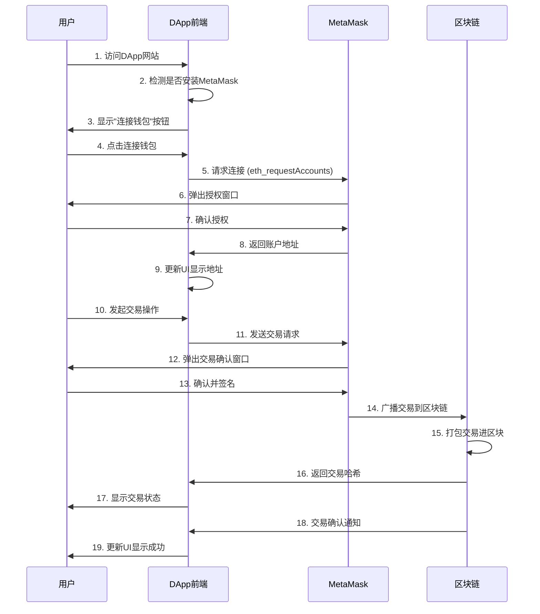
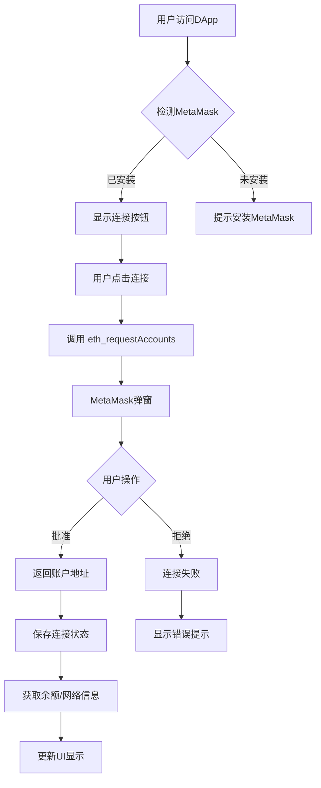
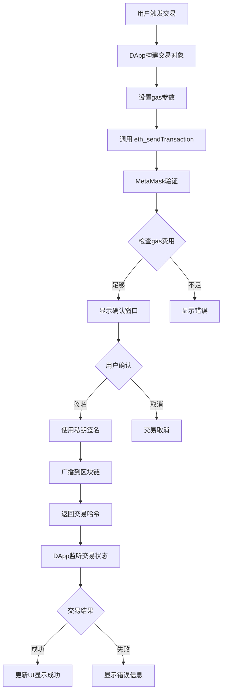
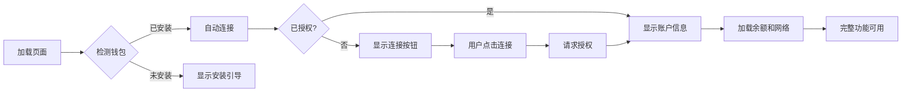

# Web3 前端开发完整教程：MetaMask 钱包与 DApp 前端

## 目录

1. [Web3 前端架构概述](#1-web3前端架构概述)
2. [MetaMask 钱包详解](#2-metamask钱包详解)
3. [DApp 前端详解](#3-dapp前端详解)
4. [MetaMask 与 DApp 交互流程](#4-metamask与dapp交互流程)
5. [实战开发指南](#5-实战开发指南)
6. [最佳实践与安全建议](#6-最佳实践与安全建议)

---

## 1. Web3 前端架构概述

### 1.1 Web3 技术栈层次

```
┌─────────────────────────────────────┐
│        用户界面层 (UI Layer)         │
│     - DApp前端 (React/Vue/等)       │
└─────────────────────────────────────┘
              ↕
┌─────────────────────────────────────┐
│      钱包层 (Wallet Layer)          │
│     - MetaMask / WalletConnect      │
└─────────────────────────────────────┘
              ↕
┌─────────────────────────────────────┐
│    Web3库层 (Web3 Library Layer)    │
│     - ethers.js / web3.js           │
└─────────────────────────────────────┘
              ↕
┌─────────────────────────────────────┐
│   区块链层 (Blockchain Layer)       │
│     - 以太坊 / Polygon / BSC        │
└─────────────────────────────────────┘
```

### 1.2 关键概念

- **DApp 前端**: 去中心化应用的用户界面，运行在浏览器中
- **MetaMask**: 浏览器扩展钱包，充当 Web3 提供者
- **Provider**: 连接区块链的接口
- **Signer**: 签名交易的账户

---

## 2. MetaMask 钱包详解

### 2.1 什么是 MetaMask？

MetaMask 是一个浏览器扩展程序（也有移动应用），它主要功能包括：

- **密钥管理**: 安全存储私钥和助记词
- **账户管理**: 创建和管理多个以太坊账户
- **网络切换**: 支持主网、测试网和自定义网络
- **交易签名**: 为交易和消息签名
- **DApp 连接**: 作为 Web3 Provider 供 DApp 调用

### 2.2 MetaMask 的核心功能

#### 功能列表

| 功能     | 描述                     |
| -------- | ------------------------ |
| 钱包创建 | 生成助记词，创建新钱包   |
| 账户导入 | 通过私钥或助记词导入账户 |
| 资产管理 | 查看 ETH 和代币余额      |
| 交易发送 | 发送 ETH 和代币转账      |
| 交易签名 | 为智能合约交互签名       |
| 消息签名 | 签名个人消息用于身份验证 |
| 网络管理 | 添加自定义 RPC 网络      |

### 2.3 MetaMask 注入的对象

当用户安装 MetaMask 后，它会在浏览器中注入 `window.ethereum` 对象：

```javascript
// MetaMask注入的全局对象
window.ethereum = {
  isMetaMask: true,
  selectedAddress: '0x...', // 当前选中的账户地址
  chainId: '0x1', // 当前网络ID

  // 核心方法
  request: async ({ method, params }) => {},
  enable: async () => {},

  // 事件监听
  on: (eventName, callback) => {},
  removeListener: (eventName, callback) => {},
};
```

---

## 3. DApp 前端详解

### 3.1 什么是 DApp 前端？

DApp 前端是去中心化应用的用户界面，通常是一个运行在浏览器中的 Web 应用，具有以下特点：

- 使用传统前端技术（HTML, CSS, JavaScript）
- 通过 Web3 库与区块链交互
- 依赖钱包进行身份验证和交易签名
- 数据存储在区块链或去中心化存储（如 IPFS）

### 3.2 DApp 前端的技术栈

#### 常用技术

```
前端框架:
  - React (最流行)
  - Vue.js
  - Next.js (支持SSR)
  - Svelte

Web3库:
  - ethers.js (推荐，现代化)
  - web3.js (传统)
  - wagmi (React Hooks)
  - viem (TypeScript优先)

UI组件库:
  - RainbowKit (钱包连接)
  - Web3Modal
  - Chakra UI
  - Material-UI
```

### 3.3 DApp 前端的核心功能模块

```javascript
// 1. 钱包连接模块
const connectWallet = async () => {
  // 连接MetaMask
};

// 2. 合约交互模块
const interactWithContract = async () => {
  // 调用智能合约
};

// 3. 交易监听模块
const listenToEvents = () => {
  // 监听区块链事件
};

// 4. 状态管理模块
const manageState = () => {
  // 管理钱包连接状态、账户信息等
};
```

---

## 4. MetaMask 与 DApp 交互流程

### 4.1 完整交互流程图



### 4.2 连接流程详解



### 4.3 交易流程详解



---

## 5. 实战开发指南

### 5.1 环境准备

#### 安装依赖

```bash
# 创建新项目
npx create-react-app my-dapp
cd my-dapp

# 安装ethers.js
npm install ethers

# 安装其他依赖（可选）
npm install @rainbow-me/rainbowkit wagmi
```

### 5.2 检测和连接 MetaMask

```javascript
// utils/ethereum.js

/**
 * 检测MetaMask是否安装
 */
export const detectMetaMask = () => {
  if (typeof window.ethereum !== 'undefined') {
    console.log('MetaMask已安装');
    return true;
  } else {
    console.log('请安装MetaMask');
    return false;
  }
};

/**
 * 连接MetaMask钱包
 */
export const connectWallet = async () => {
  try {
    // 请求用户授权
    const accounts = await window.ethereum.request({
      method: 'eth_requestAccounts',
    });

    const account = accounts[0];
    console.log('已连接账户:', account);

    return account;
  } catch (error) {
    if (error.code === 4001) {
      console.log('用户拒绝了连接请求');
    } else {
      console.error('连接失败:', error);
    }
    throw error;
  }
};

/**
 * 获取账户余额
 */
export const getBalance = async (address) => {
  try {
    const balance = await window.ethereum.request({
      method: 'eth_getBalance',
      params: [address, 'latest'],
    });

    // 将Wei转换为ETH
    const ethBalance = parseInt(balance, 16) / 1e18;
    return ethBalance.toFixed(4);
  } catch (error) {
    console.error('获取余额失败:', error);
    throw error;
  }
};

/**
 * 获取当前网络
 */
export const getChainId = async () => {
  try {
    const chainId = await window.ethereum.request({
      method: 'eth_chainId',
    });
    return parseInt(chainId, 16);
  } catch (error) {
    console.error('获取网络失败:', error);
    throw error;
  }
};

/**
 * 切换网络
 */
export const switchNetwork = async (chainId) => {
  try {
    await window.ethereum.request({
      method: 'wallet_switchEthereumChain',
      params: [{ chainId: `0x${chainId.toString(16)}` }],
    });
  } catch (error) {
    if (error.code === 4902) {
      console.log('需要添加该网络');
    }
    throw error;
  }
};
```

### 5.3 使用 ethers.js 进行交互

```javascript
// utils/contract.js
import { ethers } from 'ethers';

/**
 * 初始化Provider和Signer
 */
export const initEthers = () => {
  // 创建Provider（只读）
  const provider = new ethers.BrowserProvider(window.ethereum);

  return provider;
};

/**
 * 获取Signer（可签名交易）
 */
export const getSigner = async () => {
  const provider = new ethers.BrowserProvider(window.ethereum);
  const signer = await provider.getSigner();
  return signer;
};

/**
 * 发送ETH转账
 */
export const sendEther = async (toAddress, amount) => {
  try {
    const signer = await getSigner();

    const tx = await signer.sendTransaction({
      to: toAddress,
      value: ethers.parseEther(amount), // 将ETH转换为Wei
    });

    console.log('交易哈希:', tx.hash);

    // 等待交易确认
    const receipt = await tx.wait();
    console.log('交易确认:', receipt);

    return receipt;
  } catch (error) {
    console.error('转账失败:', error);
    throw error;
  }
};

/**
 * 与智能合约交互
 */
export const interactWithContract = async (contractAddress, abi, functionName, params) => {
  try {
    const signer = await getSigner();

    // 创建合约实例
    const contract = new ethers.Contract(contractAddress, abi, signer);

    // 调用合约函数
    const tx = await contract[functionName](...params);

    console.log('交易提交:', tx.hash);

    // 等待确认
    const receipt = await tx.wait();
    console.log('交易确认:', receipt);

    return receipt;
  } catch (error) {
    console.error('合约交互失败:', error);
    throw error;
  }
};

/**
 * 读取合约数据（无需gas）
 */
export const readContract = async (contractAddress, abi, functionName, params = []) => {
  try {
    const provider = initEthers();
    const contract = new ethers.Contract(contractAddress, abi, provider);

    const result = await contract[functionName](...params);
    return result;
  } catch (error) {
    console.error('读取合约失败:', error);
    throw error;
  }
};

/**
 * 监听合约事件
 */
export const listenToEvent = (contractAddress, abi, eventName, callback) => {
  const provider = initEthers();
  const contract = new ethers.Contract(contractAddress, abi, provider);

  contract.on(eventName, (...args) => {
    callback(...args);
  });

  // 返回清理函数
  return () => {
    contract.removeAllListeners(eventName);
  };
};
```

### 5.4 React 组件示例

```javascript
// components/WalletConnect.jsx
import React, { useState, useEffect } from 'react';
import { connectWallet, getBalance, getChainId } from '../utils/ethereum';

const WalletConnect = () => {
  const [account, setAccount] = useState('');
  const [balance, setBalance] = useState('0');
  const [chainId, setChainId] = useState(0);
  const [isConnected, setIsConnected] = useState(false);

  // 检查是否已连接
  useEffect(() => {
    checkConnection();
    setupEventListeners();
  }, []);

  const checkConnection = async () => {
    if (typeof window.ethereum !== 'undefined') {
      const accounts = await window.ethereum.request({
        method: 'eth_accounts',
      });

      if (accounts.length > 0) {
        setAccount(accounts[0]);
        setIsConnected(true);
        updateAccountInfo(accounts[0]);
      }
    }
  };

  const setupEventListeners = () => {
    if (typeof window.ethereum !== 'undefined') {
      // 监听账户切换
      window.ethereum.on('accountsChanged', (accounts) => {
        if (accounts.length > 0) {
          setAccount(accounts[0]);
          updateAccountInfo(accounts[0]);
        } else {
          setAccount('');
          setIsConnected(false);
        }
      });

      // 监听网络切换
      window.ethereum.on('chainChanged', (chainId) => {
        window.location.reload();
      });
    }
  };

  const updateAccountInfo = async (address) => {
    const bal = await getBalance(address);
    const chain = await getChainId();
    setBalance(bal);
    setChainId(chain);
  };

  const handleConnect = async () => {
    try {
      const account = await connectWallet();
      setAccount(account);
      setIsConnected(true);
      updateAccountInfo(account);
    } catch (error) {
      console.error('连接失败:', error);
    }
  };

  const formatAddress = (addr) => {
    return `${addr.substring(0, 6)}...${addr.substring(addr.length - 4)}`;
  };

  const getNetworkName = (id) => {
    const networks = {
      1: 'Ethereum Mainnet',
      5: 'Goerli Testnet',
      137: 'Polygon Mainnet',
      80001: 'Mumbai Testnet',
    };
    return networks[id] || `Chain ID: ${id}`;
  };

  return (
    <div className="wallet-connect">
      {!isConnected ? (
        <button onClick={handleConnect} className="connect-button">
          连接钱包
        </button>
      ) : (
        <div className="wallet-info">
          <div className="account">
            <strong>账户:</strong> {formatAddress(account)}
          </div>
          <div className="balance">
            <strong>余额:</strong> {balance} ETH
          </div>
          <div className="network">
            <strong>网络:</strong> {getNetworkName(chainId)}
          </div>
        </div>
      )}
    </div>
  );
};

export default WalletConnect;
```

### 5.5 完整的 DApp 示例

```javascript
// App.jsx
import React, { useState } from 'react';
import WalletConnect from './components/WalletConnect';
import { sendEther } from './utils/contract';
import './App.css';

function App() {
  const [recipient, setRecipient] = useState('');
  const [amount, setAmount] = useState('');
  const [txHash, setTxHash] = useState('');
  const [loading, setLoading] = useState(false);

  const handleSendEther = async (e) => {
    e.preventDefault();

    if (!recipient || !amount) {
      alert('请填写收款地址和金额');
      return;
    }

    try {
      setLoading(true);
      const receipt = await sendEther(recipient, amount);
      setTxHash(receipt.hash);
      alert('交易成功!');

      // 清空表单
      setRecipient('');
      setAmount('');
    } catch (error) {
      alert('交易失败: ' + error.message);
    } finally {
      setLoading(false);
    }
  };

  return (
    <div className="App">
      <header className="App-header">
        <h1>我的第一个DApp</h1>
        <WalletConnect />
      </header>

      <main className="App-main">
        <div className="send-form">
          <h2>发送ETH</h2>
          <form onSubmit={handleSendEther}>
            <div className="form-group">
              <label>收款地址:</label>
              <input
                type="text"
                value={recipient}
                onChange={(e) => setRecipient(e.target.value)}
                placeholder="0x..."
                disabled={loading}
              />
            </div>

            <div className="form-group">
              <label>金额 (ETH):</label>
              <input
                type="number"
                step="0.001"
                value={amount}
                onChange={(e) => setAmount(e.target.value)}
                placeholder="0.1"
                disabled={loading}
              />
            </div>

            <button type="submit" disabled={loading}>
              {loading ? '处理中...' : '发送'}
            </button>
          </form>

          {txHash && (
            <div className="tx-info">
              <p>交易哈希:</p>
              <a
                href={`https://etherscan.io/tx/${txHash}`}
                target="_blank"
                rel="noopener noreferrer"
              >
                {txHash}
              </a>
            </div>
          )}
        </div>
      </main>
    </div>
  );
}

export default App;
```

---

## 6. 最佳实践与安全建议

### 6.1 错误处理

```javascript
// 常见错误代码
const ERROR_CODES = {
  4001: '用户拒绝请求',
  4100: '请求的方法未授权',
  4200: '不支持的方法',
  4900: '连接已断开',
  4901: '链未连接',
  -32700: '解析错误',
  -32600: '无效请求',
  -32601: '方法未找到',
  -32602: '无效参数',
  -32603: '内部错误'
};

// 完善的错误处理
const handleError = (error) => {
  if (error.code) {
    const message = ERROR_CODES[error.code] || error.message;
    console.error('错误:', message);
    return message;
  }

  if (error.message.includes('insufficient funds')) {
    return '余额不足';
  }

  if (error.message.includes('user rejected')) {
    return '用户取消了交易';
  }

  return '发生未知错误';
};
```

### 6.2 安全建议

#### DApp 开发安全清单

- ✅ **永远不要在前端存储私钥**
- ✅ **验证所有用户输入（地址格式、金额等）**
- ✅ **在交易前显示清晰的确认信息**
- ✅ **使用最新版本的库和依赖**
- ✅ **实现适当的错误处理**
- ✅ **在测试网充分测试后再部署主网**
- ✅ **对合约地址进行硬编码或严格验证**
- ✅ **实现交易确认等待机制**
- ✅ **提供交易状态反馈**
- ✅ **考虑 gas 价格优化**

### 6.3 用户体验优化



#### UX 最佳实践

1. **加载状态**: 显示清晰的加载指示器
2. **错误反馈**: 用友好的语言解释错误
3. **交易确认**: 在 MetaMask 弹窗前显示预览
4. **网络检测**: 自动提示用户切换到正确网络
5. **移动端适配**: 支持 MetaMask 移动应用
6. **离线检测**: 处理网络连接问题

### 6.4 性能优化

```javascript
// 使用React Context避免prop drilling
import React, { createContext, useContext, useState, useEffect } from 'react';

const Web3Context = createContext();

export const Web3Provider = ({ children }) => {
  const [account, setAccount] = useState(null);
  const [provider, setProvider] = useState(null);
  const [chainId, setChainId] = useState(null);

  useEffect(() => {
    // 初始化连接
    initializeConnection();
  }, []);

  const initializeConnection = async () => {
    // 实现连接逻辑
  };

  return (
    <Web3Context.Provider value={{ account, provider, chainId }}>{children}</Web3Context.Provider>
  );
};

export const useWeb3 = () => {
  const context = useContext(Web3Context);
  if (!context) {
    throw new Error('useWeb3 must be used within Web3Provider');
  }
  return context;
};
```

---

## 7. 常见问题解答

### Q1: MetaMask 未检测到？

```javascript
// 等待MetaMask注入
const waitForMetaMask = () => {
  return new Promise((resolve, reject) => {
    let count = 0;
    const interval = setInterval(() => {
      if (window.ethereum) {
        clearInterval(interval);
        resolve(window.ethereum);
      }
      if (count++ > 50) {
        // 5秒超时
        clearInterval(interval);
        reject(new Error('MetaMask未安装'));
      }
    }, 100);
  });
};
```

### Q2: 如何处理网络切换？

```javascript
// 添加自定义网络
const addNetwork = async (networkConfig) => {
  try {
    await window.ethereum.request({
      method: 'wallet_addEthereumChain',
      params: [
        {
          chainId: networkConfig.chainId,
          chainName: networkConfig.name,
          nativeCurrency: networkConfig.currency,
          rpcUrls: networkConfig.rpcUrls,
          blockExplorerUrls: networkConfig.explorers,
        },
      ],
    });
  } catch (error) {
    console.error('添加网络失败:', error);
  }
};
```

### Q3: 如何实现消息签名验证身份？

```javascript
// 签名消息
const signMessage = async (message) => {
  try {
    const signer = await getSigner();
    const signature = await signer.signMessage(message);
    return signature;
  } catch (error) {
    console.error('签名失败:', error);
    throw error;
  }
};

// 验证签名
const verifySignature = (message, signature, address) => {
  const recoveredAddress = ethers.verifyMessage(message, signature);
  return recoveredAddress.toLowerCase() === address.toLowerCase();
};
```

---

## 8. 进阶资源

### 推荐学习资源

1. **官方文档**

   - [MetaMask 文档](https://docs.metamask.io/)
   - [ethers.js 文档](https://docs.ethers.org/)
   - [Ethereum 开发文档](https://ethereum.org/developers)

2. **开发工具**

   - Hardhat - 智能合约开发框架
   - Remix - 在线 IDE
   - Tenderly - 交易模拟和调试

3. **UI 库**

   - RainbowKit - 美观的钱包连接 UI
   - Web3Modal - 多钱包支持
   - ConnectKit - 现代化连接组件

4. **测试网水龙头**
   - Goerli Faucet
   - Sepolia Faucet
   - Mumbai Faucet

---

## 总结

本教程涵盖了 Web3 前端开发的核心概念：

- ✅ **MetaMask**: 作为 Web3 Provider，管理密钥和签名交易
- ✅ **DApp 前端**: 使用传统 Web 技术构建，通过 Web3 库与区块链交互
- ✅ **交互流程**: 用户 → DApp → MetaMask → 区块链的完整流程
- ✅ **实战代码**: 从基础连接到完整 DApp 的开发示例

记住：始终在测试网上充分测试，关注安全最佳实践，为用户提供清晰的反馈和良好的体验！

---

**祝你开发顺利！🚀**
